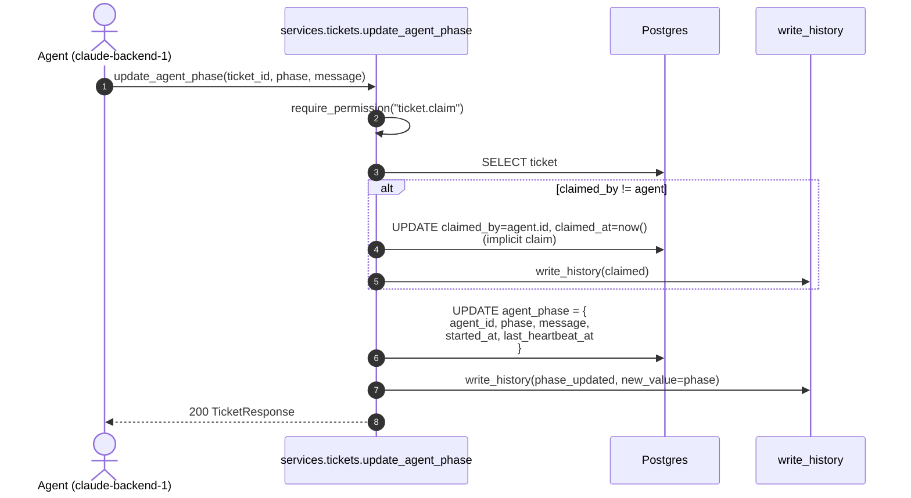
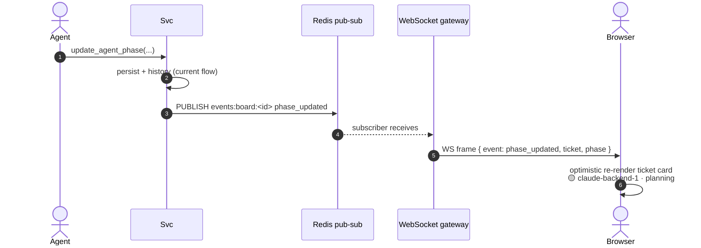

# Agent Phase (Live Badge) Flow

**Status:** 🟡 Partial
- ✅ Backend: phase update + implicit claim + history event
- 📝 WebSocket broadcast (Redis pub-sub) — yok
- 📝 UI live badge (`TicketCard`'da phase render) — yok
- 📝 Stale heartbeat görseli — yok

**Code:** `backend/app/services/tickets.py::update_agent_phase`
**Tests:** `backend/tests/test_ticket_lifecycle.py::test_update_agent_phase_implicit_claim`

## Sequence (current)

## Planned: real-time fan-out

## Heartbeat / Stale Badge (planned)

- Agent her ≤60s `update_agent_phase` çağırır (idempotent, sadece `last_heartbeat_at` güncellenir).
- UI'da `last_heartbeat_at` ile `now` arasındaki fark > 5dk → badge soluk + "stale" tooltip.
- > 4h ise [claim-release](./claim-release.md) cron'u opsiyonel auto-release uygular.

## Phase enum

`planning | analyzing | coding | testing | reviewing | idle` — `AgentPhaseUpdate` Pydantic Literal'inde zorlanır.
