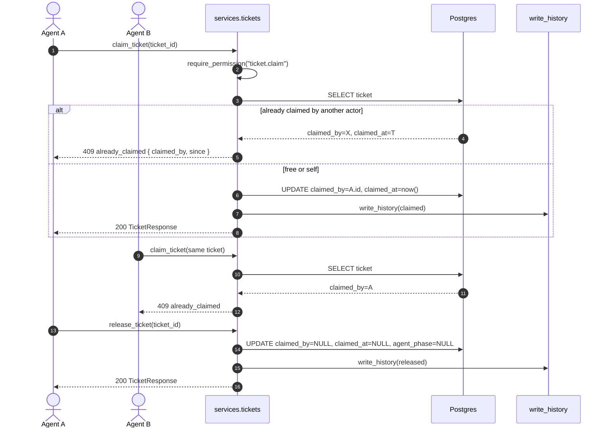
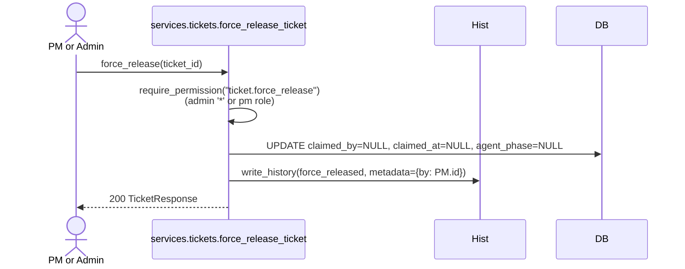

# Claim / Release Flow

**Status:** ✅ Implemented (force_release: ✅; stale auto-release cron: 📝 Planned)
**Code:** `backend/app/services/tickets.py::claim_ticket`, `release_ticket`, `force_release_ticket`
**Tests:** `backend/tests/test_ticket_lifecycle.py::test_claim_conflict_*`, `test_release_clears_*`

## Sequence

## Force Release (admin/PM)

## Auto-release on state change

- `transition_ticket_state` → `done` veya `blocked` ise `claimed_by` ve `claimed_at` `NULL` yapılır.
- Bu DB transaction içinde state change ile aynı commit'te olur.

## Planned (v1.1)

- 📝 **Stale claim cron:** `claimed_at < now() - 4h` ve `agent_phase.last_heartbeat_at` eski → uyarı veya auto-release (config flag).
