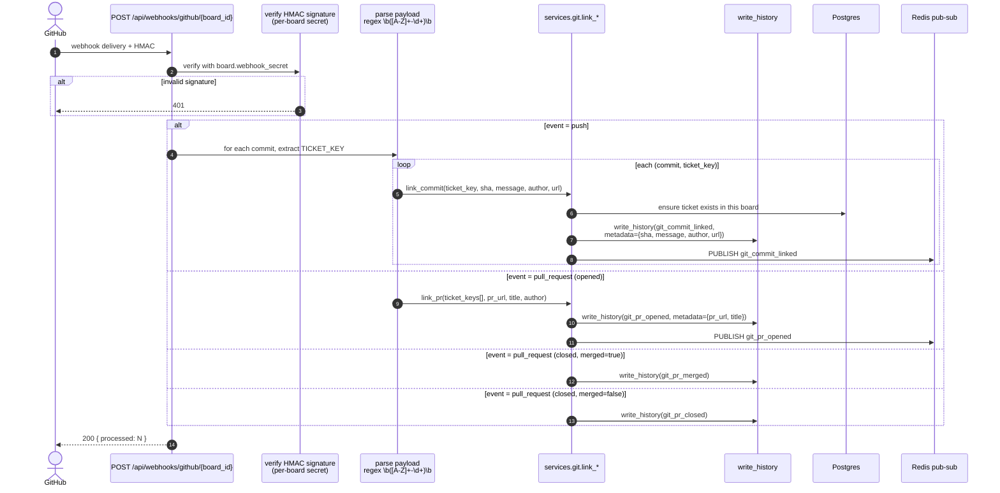
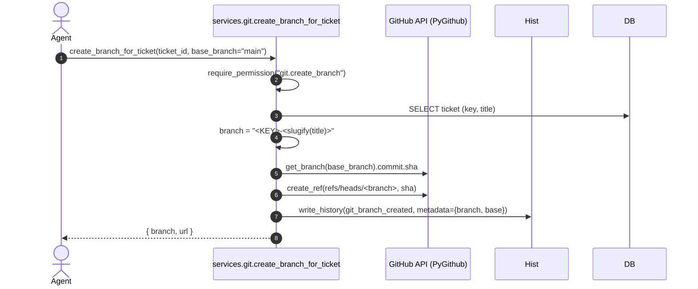

# Git Webhook Ingestion Flow

**Status:** 📝 Planned (Phase 4)
**Spec:** `docs/project_plan.md` §8 (Git Integration)
**Code:** _yok_ — `backend/app/git/` ve `backend/app/api/webhooks/` henüz boş iskelet.

## Goal

GitHub webhook'larından gelen `push` ve `pull_request` event'lerini ticket key'ine bağlayıp `TicketHistory`'ye `git_*` event'leri olarak yazmak; UI'da [interleaved activity timeline](../project_plan.md#73-interleaved-activity-timeline) için tek kaynak oluşturmak.

## Planned Endpoint

```
POST /api/webhooks/github/{board_id}?secret=<webhook_secret>
X-GitHub-Event: push | pull_request
X-Hub-Signature-256: sha256=...
```

## Sequence



## Branch Create (outbound, MCP tool)



## Ticket Key Parsing

- Regex: `\b([A-Z]+-\d+)\b`
- Bir commit/PR birden fazla ticket key içerebilir → her birine ayrı history satırı.
- Bilinmeyen / silinmiş ticket key'leri loglanır ama webhook 200 döner (delivery retry'ı önlemek için).

## Out of Scope (v1)

- ❌ Otomatik PR-merge → state transition (manuel kalır; bkz. `project_plan.md` §8.5).
- ❌ GitLab/Bitbucket — sadece GitHub.
- ❌ Commit body-level "fixes #123" semantic kapatma.
