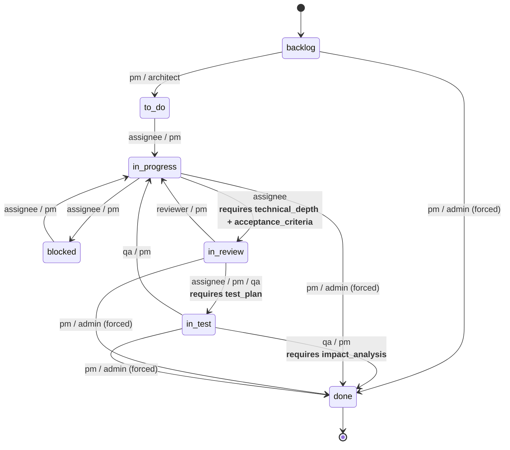
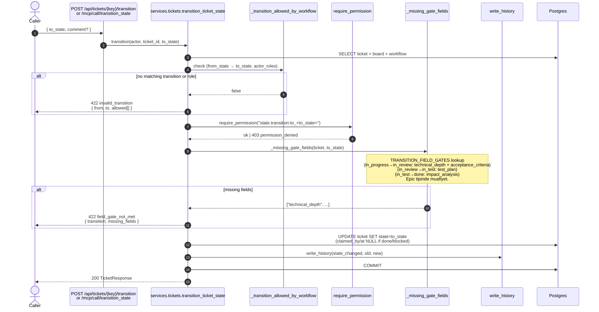

# State Transition Flow (with Field Gates)

**Status:** ✅ Implemented
**Code:** `backend/app/services/tickets.py::transition_ticket_state`, `TRANSITION_FIELD_GATES`
**Tests:** `backend/tests/test_ticket_lifecycle.py::test_transition_*`, `test_invalid_transition_*`, `test_*_field_gate_*`

## State Machine (default workflow)



> **Forced-close** (`* → done` by pm/admin) field gate'lerini **bypass etmez**; `in_test → done` için `impact_analysis` halen zorunludur. Epic ticket'lar (`type='epic'`) tüm gate'lerden muaf.

## Transition Sequence



## Field Gate Matrix

| From → To | Required field(s) | Exempt types |
|---|---|---|
| `in_progress → in_review` | `technical_depth`, `acceptance_criteria` | epic |
| `in_review → in_test` | `test_plan` | epic |
| `in_test → done` | `impact_analysis` | epic |

## Error Payloads

```json
// invalid_transition
{ "error": "invalid_transition", "from_state": "backlog", "to_state": "in_review",
  "allowed": ["to_do", "done"] }

// field_gate_not_met
{ "error": "field_gate_not_met", "transition": "in_progress->in_review",
  "missing_fields": ["technical_depth", "acceptance_criteria"] }
```
