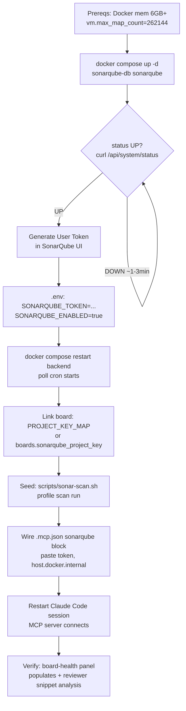

# SonarQube Setup Runbook

> Operator guide to stand up the full SonarQube integration (PH-191 epic:
> PH-192 service, PH-193 poller, PH-194 scanner, PH-195 reviewer MCP, PH-196
> board-health panel) from a fresh checkout. Follow the sections in order.

## 0. Overview & safety

The SonarQube integration is **opt-in**. The default `SONARQUBE_ENABLED=false`
(in `.env.example`) means the rest of the stack — backend, frontend, Postgres,
Redis — boots normally even if you never start SonarQube. Nothing depends on the
`sonarqube` service.

What you get once it is enabled:

- A self-hosted SonarQube Community Build server (`docker compose`).
- A backend poll cron (PH-193) that ingests quality-gate + measures per linked board.
- A one-shot scanner (PH-194) that refreshes the `project-hub` analysis after merge-to-main.
- The reviewer's `mcp__sonarqube__*` tools (PH-195) for per-diff snippet analysis.
- A board-health panel (PH-196) that surfaces the metrics in the UI.

> **NEVER commit a token.** The real `.env` and real `.mcp.json` are **gitignored**;
> only `.env.example` and `.mcp.json.example` are committed. Tokens and passwords
> live only in those gitignored local files. Every placeholder in committed files
> stays a placeholder.

---

## 1. Prerequisites

1. **Docker Desktop memory ≥ 6 GB.** SonarQube plus its embedded Elasticsearch
   wants roughly 2–4 GB; give Docker at least 6 GB.

2. **Host kernel `vm.max_map_count` ≥ 262144.** SonarQube's bundled Elasticsearch
   refuses to start otherwise, logging:

   ```text
   max virtual memory areas vm.max_map_count [65530] is too low
   ```

   This is a **HOST kernel knob, NOT a compose `sysctl`** — set it once on the host
   before `docker compose up`. Use the exact command for your platform:

   - **macOS / Docker Desktop** (resets on Docker Desktop restart — re-run after a restart):

     ```bash
     docker run --rm --privileged alpine sysctl -w vm.max_map_count=262144
     ```

   - **Linux host** (persistent across reboots):

     ```bash
     echo 'vm.max_map_count=262144' | sudo tee /etc/sysctl.d/99-sonarqube.conf && sudo sysctl --system
     ```

> These are the same commands documented in the `docker-compose.yml` `sonarqube`
> header and `.env.example`.

---

## 2. Start the stack

Bring up the SonarQube database and server (the db comes up first via a
`depends_on` healthcheck; one command starts both):

```bash
docker compose up -d sonarqube-db sonarqube
```

First boot runs the Elasticsearch init plus a DB schema migration (~1–3 min). An
early `DOWN` / `502` is **normal** — the compose healthcheck has `start_period: 120s`
and 20 retries to cover this.

The container's own healthcheck curls `http://localhost:9000/api/system/status`
inside the network. From the **host**, probe the published port and wait for
`{"status":"UP"}`:

```bash
curl -fsS "http://localhost:${SONARQUBE_PORT:-9000}/api/system/status"
```

The published port is `SONARQUBE_PORT` (default `9000`). The web UI is at
<http://localhost:9000>.

---

## 3. Generate a User token (one-time bootstrap)

1. Open <http://localhost:9000> and log in. The first login uses the default
   `admin` / `admin`, which forces an immediate password change.
2. Go to **My Account → Security → Generate Tokens**.
3. Choose token type **User Token**, name it (e.g. `project-hub-poller`), click
   **Generate**, and **copy it now** — SonarQube shows the value only once.
4. Put it in the gitignored `.env`:

   ```dotenv
   SONARQUBE_TOKEN=<paste-your-user-token-here>
   ```

> **Auth model** (from `backend/app/services/sonarqube.py`): SonarQube user tokens
> authenticate as HTTP Basic with the **token as the username and an empty password**
> (portable across Community builds). You do not need a separate password.

> **HARD RULE:** never paste a real token into any committed file
> (`.env.example`, `.mcp.json.example`, this runbook). The committed
> `SONARQUBE_TOKEN=` placeholder stays empty.

---

## 4. Enable the integration

1. Set the flag in `.env`:

   ```dotenv
   SONARQUBE_ENABLED=true
   ```

2. Restart the backend so the FastAPI lifespan creates the `sonarqube_poll_cron`:

   ```bash
   docker compose restart backend
   ```

   The lifespan gates task creation on `sonarqube_enabled` **and**
   `sonarqube_polling_interval_seconds > 0`. The cron itself does not re-check the
   flag, so a **restart is required** after flipping `SONARQUBE_ENABLED`.

3. Poll cadence is `SONARQUBE_POLLING_INTERVAL_SECONDS` (default `300`, i.e. 5 min).

---

## 5. Link a board to a SonarQube project

The poller resolves exactly **one** projectKey per board via
`resolve_project_key(board)` in `backend/app/services/sonarqube.py`, with this
precedence:

1. The explicit per-board column `boards.sonarqube_project_key`, **then**
2. The `SONARQUBE_PROJECT_KEY_MAP` JSON in `.env`, keyed by board key.

If both are unset → `None` → the board is **silently skipped** (not an error).

The default mapping ships in `.env.example`:

```dotenv
SONARQUBE_PROJECT_KEY_MAP={"PH":"project-hub"}
```

> **Consistency contract** (from the `sonar-project.properties` header): the
> resolved key for board `PH` **MUST equal** `sonar.projectKey=project-hub` in
> `sonar-project.properties`, so that the scanner **write** and the PH-193 poller
> **read** agree on a single key. This is a must-match invariant — a mismatch
> leaves the panel empty.

---

## 6. Seed metrics with a scan

The poller only *reads* metrics; SonarQube has none until a scan *writes* them.
Once `SONARQUBE_ENABLED=true` and SonarQube is `UP`, run the scanner from the repo
root:

```bash
scripts/sonar-scan.sh
```

What the script does (and its guards):

- **Self-guarding** — it exits `0` (skips) when `SONARQUBE_ENABLED` is not `true`,
  or SonarQube is not reachable at `SONAR_SCAN_URL` (default
  `http://localhost:${SONARQUBE_PORT}`), or `curl`/`docker` are missing. It
  **warns but proceeds** if `SONARQUBE_TOKEN` is empty.
- **Runs the scanner via Docker** — `docker compose --profile scan run --rm sonar-scanner`,
  so no host scanner install is needed. The container joins the compose network so
  the compose-internal `sonarqube:9000` resolves.
- **ALWAYS exits `0`** — a scan problem must never block or roll back a deploy.

**Auto-run on deploy:** the project `CLAUDE.md` `## Post-done deployment (override)`
block lists `scripts/sonar-scan.sh` as a post-merge command, so the Coordinator
runs it on the **host** after merge-to-main.

**Two URLs, two purposes** (the most common confusion):

- The scanner **container** targets `SONARQUBE_URL` — the compose-internal
  `http://sonarqube:9000`.
- The host-side reachability probe uses `SONAR_SCAN_URL` — the published
  `http://localhost:9000` — because `sonarqube:9000` does **not** resolve off the
  compose network.

> **Community Build is main-branch only.** SonarQube Community Build analyses the
> main branch only — there is no PR / feature-branch analysis. This is *why* the
> reviewer's incremental review uses snippet analysis (`analyze_code_snippet`)
> rather than branch scans.

---

## 7. Wire the reviewer's MCP server

1. Copy the 7th `sonarqube` block from `.mcp.json.example` into your local
   (gitignored) `.mcp.json`.
2. Paste your real **User token** into that block's `env.SONARQUBE_TOKEN`.
   **Never commit it** — the real `.mcp.json` is gitignored.

   The committed example block looks like this (token is a placeholder):

   ```json
   "sonarqube": {
     "command": "docker",
     "args": [
       "run", "-i", "--rm",
       "-e", "SONARQUBE_URL",
       "-e", "SONARQUBE_TOKEN",
       "mcp/sonarqube"
     ],
     "env": {
       "SONARQUBE_URL": "http://host.docker.internal:9000",
       "SONARQUBE_TOKEN": "<paste real SonarQube user token here — NEVER commit>"
     }
   }
   ```

3. **URL — use `host.docker.internal:9000`.** Claude Code launches the MCP server
   on the **host** via `docker run`, so it must reach the host-published port via
   `host.docker.internal`:

   - **NOT** `sonarqube:9000` — that name only resolves inside the compose network.
   - **NOT** `localhost` — inside the MCP container, `localhost` is the container itself.

   On **Linux**, `host.docker.internal` is not automatic — add
   `--add-host=host.docker.internal:host-gateway` to the block's `args`.

4. **Server mode** = `SONARQUBE_URL` + `SONARQUBE_TOKEN` only. Do **not** set
   `SONARQUBE_ORG` (that is SonarQube Cloud only) and do **not** set
   `SONARQUBE_PROJECT` (`analyze_code_snippet` is project-agnostic).

5. **Restart the Claude Code session.** The `sonarqube` MCP server connects only
   after a **fresh session** AND a running SonarQube + valid token. After the
   restart, the reviewer's `mcp__sonarqube__analyze_code_snippet` works. If the
   server is still unavailable, the reviewer gracefully skips snippet analysis
   (see `.claude/agents/reviewer.md`) — it is not a hard reject on its own.

---

## 8. Verify the board-health panel (PH-196)

After a scan **and** at least one poll tick (≤ the polling interval):

1. Open the board (e.g. **PH**) detail page in the UI.
2. The SonarQube health panel should show the quality gate plus
   `bugs` / `vulnerabilities` / `code_smells` / `coverage` / `duplications` /
   `ncloc`.

**Live update:** the poller publishes a `sonarqube_synced` event on the
`board:{id}` Redis channel, so the panel patches in place without a manual refetch.

**Optional host spot-check:** confirm a metric row exists via the board detail API
(the board's health field).

---

## 9. Troubleshooting

| Symptom | Likely cause → fix |
|---|---|
| **Panel empty** | No scan yet → run `scripts/sonar-scan.sh`. / Board unlinked (`resolve_project_key` returned `None`) → set `SONARQUBE_PROJECT_KEY_MAP` or `boards.sonarqube_project_key`. / Poller not running → `SONARQUBE_ENABLED` off or backend not restarted (`docker compose restart backend`). / Project-key mismatch between the `.env` map and `sonar-project.properties`. |
| **MCP server won't connect** | Claude Code session not restarted. / SonarQube down. / Wrong/empty token. / On Linux, missing `--add-host=host.docker.internal:host-gateway`. / Wrong URL — `host.docker.internal` (correct for the host-launched MCP container) vs `sonarqube:9000` (compose-internal only) vs `localhost` (the container itself). |
| **Elasticsearch won't start / SonarQube stuck `DOWN`** | `vm.max_map_count` not set → re-run the §1 prereq command (on macOS it **resets after a Docker Desktop restart**). / Docker memory < 6 GB → raise it. |
| **Scan silently no-ops** | `SONARQUBE_ENABLED` ≠ `true`, or SonarQube not `UP` at `SONAR_SCAN_URL` — these are the script's guards. By design `scripts/sonar-scan.sh` always exits `0` so a scan problem never blocks a deploy; read its `[sonar-scan]` log lines for the reason. |

---

## Appendix — Operator setup flow



---

## Referenced artifacts (all on `main`)

| Artifact | Role |
|---|---|
| `docker-compose.yml` (`sonarqube-db`, `sonarqube`, `sonar-scanner`) | Service definitions + `--profile scan` |
| `.env.example` (`SONARQUBE_*`, `SONAR_SCAN_URL`) | Env var reference |
| `scripts/sonar-scan.sh` | Best-effort main-branch scan |
| `sonar-project.properties` (`sonar.projectKey=project-hub`) | Scanner config + consistency contract |
| `backend/app/services/sonarqube.py` (`resolve_project_key`) | Board → projectKey resolution + auth model |
| `.mcp.json.example` (`sonarqube` block) | Reviewer MCP server template |
| `.claude/agents/reviewer.md` | Reviewer `mcp__sonarqube__*` usage + graceful skip |
| `docs/permissions.md` | The PH-195 reviewer tools + `Edit(.claude/agents/**)` rule |
