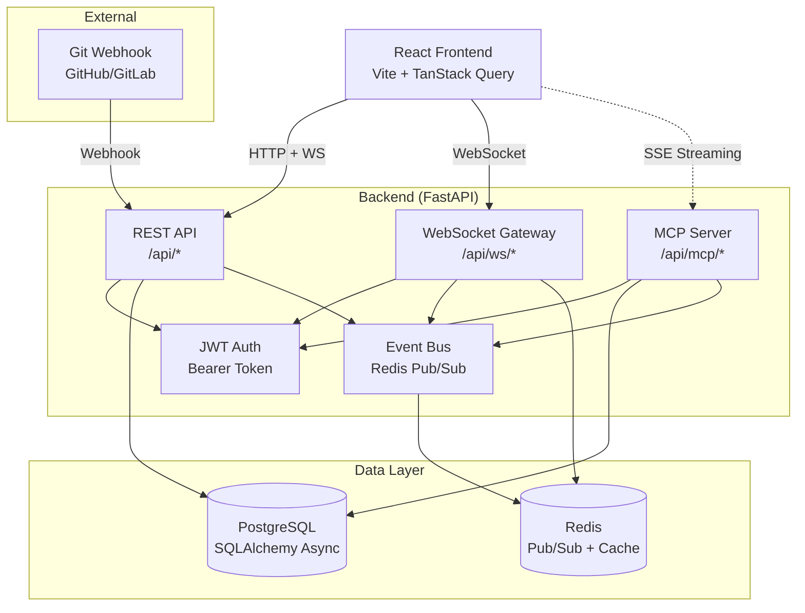
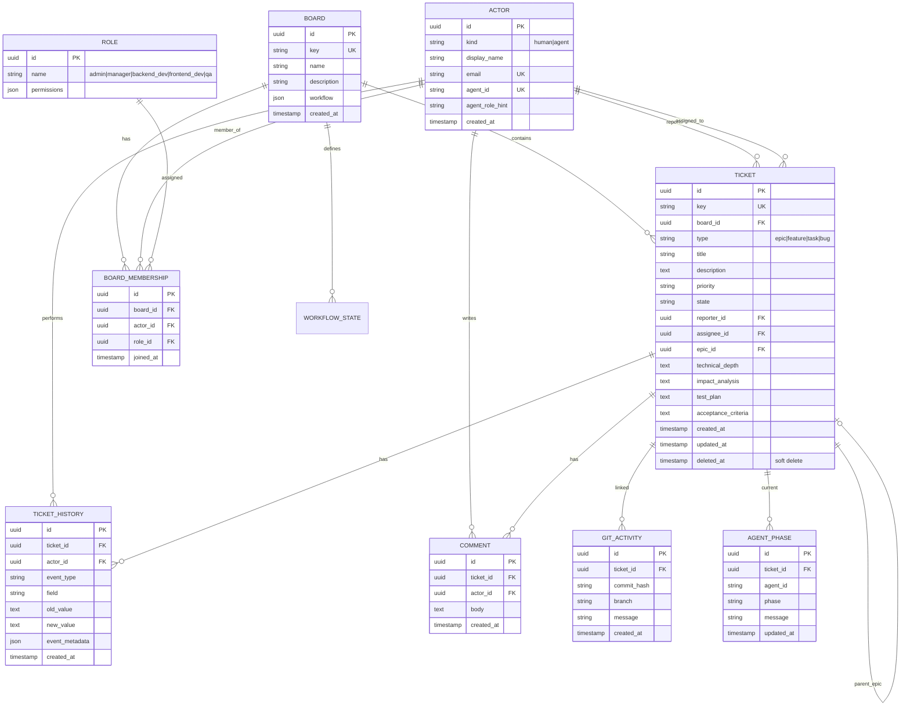

# System Design

> ProjectHub architecture, component diagram, and data model.

---

## Component Diagram



---

## ER Diagram



---

## API Architecture

### REST Endpoints

| Resource | Endpoints |
|---|---|
| Boards | `GET /api/boards`, `GET /api/boards/{key}` |
| Tickets | `GET /api/tickets`, `POST /api/tickets`, `GET /api/tickets/{key}` |
| | `PATCH /api/tickets/{key}`, `POST /api/tickets/{key}/transition/{state}` |
| | `POST /api/tickets/{key}/claim`, `POST /api/tickets/{key}/release` |
| | `POST /api/tickets/{key}/comments` |

### WebSocket Endpoints

| Endpoint | Purpose |
|---|---|
| `/api/ws/boards/{board_id}?token={jwt}` | Board-scoped event stream |
| `/api/ws/tickets/{ticket_id}?token={jwt}` | Ticket-scoped event stream |

### MCP Endpoints

| Endpoint | Purpose |
|---|---|
| `GET /api/mcp/tools` | List available tools |
| `POST /api/mcp/call/{tool}` | Execute tool |
| `GET /api/mcp/stream/events?board_id={id}` | SSE streaming |

---

## Event Flow

```
User Action → Service Layer → EventBus.publish()
                                    ↓
                              Redis Channel
                           (board:{id}, ticket:{id})
                                    ↓
                           WebSocket Subscribers
                                    ↓
                           Frontend Update (React Query)
```

---

## Tech Stack

| Layer | Technology |
|---|---|
| Frontend | React 18, Vite, TailwindCSS, TanStack Query |
| Backend | FastAPI, SQLAlchemy 2.0 (async), Pydantic |
| Database | PostgreSQL 15, Alembic migrations |
| Cache/Events | Redis 7 (pub/sub) |
| Auth | JWT Bearer tokens |

---

## References

- `docs/flows/README.md` — Flow diagrams
- `docs/permissions.md` — Permission system
- `docs/agent-workflow.md` — Ticket lifecycle
