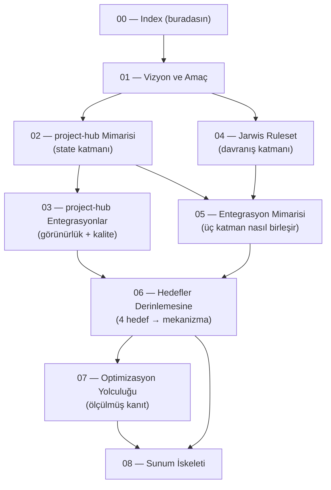

# Jarwis × project-hub — Whitepaper Seti

> **Bir cümlede:** Bu doküman seti, LLM ajanlarıyla yazılım geliştirmeyi **kontrol altında, anlaşılabilir ve hafızalı** kılmak için tasarlanmış iki bileşeni — *davranış kuralları* (Jarwis) ve *state-of-truth motoru* (project-hub) — vizyondan mimariye, entegrasyondan ölçülmüş kanıta kadar anlatır.

Bu klasör (`docs/whitepaper/`), bir sonraki adımda hazırlanacak **birkaç slaytlık sunumun** kaynak metnidir. Dokümanlar yapılandırılmış olarak birbirine bağlıdır (her bölüm ilgili diğer dokümanlara link verir) ve `problem → çözüm → mekanizma → kanıt` akışını izler. Birincil okuyucu, sistemi ilk kez gören teknik bir izleyicidir.

---

## Sistem bir bakışta

İki bileşen, bilinçle ayrılmış iki sorumluluk:

| Bileşen | Rolü | Doğası | Konum |
|---|---|---|---|
| **project-hub** | State-of-truth + hafıza + insan kontrol yüzeyi | Çalışan yazılım: FastAPI + PostgreSQL 16 + Redis 7 + React 18; MCP-first | `~/Documents/project-hub/` |
| **Jarwis** | Davranış kuralları + orkestrasyon | Kod içermeyen canonical **markdown** ruleset; Coordinator-merkezli | `~/Jarwis/` |
| **Proje repo'su** | Gerçek kod + per-task hafıza | Git + `.jarwis/logs/` + `docs/codewiki/` | `~/<proje>/` |

Ayrımın özü: **state katmanı** (sağlam, transactional, uzun ömürlü) bir kez mühendislikle inşa edilir; **davranış katmanı** (hızlı evrilen, deneyle/benchmark ile optimize edilen) markdown olarak özgürce iterate edilir — ve bu deneyler asla kalıcı veriyi bozmaz.

---

## Doküman grafiği ve okuma sırası

**Önerilen sıra:** Vizyonla başla ([01](01-vizyon-amac.md)); iki bileşeni ayrı ayrı anla — state katmanı [02](02-projecthub-mimari.md) + entegrasyonları [03](03-projecthub-entegrasyonlar.md), davranış katmanı [04](04-jarwis-ruleset.md); birleşimlerini gör [05](05-entegrasyon-mimari.md); hedeflerin kanıtını incele [06](06-hedefler-derinlemesine.md) + [07](07-optimizasyon-yolculugu.md); slaytları çıkar [08](08-sunum-iskeleti.md).

---

## Doküman kataloğu

| # | Doküman | Tek-cümle içerik |
|---|---|---|
| 00 | **00-index.md** (bu doküman) | Genel bakış, doküman grafiği, okuma sırası, sözlük, hızlı gerçekler |
| 01 | [01-vizyon-amac.md](01-vizyon-amac.md) | Problem (görünürlük/durum/borç/context kaybı), tez (iki bileşen), 4 üst-hedef özeti |
| 02 | [02-projecthub-mimari.md](02-projecthub-mimari.md) | Tek servis katmanı (REST/WS/MCP), veri modeli, [state machine + field gate](02-projecthub-mimari.md#state-machine-ve-field-gateler), [permission grammar](02-projecthub-mimari.md#permission-grammar), append-only audit |
| 03 | [03-projecthub-entegrasyonlar.md](03-projecthub-entegrasyonlar.md) | Git linkage + branch graph, [SonarQube](03-projecthub-entegrasyonlar.md#sonarqube) watcher, canlı frontend kontrol yüzeyi |
| 04 | [04-jarwis-ruleset.md](04-jarwis-ruleset.md) | 3 katman, [single-driver Coordinator](04-jarwis-ruleset.md#single-driver-mimari), [roller](04-jarwis-ruleset.md#roller), [transition map](04-jarwis-ruleset.md#transition-map), flow/contract/mode/playbook, [eager/lazy import](04-jarwis-ruleset.md#eager-vs-lazy-import) |
| 05 | [05-entegrasyon-mimari.md](05-entegrasyon-mimari.md) | Per-role token/actor, ticket lifecycle kontrat yüzeyi, [WHY/WHAT/WHEN üçgeni + codewiki](05-entegrasyon-mimari.md#why-what-when-ucgeni-ve-codewiki), `jarwis-init.sh` |
| 06 | [06-hedefler-derinlemesine.md](06-hedefler-derinlemesine.md) | 4 hedef → somut mekanizma: [long-term memory](06-hedefler-derinlemesine.md#long-term-memory), context-switch, kontrol, technical depth |
| 07 | [07-optimizasyon-yolculugu.md](07-optimizasyon-yolculugu.md) | Sabit pilot + snapshot equivalence, iter 0→9, $8.88→$6.29 davranış korunarak |
| 08 | [08-sunum-iskeleti.md](08-sunum-iskeleti.md) | Slayt-slayt taslak + konuşmacı notları + her slaytın kaynak dokümanı |

---

## Kullanıcının dört üst-hedefi (sistemin varlık nedeni)

Tüm tasarım kararları dört hedefe hizmet eder; her biri [06-hedefler-derinlemesine.md](06-hedefler-derinlemesine.md) içinde somut mekanizmalara bağlanır.

1. **Long-term memory & context-switch** — Dört katmanlı, append-only hafıza (ticket history · `.jarwis/logs` · codewiki · Claude Code memory); yeni oturum "kaldığı yerden" sıfır yeniden-keşifle devam eder. → [06 §1–2](06-hedefler-derinlemesine.md#long-term-memory)
2. **Agentic geliştirme kontrolü** — Single-driver Coordinator, state machine + field gate, permission grammar, per-prompt audit, heartbeat/stale-claim, PARALEL YASAK, escalation. → [06 §3](06-hedefler-derinlemesine.md)
3. **Anlaşılabilirlik** — Her değişiklik tek append-only timeline'da interleaved akar; insan Jira-vari board + tek kronolojik feed üzerinden durumu okur. → [03](03-projecthub-entegrasyonlar.md) · [06 §3](06-hedefler-derinlemesine.md)
4. **Technical depth management** — Teknik derinlik field gate'lerle akışın zorunlu koşulu; Reviewer validasyonu + codewiki sync gate + SonarQube. → [06 §4](06-hedefler-derinlemesine.md)

---

## Anahtar kavramlar sözlüğü

| Terim | Anlamı | Detay |
|---|---|---|
| **Coordinator** | Tek arayüz + state machine sürücüsü olan ana Claude oturumu; kod yazmaz, sadece yönetir | [04 §3](04-jarwis-ruleset.md#single-driver-mimari) |
| **Single-driver** | State transition'larını *yalnız* Coordinator yapar; sub-agent state'e dokunamaz (tool whitelist'te yok) | [04 §3](04-jarwis-ruleset.md#single-driver-mimari) |
| **Sub-agent** | İzole context + kendi MCP token'ı olan rol (PM/Architect/Backend/Frontend/Reviewer/QA) | [04 §4](04-jarwis-ruleset.md#roller) |
| **Ticket = source of truth** | Ajanlar veriyi doğrudan değil, ticket alanları + `[HANDOFF]` yorumları üzerinden devreder | [05 §3](05-entegrasyon-mimari.md) |
| **Field gate** | Bir state geçişini zorunlu alan dolu olmadan reddeden kapı (`FieldGateNotMet`) | [02 §3](02-projecthub-mimari.md#state-machine-ve-field-gateler) |
| **Permission grammar** | `resource.action:scope` formatı; board-scoped, rol bazlı yetki | [02 §5](02-projecthub-mimari.md#permission-grammar) |
| **`[HANDOFF X→Y]`** | Roller arası devri kayda geçiren sabit-formatlı yorum | [04 §7.2](04-jarwis-ruleset.md#transition-map) |
| **WHY/WHAT/WHEN üçgeni** | ticket history (neden) ↔ codewiki (ne) ↔ git (ne zaman/nasıl) | [05 §4](05-entegrasyon-mimari.md#why-what-when-ucgeni-ve-codewiki) |
| **Codewiki** | LLM-maintained synthesis layer; sync gate ile güncel tutulur | [05 §4.1](05-entegrasyon-mimari.md#codewiki-sync-gate) |
| **Snapshot equivalence** | "Davranış parmak izi korunmadıkça token kazancı sayılmaz" ilkesi | [07 §1.4](07-optimizasyon-yolculugu.md) |
| **`jarwis-init.sh`** | Bir repo'yu tek idempotent komutla pipeline'a bağlayan 9 adımlı script | [05 §5](05-entegrasyon-mimari.md) |
| **Heartbeat / stale claim** | `update_agent_phase` ile canlılık; 5 dk sessizlikte otomatik release | [02 §6](02-projecthub-mimari.md) · [06 §3](06-hedefler-derinlemesine.md) |

---

## Hızlı gerçekler (sunum için)

- **6 sub-agent rolü** (PM, Architect, Backend, Frontend, Reviewer, QA) + tek Coordinator; web mode'da **6 per-role token**, tek `/mcp` endpoint.
- **7 state** (`backlog → to_do → in_progress → in_review → in_test → done` + `blocked`), **4 zorunlu derinlik alanı** (`technical_depth`, `acceptance_criteria`, `test_plan`, `impact_analysis`) field gate'lerle korunur.
- **4 hafıza katmanı**, hepsi append-only / silinmez.
- **Optimizasyon:** baseline **$8.88 / 9.44M input token** → iter-5 **$6.29 / 5.70M** (maliyet −%29), her adımda **snapshot equivalence PASS**. En büyük tek kazanç tool-whitelist-trim (152→49 tool, input −%39.5). MCP write tool body iter-1→iter-4 **−%70**.
- **Codewiki canlı kanıt:** 17 günde **98 sentez işlemi**, **105 distinct ticket ref** (project-hub'ın kendi `log.md`'si).
- **Multi-project:** aynı 6 actor tüm projeleri sunar; izolasyon board membership ile.

---

## İlgili dokümanlar

- [01 — Vizyon ve amaç](01-vizyon-amac.md)
- [02 — project-hub mimarisi](02-projecthub-mimari.md)
- [03 — project-hub entegrasyonları](03-projecthub-entegrasyonlar.md)
- [04 — Jarwis ruleset](04-jarwis-ruleset.md)
- [05 — Entegrasyon mimarisi](05-entegrasyon-mimari.md)
- [06 — Hedefler derinlemesine](06-hedefler-derinlemesine.md)
- [07 — Optimizasyon yolculuğu](07-optimizasyon-yolculugu.md)
- [08 — Sunum iskeleti](08-sunum-iskeleti.md)
