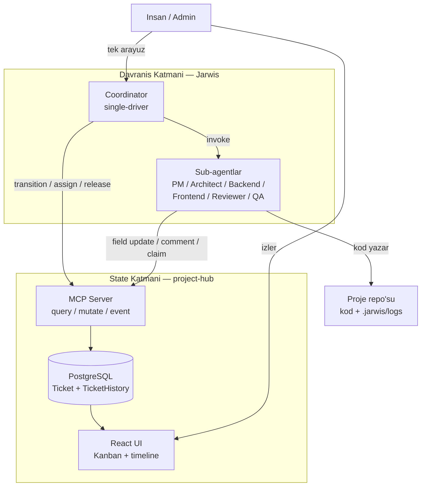
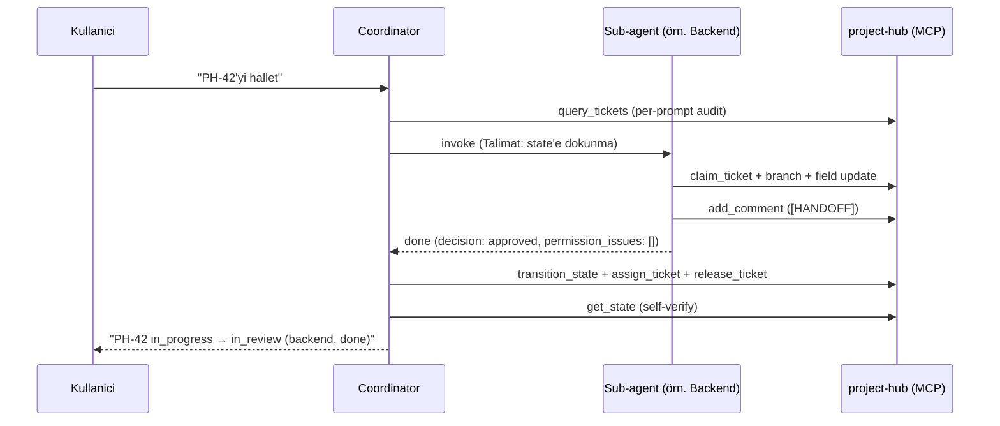
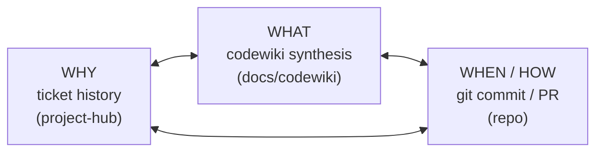

# Vizyon ve Amaç — Kontrol Altında Agentic Geliştirme

> **Bir cümlede:** project-hub (state-of-truth + hafıza + kontrol yüzeyi) ile Jarwis (kod içermeyen davranış kuralları + Coordinator-merkezli orkestrasyon) birlikte, LLM ajanlarıyla yazılım geliştirmeyi **kontrol altında, anlaşılabilir ve hafızalı** hâle getirir.

Bu doküman, bütün whitepaper setinin başlangıç noktasıdır. Amacı; problemi tanımlamak, çözümün tezini ortaya koymak, neden iki ayrı bileşen (project-hub + Jarwis) olduğunu gerekçelendirmek ve kullanıcının dört üst-hedefini özetleyerek geri kalan dokümanlara yol haritası çizmektir. Birincil okuyucu, bu sistemi ilk kez gören teknik bir izleyicidir; akış bilinçli olarak **problem → çözüm → mekanizma → kanıt** sırasında ilerler.

---

## 1. Problem: LLM ajanlarıyla geliştirme neden kontrolden çıkar

> **Özet:** Yetenekli ajanlar tek başına yeterli değildir; görünürlük, durum kalıcılığı, teknik borç takibi ve context-switch'te bağlam kaybı çözülmeden çoklu-ajan geliştirme hızla kaosa döner.

LLM ajanları kod yazabilir, test koşabilir, dosya düzenleyebilir. Ancak bir ajanı (veya birkaç ajanı) gerçek bir yazılım projesinde günlerce, haftalarca çalıştırmaya kalktığınızda dört yapısal sorun ortaya çıkar:

### 1.1 Görünürlük yok

Birden fazla ajan paralel çalıştığında "şu an kim, hangi işin, hangi fazında" sorusunun yanıtı kaybolur. Klasik proje yönetim araçları (Jira gibi) **insan kullanıcıyı varsayar**; ajanlar ancak API üzerinden ikinci sınıf entegre olur. Ajan aktivitesi, insan aktivitesi ve git aktivitesi parçalı sistemlerde dağılır — birini izlemek için terminale, diğerini izlemek için bir web arayüzüne, üçüncüsünü izlemek için `git log`'a bakmak gerekir. Tek bir birleşik tabloya bakıp "sistemin durumu nedir" diyemezsiniz.

### 1.2 Durum (state) kaybı

Bir ajan oturumu bittiğinde bağlam pencerede kalır ve buharlaşır. Sonraki oturum "nereden devam edeceğini" bilmez; ya baştan keşfeder (token israfı) ya da yanlış varsayımla ilerler. Karar gerekçeleri, yarım kalmış işler, "neden bu yaklaşımı seçtik" bilgisi hiçbir kalıcı yere yazılmamışsa, her oturum sıfırdan başlar.

### 1.3 Teknik borç gözden kaçar

Ajan bir özelliği "çalışır" hâle getirir ama implementasyon sırasında ortaya çıkan teknik borç, kısayollar, "şimdilik böyle bıraktık" notları hiçbir yerde dokümante edilmez. Bu borç, gözden kaçtıkça birikir; ne reviewer ne de sonraki ajan farkında olur.

### 1.4 Context-switch'te bağlam kaybı

Bir görevden diğerine geçişte (veya bir ajandan başka bir role devirde) hangi bilginin devredildiği belirsizdir. Ajanlar arası veri "ağızdan ağıza" geçerse — yani prompt'tan prompt'a kopyalanırsa — bilgi sızıntısı ve tutarsızlık kaçınılmazdır.

Bu dört sorun birbirini besler: görünürlük olmadan durum kaybı fark edilmez, durum kaybı teknik borcu görünmez kılar, context-switch ise birikmiş bağlamı tamamen siler.

---

## 2. Tez: Kontrol altında, anlaşılabilir, hafızalı agentic development

> **Özet:** Çözüm tek bir dev sistem değil, sorumlulukları bilinçle ayrılmış iki bileşendir — biri durumu ve hafızayı tutar, diğeri davranışı yönetir.

Tezimiz şudur: **agentic geliştirme ancak iki şeyi birbirinden ayırırsan kontrol altına alınabilir** —

1. **State, hafıza ve kontrol yüzeyi** — sistemin "ne biliyor, ne durumda" katmanı.
2. **Davranış kuralları ve orkestrasyon** — ajanların "nasıl davranır, kim sıradaki" katmanı.

Bu ayrım keyfi değil; her bileşenin değişim hızı ve doğası farklıdır. State katmanı (veritabanı, API, audit trail) sağlam, transactional ve uzun ömürlü olmalı — yazılım mühendisliği disipliniyle inşa edilir. Davranış katmanı ise hızlı evrilen, deneyle iyileşen, hatta benchmark ile optimize edilen bir kural setidir; kod değil markdown'dır, çünkü bir LLM'in talimatıdır.

İki bileşen:

| Bileşen | Rolü | Doğası |
|---|---|---|
| **project-hub** | State-of-truth + hafıza + kontrol yüzeyi | Lokal, MCP-first, Jira-vari çalışan yazılım (FastAPI + PostgreSQL + React) |
| **Jarwis** | Davranış kuralları + orkestrasyon | Kod içermeyen canonical markdown ruleset; Coordinator-merkezli |

Bu ayrımın somut faydası şudur: state katmanı bir kez sağlamca inşa edildiğinde, davranış katmanını (Jarwis ruleset'ini) deneyerek, ölçerek, geri alarak özgürce iterate edebilirsin — ve bu deneyler asla kalıcı veriyi bozmaz; çünkü tek source-of-truth project-hub'tır.



---

## 3. project-hub'ın amacı

> **Özet:** project-hub, ajanı API tüketicisi değil first-class operator yapan; insan, ajan ve git aktivitesini tek bir append-only timeline'da birleştiren, lokal çalışan bir ticket yönetim sistemidir.

project-hub'ın kendi tanımı nettir: *"Jira-vari, lokal çalışan, MCP entegrasyonu birinci sınıf vatandaş olan bir proje/ticket yönetim sistemi. Sistem admin (insan) + role-based agent'lar tarafından kullanılacak; her ticket aksiyonu, agent fazı ve git aktivitesi tek bir time-based knowledge base'de birleştirilecek."*

### 3.1 Beş kilit hedef

| Hedef | Açıklama |
|---|---|
| **MCP-first** | Ajanlar tüm ticket lifecycle'ını **minimum context maliyetiyle** yönetebilmeli |
| **Full audit trail** | Her field değişikliği, kim/ne zaman/neden bilgisiyle kalıcı |
| **Live agent visibility** | Hangi ajan şu an hangi ticket üzerinde, hangi fazda — anlık |
| **Git-as-timeline** | Branch / commit / PR aktivitesi ticket history ile interleaved akar |
| **Jira-like UX** | İnsan kullanıcı için tanıdık board + ticket detay arayüzü |

### 3.2 Neden lokal/self-hosted

İki kullanıcı sınıfı vardır: **insan admin** (session cookie + bcrypt ile auth) ve **role-based ajanlar** (MCP üzerinden bearer token ile attach). Lokal/self-hosted tercih bilinçli bir tasarım kararıdır, eksiklik değil:

- Tek admin varsayımı auth'u basitleştirir ("Tek admin, lokal — yeterli").
- Rate limit yoktur (lokal sistem).
- Docker Compose ile tek `up` komutuyla saniyelerde ayağa kalkar.
- Mobile erişim Tailscale / Cloudflare Tunnel ile host makineden sağlanır.
- Multi-tenancy / SaaS deployment açıkça **kapsam dışıdır**.

Bu sistemin teknik ayrıntıları — veri modeli, servisler, MCP araçları, [state machine ve field gate'ler](02-projecthub-mimari.md#state-machine-ve-field-gateler), permission grammar — [02-projecthub-mimari.md](02-projecthub-mimari.md) dokümanında derinlemesine ele alınır. Git, SonarQube ve frontend kontrol yüzeyi entegrasyonları ise [03-projecthub-entegrasyonlar.md](03-projecthub-entegrasyonlar.md) dokümanındadır.

---

## 4. Jarwis'in amacı

> **Özet:** Jarwis hiç kod içermez; sadece markdown'dur — ajanların davranışını şekillendiren, tek arayüz olarak Coordinator'ı koyan canonical bir kural setidir.

Jarwis'in tanımı birebir şudur: çok-agentlı bir yazılım geliştirme iş akışının **canonical kural seti**dir ve *"Hiç kod içermez; sadece markdown."* Bir framework veya kütüphane değil; LLM ajanlarının davranışını eager/lazy import edilen markdown talimat katmanıdır.

### 4.1 Üç katmanı koordine eder

```
1. Jarwis (~/Jarwis/)                — rol/is akisi tanimlari (kurallar)
2. project-hub (~/Documents/...)     — ticket/state/branch state-of-truth (MCP)
3. Proje repo'su (~/<proje>/)        — gercek kod + .jarwis/logs/<id>/<role>.md
```

### 4.2 Coordinator-merkezli single-driver mimari

Jarwis'in çekirdek kararı şudur: **Coordinator hem orchestrator hem transition driver'dır. Sub-agent state'e DOKUNMAZ; sadece işini yapar (kod, rapor, field update, comment) ve `done|blocked|rejected` raporu döner.** Coordinator, sub-agent turn'ünü kapatmadan önce state transition + assign + release yapar.

Bu mimarinin gerekçesi birebir şöyledir: *"sub-agent başına permission gate, missing tool, invalid_transition hataları tekil noktada toplanır. Sub-agent simple kalır."* Yani N rol × M hata tipi yerine, sorun **1 nokta × M hata tipi**'ne indirgenir.

Tasarım ilkeleri altı maddedir:

1. **Tek arayüz: Coordinator.** Kullanıcı sadece Coordinator ile konuşur; diğer roller asla doğrudan kullanıcıya yazmaz.
2. **Ticket = tek source of truth.** Ajanlar arası veri direkt geçmez; ticket alanları + yorumları üzerinden devredilir.
3. **Sub-agent izolasyonu.** Her rol kendi temiz context'inde çalışır, kendi tool whitelist'i ve sistem promptu vardır.
4. **Append-only log.** Her rol `.jarwis/logs/<ticket-id>/<role>.md` içine timestamp'li bölüm ekler; hiçbir geçmiş silinmez.
5. **Sıralı işleyiş.** Coordinator aynı anda yalnızca bir ticket'ı pipeline'da tutar.
6. **State-of-truth = project-hub.** Lokal kayıt yok; her transition/yorum/branch MCP üzerinden.

Enforcement davranışla değil, **tool whitelist'le** sağlanır: sub-agent `.md` dosyalarında `transition_state` / `assign_ticket` / `release_ticket` araçları fiziksel olarak yoktur. Kural ihlali "yasak" değil, "yapamaz" düzeyindedir. Jarwis'in tam anatomisi — 3 katman, roller, flow'lar, contract'lar, mode'lar, playbook'lar — [04-jarwis-ruleset.md](04-jarwis-ruleset.md) dokümanındadır.



---

## 5. Kullanıcının dört üst-hedefi

> **Özet:** Sistemin tüm tasarım kararları dört üst-hedefe hizmet eder; her biri somut mekanizmalarla [06-hedefler-derinlemesine.md](06-hedefler-derinlemesine.md) dokümanında ayrıntılandırılır.

Aşağıdaki dört hedef, hem project-hub'ın hem Jarwis'in varlık nedenidir. Burada özetlenir; her birinin somut mekanizmaları (kod yolları, gate'ler, dosya formatları) [06-hedefler-derinlemesine.md](06-hedefler-derinlemesine.md) içindedir.

### 5.1 Long-term memory & context-switch

Sistem **dört katmanlı hafıza** taşır; her katman farklı bir şeyi hatırlar:

- **project-hub ticket history + comments** — WHY katmanı; `technical_depth`, `impact_analysis`, `test_plan`, AC alanları + `[HANDOFF X→Y]` yorumları + `query_history` audit trail'i, hepsi actor-attributed.
- **`.jarwis/logs/<ticket-id>/<role>.md`** — append-only per-task; *"Asla silme/üzerine yazma yok"*, *"Outcome satırı zorunlu"*, ticket başına 5-10 KB.
- **codewiki synthesis (`docs/codewiki/`)** — WHAT katmanı; `.codemap` ile hot subsystem'leri sentez page'lere map'ler.
- **Claude Code persistent memory (`MEMORY.md` + dosyalar)** — oturumlar arası kalıcı, frontmatter'lı "point-in-time observation"lar.

Context-switch'te yeni oturum şu okuma sırasıyla "nereden devam edeceğini" bulur: per-prompt audit → son `[HANDOFF]` yorumu → `.jarwis/logs/` → codewiki → MEMORY.md. Detay: [06-hedefler-derinlemesine.md#long-term-memory](06-hedefler-derinlemesine.md).

### 5.2 Agentic dev kontrolü

Kontrol, single-driver mimarinin yanı sıra somut mekanizmalarla sağlanır: [state machine](02-projecthub-mimari.md#state-machine-ve-field-gateler) (`backlog→to_do→in_progress→in_review→in_test→done`), field gate'ler (`test_plan` olmadan `in_review→in_test` geçilemez), permission grammar, heartbeat + stale claim cron, **PARALEL YASAK** (aynı anda tek aktif sub-agent) ve escalation protokolü. Detay: [06-hedefler-derinlemesine.md#agentic-dev-kontrolu](06-hedefler-derinlemesine.md).

### 5.3 Anlaşılabilirlik

Her field değişikliği, her transition, her git event'i tek bir append-only `TicketHistory` timeline'ında **interleaved** akar — `permission_denied` event'i bile loglanır. İnsan, Jira-vari board + tek kronolojik feed üzerinden sistemin durumunu anlayabilir; Coordinator her turun sonunda `"PH-XX <old_state> → <new_state> (<role>, <decision>)"` formatında tek satırlık özet verir. Detay: [06-hedefler-derinlemesine.md#anlasilabilirlik](06-hedefler-derinlemesine.md).

### 5.4 Technical depth management

Teknik borç akışa gömülü gate'lerle yönetilir: Architect `technical_depth` + mermaid + AC yazar; Implementer `impact_analysis` + codewiki design-decisions yazar (kod + wiki aynı commit'te); Reviewer `technical_depth=validated` set eder ve codewiki sync gate eksikse **needs_revision** verir; QA `test_plan` doldurur; SonarQube post-merge best-effort tarar. Depth dokümante edilmeden ticket ilerleyemez. Detay: [06-hedefler-derinlemesine.md#technical-depth-management](06-hedefler-derinlemesine.md).

---

## 6. WHY / WHAT / WHEN üçgeni

> **Özet:** Üç katman birlikte tek bir bilgi üçgeni oluşturur — neden yapıldı, ne yapıldı, ne zaman/nasıl yapıldı.

Bu üç bileşenin birleşimi codewiki dokümantasyonunda "triangle" olarak adlandırılır:



Bu üçgenin nasıl bir araya geldiği — per-role token, ticket lifecycle kontrat yüzeyi, codewiki sync gate'leri ve `jarwis-init.sh` ile bir projeye nasıl bağlandığı — [05-entegrasyon-mimari.md](05-entegrasyon-mimari.md) dokümanının konusudur.

---

## 7. Doküman setinin yol haritası

> **Özet:** Bu whitepaper dokuz parçadan oluşur; vizyon → mimari → entegrasyon → kanıt sırasında ilerler.

| # | Doküman | İçerik |
|---|---|---|
| 00 | [00-index.md](00-index.md) | Genel bakış + okuma sırası + doküman grafiği |
| 01 | **01-vizyon-amac.md** (bu doküman) | Vizyon, problem, tez, neden iki repo, 4 hedef özet |
| 02 | [02-projecthub-mimari.md](02-projecthub-mimari.md) | project-hub: stack, veri modeli, servisler, MCP, state machine, field gate, permission |
| 03 | [03-projecthub-entegrasyonlar.md](03-projecthub-entegrasyonlar.md) | Git entegrasyonu, SonarQube, frontend kontrol yüzeyi |
| 04 | [04-jarwis-ruleset.md](04-jarwis-ruleset.md) | Jarwis: 3 katman, Coordinator single-driver, roller, flow, contract, mode, playbook |
| 05 | [05-entegrasyon-mimari.md](05-entegrasyon-mimari.md) | Jarwis↔project-hub↔repo bağlantısı, per-role token, ticket lifecycle, WHY/WHAT/WHEN, codewiki, jarwis-init |
| 06 | [06-hedefler-derinlemesine.md](06-hedefler-derinlemesine.md) | 4 hedef → somut mekanizmalar |
| 07 | [07-optimizasyon-yolculugu.md](07-optimizasyon-yolculugu.md) | Benchmark-driven optimizasyon (iter 0→9), snapshot equivalence |
| 08 | [08-sunum-iskeleti.md](08-sunum-iskeleti.md) | Slayt taslağı |

Önerilen okuma sırası: bu dokümandan sonra [02](02-projecthub-mimari.md) (state katmanı) ve [04](04-jarwis-ruleset.md) (davranış katmanı) ile iki bileşeni ayrı ayrı anla; sonra [05](05-entegrasyon-mimari.md) ile birleşimlerini gör; nihayet [06](06-hedefler-derinlemesine.md) ve [07](07-optimizasyon-yolculugu.md) ile hedeflerin kanıtını incele.

---

## İlgili dokümanlar

- [00-index.md](00-index.md) — Genel bakış + okuma sırası + doküman grafiği
- [02-projecthub-mimari.md](02-projecthub-mimari.md) — project-hub mimarisi: stack, veri modeli, MCP, state machine, field gate, permission
- [03-projecthub-entegrasyonlar.md](03-projecthub-entegrasyonlar.md) — Git, SonarQube, frontend kontrol yüzeyi
- [04-jarwis-ruleset.md](04-jarwis-ruleset.md) — Jarwis ruleset: katmanlar, Coordinator, roller, flow, contract
- [05-entegrasyon-mimari.md](05-entegrasyon-mimari.md) — Entegrasyon mimarisi: per-role token, ticket lifecycle, WHY/WHAT/WHEN, codewiki, jarwis-init
- [06-hedefler-derinlemesine.md](06-hedefler-derinlemesine.md) — Dört hedefin somut mekanizmaları
- [07-optimizasyon-yolculugu.md](07-optimizasyon-yolculugu.md) — Benchmark-driven optimizasyon yolculuğu
- [08-sunum-iskeleti.md](08-sunum-iskeleti.md) — Sunum slayt taslağı
