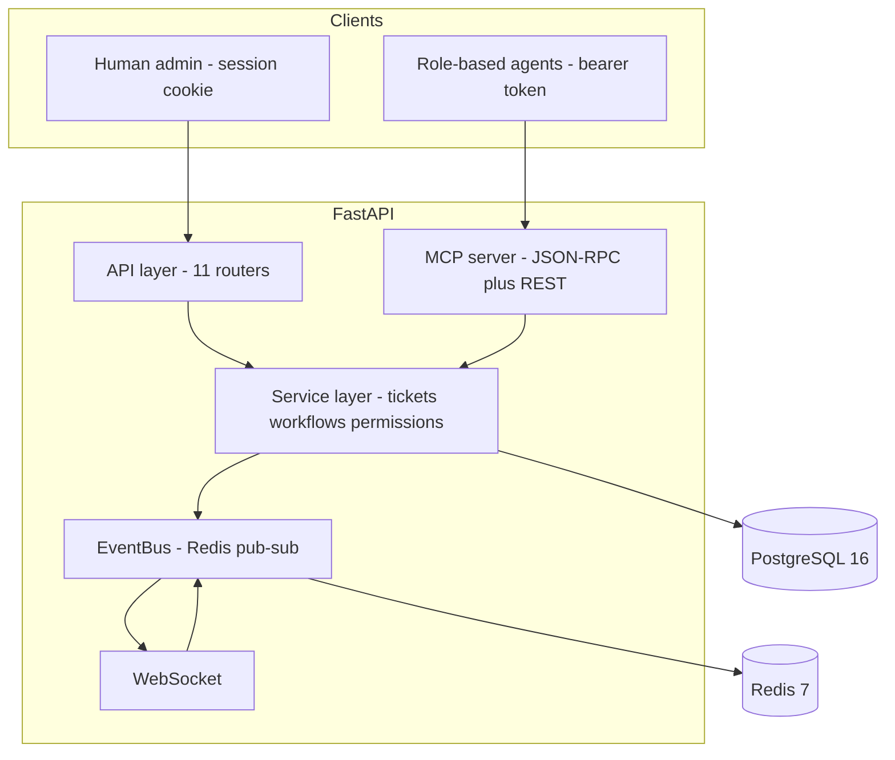
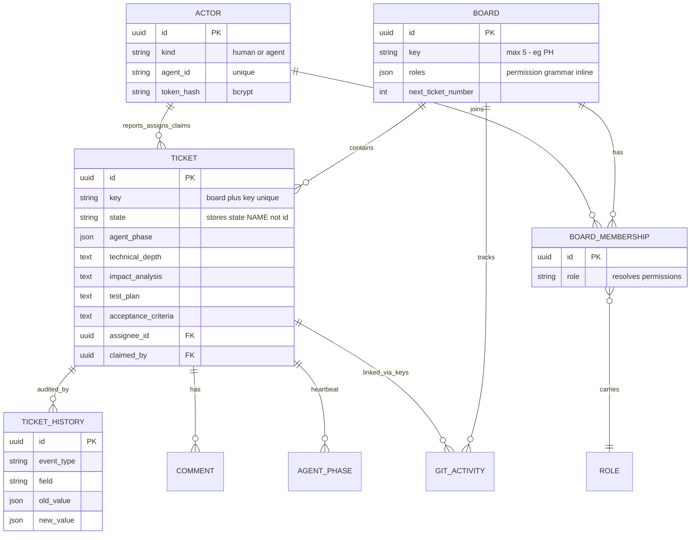
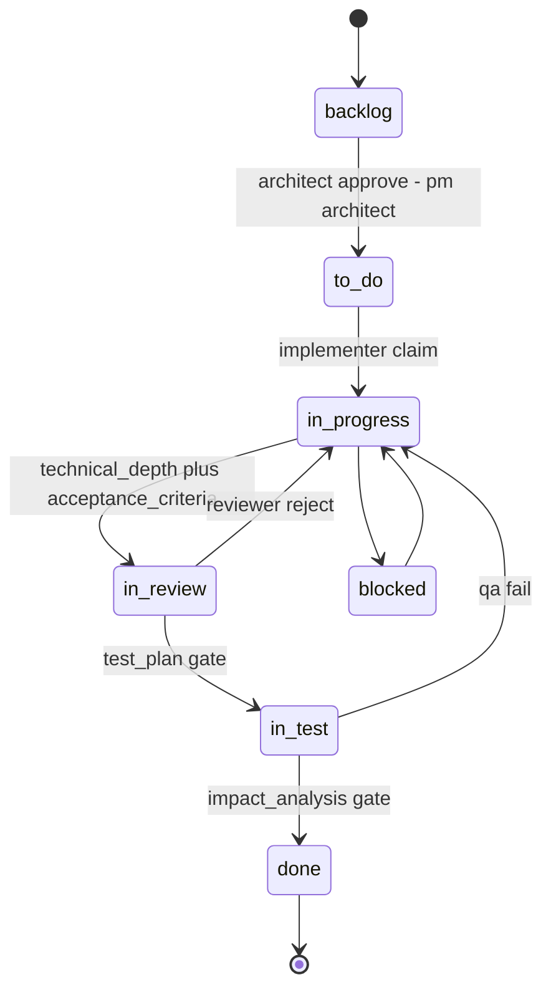

# project-hub Mimarisi — State-of-Truth Motoru

> **Bir cümlede:** project-hub, REST API, WebSocket ve agent-facing MCP server'ın *aynı* servis katmanını paylaştığı; state machine, field gate ve permission grammar'ının tek noktada yaşadığı; her mutasyonun append-only `TicketHistory`'ye immutable satır yazdığı lokal, MCP-first bir ticket yönetim motorudur — çok-agentlı bir yazılım geliştirme akışının tek "state-of-truth" kaynağı.

project-hub'ın tasarım sözleşmesi tek cümleyle özetlenebilir: ticket, agent'lar arası **tek doğruluk kaynağıdır**; agent'lar birbirine doğrudan veri geçmez, her şey ticket alanları ve geçmişi üzerinden devredilir. Bu doküman bu motorun nasıl kurulduğunu — katmanlar, veri modeli, state machine, MCP yüzeyi ve permission grammar — somut dosya yolları ve davranışlarla anlatır. Vizyonun "neden" tarafı için [vizyon ve amaç](01-vizyon-amac.md) dokümanına; bu motorun Git/SonarQube/frontend entegrasyonları için [entegrasyonlar](03-projecthub-entegrasyonlar.md) dokümanına bakın.

---

## 1. Teknoloji yığını ve katman mimarisi

> **Özet:** Tek servis katmanı üç yüzeye (REST, WebSocket, MCP) hizmet eder; iş mantığı bir kere yazılır, üç çağrı yolunda da garantili tutarlı çalışır.

project-hub, FastAPI uygulamasında (`backend/app/main.py`, title `"ProjectHub"`, description *"Local Jira-like project management with MCP-first agent integration"*) çalışan, lokal ve self-hosted bir sistemdir. Mimari net katmanlara ayrılır ve her katmanın sorumluluğu kesin sınırlıdır.

| Katman | Dizin | Sorumluluk |
|---|---|---|
| **API** | `app/api/` | 11 router: `auth`, `actors`, `boards`, `tickets`, `notifications`, `preferences`, `git`, `repositories` (PH-150), `scans` (PH-239), `mcp_server`, `websocket`. CORS + `register_exception_handlers(app)` ile servis exception'larını HTTP'ye map'ler. |
| **Service** | `app/services/` | İş mantığının tamamı: `tickets.py`, `workflows.py`, `boards.py`, `actors.py`, `history.py`, `notifications.py`, `stale_claims.py`, `sonarqube.py`. **API ve MCP aynı fonksiyonları çağırır.** |
| **DB** | `app/db/` | SQLAlchemy 2 async ORM (`models/core.py`) + Alembic migrations. Dialect-aware tipler. |
| **Events** | `app/events/` | Redis pub/sub `EventBus`. Her mutasyon `publish_ticket_event(...)` çağırır → `board:{id}` / `ticket:{id}` kanalları. |
| **MCP** | `app/mcp/server.py` | Agent-facing tool yüzeyi (JSON-RPC + legacy REST). Her rol kendi token'ı ile authenticate olur. |
| **Git** | `app/git/` | `git_poll_cron` — branch/commit/PR cache senkronizasyonu. |

Stack özeti: backend FastAPI (Python 3.12) + SQLAlchemy 2 + PostgreSQL 16 + Redis 7; frontend React 18 + Vite + Tailwind + shadcn/ui + Zustand + TanStack Query + `@dnd-kit`. **MCP server ayrı bir deployment değildir** — FastAPI içinde tek bir route grubudur.

**Sorumluluk ayrımının kanıtı:** API endpoint'i de MCP tool'u da *aynı* servis fonksiyonunu (örn. `transition_ticket_state`) çağırır. Sonuç olarak state machine ve permission gate'leri yalnızca `tickets.py` / `permissions.py`'de yaşar; üç yüzeyde (REST, WebSocket, MCP) davranış garantili tutarlıdır. Bu, çok-agentlı bir sistemde "agent başka bir yoldan kuralı atlattı" sınıfı hataları baştan elimine eder.

**Dialect-aware DB tipleri** (`models/core.py`) prod ve test arasında köprü kurar:

```python
JSON_TYPE = JSON().with_variant(JSONB(), "postgresql")
STRING_ARRAY_TYPE = JSON().with_variant(ARRAY(String), "postgresql")
```

Prod'da native Postgres JSONB/ARRAY, testte generic JSON/Uuid — aynı model kodu iki ortamda çalışır.

**Lifespan cron'ları** (`main.py`): `stale_claim_cron()` her zaman; `git_poll_cron()` (`git_refresh_enabled` + `git_poll_interval_seconds > 0` gated); `sonarqube_poll_cron()` (PH-193, `sonarqube_enabled` gated). Gate task yaratımında lifespan'de uygulanır — cron flag'i kendi içinde tekrar kontrol etmez.



---

<a id="veri-modeli"></a>
## 2. Veri modeli

> **Özet:** Dokuz çekirdek entity; ticket merkezde, etrafında actor/board/membership (kimlik+yetki), history/comment (audit+iletişim) ve git/phase cache (timeline) yer alır.

Tüm primary key'ler `uuid_pk()` (UUID4); `TimestampMixin` `created_at`/`updated_at` taşır. Önemli istisna: `TicketHistory` immutable olduğu için yalnızca `created_at` taşır, update edilmez.



**Tablo tablo sorumluluklar:**

- **Actor** — kimlik. `kind` (human|agent), `display_name`, `agent_id` (unique), `agent_role_hint`, `token_hash` (bcrypt), `is_active`. `agent_role_hint` agent_id prefix'inden parse edilir ama **otoriter değildir** — gerçek yetki `BoardMembership.role`'dan gelir.
- **Board** — proje konteyneri. `key` (≤5 char, unique, örn. "PH"), `roles` (JSON — **permission grammar burada inline saklanır**), `next_ticket_number` (seri ticket key üretimi), `workflow_id` (legacy), `repos_path` (PH-228, HOST path), `sonarqube_project_key` (PH-193).
- **Ticket** — merkezi entity. `key` (`uq_ticket_board_key` board+key unique), `state` (**state ismini saklar, id'sini değil**), `agent_phase` (JSON), `assignee_id`/`reporter_id`/`claimed_by`, `epic_id` (self-FK), gate alanları `acceptance_criteria`/`technical_depth`/`impact_analysis`/`test_plan`, bug alanları `steps_to_reproduce`/`expected_behavior`/`actual_behavior`, `claimed_at`, `deleted_at` (soft delete). Index: `ix_tickets_board_state`.
- **BoardMembership** — yetkinin temeli. `board_id`+`actor_id`+`role`, `uq_board_actor` unique. Permission lookup'ı bu tablodan başlar.
- **Role** — **ayrı tablo değil**; roller `Board.roles` JSON'unda inline tutulur (bkz. §6). Permission listesi her rol için bu JSON'dan çekilir.
- **Workflow / BoardWorkflow** — state machine config. `Workflow.states` ve `transitions` JSON column'lar. `BoardWorkflow` junction (PH-34), `uq_board_active_workflow` **partial unique index** (`postgresql_where="is_active = true"`): board başına en fazla 1 aktif, N inactive workflow.
- **TicketHistory** — append-only audit (bkz. §7). `event_type`, `field`, `old_value`/`new_value` (JSON), `event_metadata` (DB column adı `"metadata"`). Index `ix_ticket_history_ticket_created`. TimestampMixin yok.
- **Comment** — insan/agent iletişimi. `ticket_id`+`author_id`+`body`+`edited_at`.
- **GitActivity / GitCommit** (PH-150/152/221) — git cache. `Repository` (board 1:N, `slug` per-board unique), `GitCommit` (`uq_git_commit_repo_sha`, `is_conventional`/`commit_type`/`ticket_keys`), `GitCommitFile`, `GitCommitTicket` (junction, dedupe gate).
- **AgentPhase** — canlı heartbeat. **Ayrı tablo değil**; `Ticket.agent_phase` JSON column'unda tutulur (`{phase, message, ts}`).

> **Doc/kod farkı (dürüst not):** `docs/system_design.md` ER diyagramı ayrı `ROLE`, `GIT_ACTIVITY`, `AGENT_PHASE` tabloları gösterir; gerçek implementasyon roller `Board.roles` JSON'unda, `agent_phase` `Ticket` üzerinde JSON column, git verisi `GitCommit`/`GitActivity` cache tablolarında tutar. Yukarıdaki ER diyagramı mantıksal ilişkiyi verir; fiziksel layout JSON-inline'dır.

---

<a id="state-machine-ve-field-gateler"></a>
## 3. State machine ve field gate'ler

> **Özet:** Bir transition dört kademeyi sırayla geçmek zorundadır — edge var mı, actor yetkili mi, permission var mı, field gate dolu mu — ve her kademe kendine özgü bir hata fırlatır.

State machine `defaults.py` (config) ve `tickets.py` (enforcement) arasında yaşar. **7 state** (`DEFAULT_STATES`): `backlog` (is_initial), `to_do`, `in_progress`, `blocked`, `in_review`, `in_test`, `done` (is_terminal).



**İzinli geçişler** (`DEFAULT_TRANSITIONS`): `backlog→to_do` (pm,architect), `to_do→in_progress`, `in_progress→{blocked,in_review}`, `blocked→in_progress`, `in_review→{in_progress,in_test}`, `in_test→{in_progress,done}`, ve wildcard `{"from":"*","to":"done","allowed_roles":["pm","admin"]}`.

### allowed_roles override mantığı

`tickets.py` geçiş kontrolünü üç fonksiyonla zincirler: `_transition_allowed_by_active_workflow` → `_transition_matches` (`from` ∈ `{from_state,"*"}` ve `to` eşit) → `_actor_satisfies_transition`. Kritik tasarım kararları:

- **"claim = assignee" eşitliği.** `allowed_roles` içinde `"assignee"` varsa, claim sahibi de assignee sayılır: `ticket.assignee_id == actor.id or ticket.claimed_by == actor.id`. Bu, agent'ların `claim_ticket` alıp `assign_ticket`'ı atlamasından doğan permission_denied/invalid_transition zincirini çözer (kodda FN-2 referansı).
- **admin bypass.** `"admin"` rolü `allowed_roles` guard'ını bypass eder (`_admin_transition_allowed` — edge'in var olması yeter), ama downstream `state.transition:to_*` permission'ı yine çalışır.
- **Auto-release.** `to_state ∈ {"done","blocked"}` ise `claimed_by`/`claimed_at` otomatik null'lanır.

### Field gate'ler

Field gate'ler `field_gates.required_fields` (+ `exempt_ticket_types`) içinde tanımlıdır. Mantık (`_missing_gate_fields`): ticket type exempt değilse, her required field için `None` veya boş-string ise eksik sayılır → `FieldGateNotMet` raise.

| Geçiş | Zorunlu field | Exempt | Gerekçe |
|---|---|---|---|
| `in_progress → in_review` | `technical_depth`, `acceptance_criteria` | epic | technical_depth = implementasyonda ortaya çıkan teknik borç; başlanmamış işte yazılamaz |
| `in_review → in_test` | `test_plan` | epic | QA'nın neyi test edeceği review'dan önce netleşmeli |
| `in_test → done` | `impact_analysis` | epic | Done'dan önce etki/regresyon analizi zorunlu |

> **Workflow JSON'da, kod değil.** State/transition/field_gate konfigürasyonu `Workflow.states`/`transitions` JSON column'larındadır. PH-35 (`a23c92beba1b`) field_gates'i hardcode'dan workflow JSON'una taşıdı; PH-97 board başına private clone üretti; PH-79 partial-unique aktif workflow getirdi. Sonuç: her board kendi state machine'ini **kod değişmeden** özelleştirebilir.

**Üç kademeli geçiş kontrolü** — bir transition sırayla şunları sağlamalı, aksi halde belirtilen exception raise olur:

1. Workflow'da **edge** olarak mevcut → yoksa `InvalidTransition`
2. Actor `allowed_roles`/claim/admin testini geçer → geçemezse `PermissionDenied`
3. `state.transition:to_<state>` **permission**'ına sahip → yoksa `PermissionDenied`
4. **Field gate**'ler dolu → değilse `FieldGateNotMet`

> **Bilinen tuzak:** PM'in `state.transition:*` wildcard'ı, workflow'un per-transition `allowed_roles=[assignee]` kısıtını **override etmez**. Ayrıca bir transition hiç `allowed_roles` taşımıyorsa engine herkesi reddeder → board kilitlenir; `python -m app.cli repair_workflow --board <KEY>` ile onarılır (PH-168). Workaround: önce assignee=PM set et, transition yap, sonra reassign.

---

## 4. MCP server ve tool katalog

> **Özet:** İki transport yüzeyi (legacy REST + JSON-RPC 2.0) tek dispatch fonksiyonuna iner; write tool'ları default minimal cevap döner, token bütçesi birinci sınıf bir tasarım kaygısıdır.

MCP katmanı tek bir router'da yaşar (`backend/app/mcp/server.py`, `APIRouter(prefix="/mcp")`). Tüm tool tanımları ve dispatch bu dosyadadır — `app/mcp/tools/__init__.py` pratikte boştur (1 satır), katalog tamamen `server.py`'deki `TOOLS: list[ToolDescription]` listesidir.

**İki transport, tek dispatch:**

- **Legacy REST:** `GET /mcp/tools` (katalog) + `POST /mcp/call/{tool_name}` — ad-hoc curl/agent kullanımı için.
- **MCP JSON-RPC 2.0:** `POST /mcp` — Claude Code'un native protokolü. `initialize → tools/list → tools/call`, `protocolVersion: "2024-11-05"`, `serverInfo: {name: "project-hub", version: "1.0.0"}`.

Her iki route da `_dispatch_tool(tool_name, payload, actor, session)`'a iner → "behavior, permissions, and history writes are identical regardless of caller". Dispatch dev bir `if/elif tool_name == ...` zinciridir; her branch ilgili `app.services.*` fonksiyonunu çağırır, Pydantic input modeliyle validate eder.

> **JSON-RPC inceliği (Coordinator için kritik):** `id` alanı yoksa istek notification kabul edilir ve **202 Accepted** döner, sonuç yok. "id field'ını unutursan 202 dönüp boşa gider" tuzağının kaynağı budur.

### Tool katalog

**Read tools (permission'sız — board membership yeterli):**

| Tool | Amaç |
|---|---|
| `list_boards` | Görünür board'ları listele |
| `get_board` | Board detayı, roller, workflow |
| `query_tickets` | Compact projection (`board_id`, `state`, `limit` 1-100, default 20) |
| `get_ticket` | UUID/key ile tek ticket (full payload) |
| `get_state` | Coordinator self-verify için ~200 char probe |
| `get_ticket_slice` | Caller'ın seçtiği field subset'i |
| `query_history` | Aktivite zaman çizelgesi |
| `subscribe_events` | Real-time event stream (SSE — JSON-RPC üzerinden değil) |

**Write tools (permission gate'li):** `create_ticket` (`ticket.create`), `update_ticket` (`ticket.update_field`), `assign_ticket` (`ticket.assign`), `transition_state` (runtime'da `state.transition:*`), `add_comment` (`comment.add`), `delete_ticket` (`ticket.delete`, soft), `claim_ticket` (`ticket.claim`), `release_ticket`, `update_agent_phase` (`ticket.claim` — heartbeat), `create_branch_for_ticket` (`ticket.update_field`), `link_pr` (`ticket.update_field`).

**Workflow yönetim tools (admin/workflow.edit):** `create_workflow`, `update_workflow`, `add_transition`, `delete_transition`, `set_field_gates`, `activate_workflow`, `ensure_board_workflow` (PH-97, idempotent board-private kopya), `delete_workflow` (PH-102, 4 guard), `delete_state` (PH-106, 3 guard + cascade).

**Hata modeli — agent recovery için yapılandırılmış.** Domain hataları (`PermissionDenied`, `NotFound`, `InvalidTransition`, `AlreadyClaimed`, `FieldGateNotMet`) JSON-RPC internal error değil, **MCP tool-level error** olarak döner (`isError: True`). `_domain_error_detail` structured detail çıkarır: `allowed`, `missing_fields`, `from_state`, `to_state`, `required`, `have`. Böylece agent `invalid_transition`'da ara state'i, `field_gate_not_met`'te eksik field'ı programatik çözer.

### Minimal vs verbose response — token mühendisliği

Write tool'ları default **minimal JSON** döner; her birinde `verbose: bool = False` flag'i full payload'a geçer. Somut şekiller:

```text
update_ticket      → {ok, id, state, updated_fields}
assign_ticket      → {ok, id, assignee_id}
transition_state   → {ok, id, from_state, to_state}
claim_ticket       → {ok, id, claimed_by, claimed_at, branch_name, state}
release_ticket     → {ok, id, state}
update_agent_phase → {ok, id, phase, ts}
```

Mantık: agent akışında write sonrası tipik olarak sadece "oldu mu + yeni state" gerekir; full payload (~6K bytes) gereksiz token yakar.

<a id="token-budget-projection"></a>
### get_state ve get_ticket_slice projection tool'ları

İkisi de token-budget projection araçları:

- **`get_state`** — full ticket'ı okur ama yalnız `{id (=key), state, assignee_id, claim_owner, branch_name, last_phase, last_heartbeat_at, updated_at}` döner (~200 char). Amaç: Coordinator self-verify — "state beklenen yere geçti mi, assignee doğru mu, claim release oldu mu". `last_phase`/`last_heartbeat_at` `agent_phase` JSON blob'undan çekilir.
- **`get_ticket_slice`** — her zaman skeleton `{id, key, state}` döner; `include=[...]` ile field eklenir. Whitelist `_SLICE_ALLOWED_FIELDS` (26 field) bilinmeyen isimleri sessizce atlar — "prevents accidentally cloning the whole payload and acts as a documented contract of what's safe to project". Description: "5-10x smaller than get_ticket".

Ölçülen kazanç: Coordinator self-verify `get_ticket` (5×6K bytes) yerine `get_state` (5×200 bytes) ile token'ı ~30x azalttı. Bu optimizasyon yolculuğunun detayı için [optimizasyon yolculuğu](07-optimizasyon-yolculugu.md) dokümanına bakın.

---

<a id="permission-grammar"></a>
## 5. Permission grammar ve per-role token izolasyonu

> **Özet:** Kompakt bir `resource.action:scope` grammar'ı 8 rolü ayırır; izolasyon iki katmanlıdır — Claude Code tarafında namespace whitelist, server tarafında token→actor→role→permission.

Grammar formatı: `<resource>.<action>[:<scope>]`. Board-scoped'tur, `BoardMembership.role`'dan resolve edilir. `KNOWN_PERMISSIONS` top-level capability şemasıdır (`*`, `ticket.create`, `ticket.claim`, `state.transition:*`, `workflow.edit`, ...); scoped permission'lar `_permission_matches`'de **dinamik** match'lenir, listelenmesi gerekmez.

**Resolution akışı** (`require_permission(actor, board, required, resource)`): actor'ın board membership'lerinden roller toplanır → `role_permissions(board, role)` ile `Board.roles` JSON'undan permission listesi çekilir → herhangi biri match ederse geçer, yoksa `PermissionDenied(required, have=...)`.

**Match kuralları** (`_permission_matches`):

- `"*"` veya tam eşleşme → izin.
- `ticket.update_field` → herhangi `ticket.update_field:<field>` karşılar.
- `state.transition:*` → her `state.transition:to_<state>` karşılar (PM wildcard).
- `:if_assignee` suffix → `assignee_id == actor.id OR claimed_by == actor.id` ise izin (claim=assignee eşitliği burada da).
- `ticket.update_field:f1,f2` → virgüllü field-set; istenen field set içindeyse izin.

**Default roller** (`DEFAULT_WEB_ROLES`, 8 rol):

| Rol | Permission örneği |
|---|---|
| **admin** | `*` (tek wildcard sahibi) |
| **pm** | `ticket.create`, `ticket.delete`, `ticket.assign`, `ticket.update_field`, `state.transition:*`, `epic.manage` — claim YOK |
| **architect** | `ticket.create`, `ticket.update_field`, `state.transition:to_in_review` — `:*` YOK |
| **backend_dev / frontend_dev** | `ticket.claim`, `git.create_branch`, `ticket.update_field:if_assignee`, transition'lar `via if_assignee` — `ticket.create` YOK |
| **reviewer** | `ticket.update_field:technical_depth`, `state.transition:to_in_progress` (reject) + `to_in_test` (approve) — claim/branch YOK |
| **qa** | `ticket.claim`, `git.create_branch`, `ticket.update_field:impact_analysis,test_plan`, `state.transition:to_in_review`/`to_in_progress`/`to_done` |
| **orchestrator** | `ticket.create`, `ticket.assign`, `comment.add` — minimal write yüzeyi |

**Auth: iki yol.** Token'lar bcrypt ile (default 12 rounds) hash'lenip saklanır (`hash_token`/`verify_token`, `core/security.py`); plaintext DB'de tutulmaz. Agent yolu Bearer token (`Authorization: Bearer <token>`, tüm MCP endpoint'leri `Depends(current_actor)`); admin yolu session-based. `/api/auth/me` authenticate actor'ı + tüm board membership'lerini döner — identity smoke test'in temeli (display_name → `jarwis-<role>` doğrulaması).

**Per-role token izolasyonu** (`.mcp.json`) — iki katmanlı:

1. **Claude Code tarafı:** 6 ayrı HTTP MCP server entry (`project-hub-pm`, `-architect`, `-reviewer`, `-qa`, `-backend`, `-frontend`), hepsi `http://localhost:8000/mcp`'ye gider ama farklı Bearer token taşır. Her sub-agent yalnız kendi `mcp__project-hub-<role>__*` namespace'ini görür.
2. **Server tarafı:** token → `jarwis-<role>` actor → `BoardMembership.role` → permission grammar.

`.mcp.json` `.gitignore`'dadır, `jarwis-init.sh` tarafından `~/.jarwis/tokens.json`'dan üretilir. Bu izolasyonun nasıl Jarwis ruleset'ine bağlandığı için [entegrasyon mimarisi](05-entegrasyon-mimari.md) dokümanına bakın.

> **İki ayrı permission sistemi (karıştırma):** (1) board permission grammar (project-hub API yetkisi), (2) Claude Code tool whitelist (`.claude/agents/*.md` + `settings.json` — dosya/MCP erişimi). Git endpoint'leri (PH-149) yeni board-permission string'i getirmedi; mevcut `board.edit` (admin) / board-member (read) gate'lerine bağlandı; `/git/refresh` hybrid auth (Bearer admin VEYA `X-Git-Refresh-Token` shared secret, `hmac.compare_digest`).

---

## 6. Append-only TicketHistory ve audit trail

> **Özet:** Her servis mutasyonu immutable bir history satırı + bir Redis event üretir; ticket geçmişi asla silinmez veya güncellenmez, security için `permission_denied` bile loglanır.

`Ticket` source-of-truth ise `TicketHistory` onun *zaman boyutudur*. Her mutasyon servis fonksiyonu `write_history(...)` çağırır:

| Servis fonksiyonu | event_type |
|---|---|
| `create_ticket` | `created` |
| `update_ticket` | `field_changed` (field başına ayrı satır, `_json_safe` ile UUID/date serialize) |
| `assign_ticket` | `assigned` / `unassigned` |
| `transition_ticket_state` | `state_changed` |
| `claim_ticket` / `release_ticket` | `claimed` / `released` |
| `update_agent_phase` | `phase_updated` |
| `delete_ticket` | `deleted` |

Satırlar **asla silinmez veya update edilmez** — `TicketHistory`'de TimestampMixin yoktur, sadece immutable `created_at`. Git event'leri (`git_branch_created`, `git_pr_merged`, `git_pr_linked`) de aynı tabloya yazılır → UI tek kronolojik feed gösterir (branch create → phase → commit → state change → PR merged → admin comment sıralı akar). Bu **interleaved timeline**, insan + agent + git aktivitesini tek knowledge base'de birleştiren çekirdek fikirdir (bkz. [WHY/WHAT/WHEN üçgeni](05-entegrasyon-mimari.md)).

**Stale claim koruması:** `stale_claim_cron` (timeout `CLAIM_TIMEOUT_SECONDS = 300s = 5dk`) heartbeat'siz claim'i release ederken history'ye `reason: "stale_claim_timeout"` yazar. Bu, ölen/kaybolan bir agent'ın ticket'ı sonsuza kadar kilitlemesini önler.

**Event akışı:** Her mutasyon ayrıca `publish_ticket_event(history, ticket, actor)` ile `EventBus`'a düşer → `board:{id}` / `ticket:{id}` Redis kanalları → WebSocket / SSE subscriber'lar → frontend React Query invalidation. Akış: `Service → EventBus.publish() → Redis Channel → WS → Frontend`.

---

## 7. Migration kronolojisinden özelliklerin evrimi

> **Özet:** Şema, nullable column + backfill + back-compat property pattern'iyle production veriyi bozmadan büyür — 1:1→1:N repo göçü buna en iyi örnek.

Migration zinciri özellik evrimini doğrudan anlatır:

1. **Temel:** `0001` initial_schema → `0002` `technical_depth` column → `0003` `branch_name` → `0004` notifications → `f53394ff48bb` UserPreference (email).
2. **Workflow esnekliği:** PH-34 (`2e0ab0aa83ce`) board_workflows junction → PH-35 (`a23c92beba1b`) field_gates'i workflow JSON'una taşıdı → PH-79 (`0ff08d26f630`) board_workflow unique → partial index `is_active=true` → PH-97 (`0005`) board başına shared default workflow clone.
3. **Git/Sonar dalgası:** PH-150 (`0006`) repositories tablosu → PH-152 (`0007`) git cache → PH-193 (`0008`) SonarQube metric + `boards.sonarqube_project_key` → PH-221 (`0009`) repo **1:1→1:N** (slug/name/is_primary) → PH-228 (`0010`) `Board.repos_path` HOST path → PH-239 (`e3a479aa5c01`) sonar_scan_jobs lifecycle → PH-246 (`b1468dc15870`) per-repo Sonar project keys.

**Göç disiplini:** Zincir additive ve geri-uyumludur — nullable column + backfill + back-compat property (`primary_repository`, `primary_sonarqube_metric` mapped olmayan property'ler). Bu, canlı KIM/PH board'ları için destructive olmayan göç garantisidir. Git ve SonarQube entegrasyonlarının detayları için [entegrasyonlar](03-projecthub-entegrasyonlar.md) dokümanına bakın.

---

## 8. Özet — neden bu motor "state-of-truth"

1. **Tek servis katmanı, üç yüzey.** REST/WebSocket/MCP aynı fonksiyonları çağırır → state machine ve permission tek noktada → garantili tutarlılık.
2. **Ticket = source-of-truth + append-only audit.** Her mutasyon immutable history satırı + Redis event; agent'lar arası doğrudan veri akışı yok.
3. **Workflow JSON'da, kod değil.** Board başına private clone + partial-unique aktif workflow → kod değişmeden özelleştirme.
4. **"claim = assignee" eşitliği.** Permission grammar ve workflow gate, claim sahibini assignee sayar → otonom agent deadlock'unu kapatır.
5. **Üç/dört kademeli geçiş kontrolü.** Edge → actor → permission → field gate, sırayla `InvalidTransition`/`PermissionDenied`/`FieldGateNotMet`.
6. **Token bütçesi birinci sınıf tasarım kaygısı.** Minimal response, `get_state`, `get_ticket_slice` → ~30x token tasarrufu.
7. **Additive, geri-uyumlu evrim.** Nullable + backfill + back-compat property → production veriyi bozmadan göç.

---

## İlgili dokümanlar

- [00 — Genel bakış ve okuma sırası](00-index.md)
- [01 — Vizyon ve amaç](01-vizyon-amac.md)
- [03 — project-hub entegrasyonları (Git, SonarQube, frontend)](03-projecthub-entegrasyonlar.md)
- [04 — Jarwis ruleset](04-jarwis-ruleset.md)
- [05 — Entegrasyon mimarisi (token izolasyonu, lifecycle, WHY/WHAT/WHEN, codewiki)](05-entegrasyon-mimari.md)
- [06 — Hedefler derinlemesine](06-hedefler-derinlemesine.md)
- [07 — Optimizasyon yolculuğu (benchmark-driven)](07-optimizasyon-yolculugu.md)
- [08 — Sunum iskeleti](08-sunum-iskeleti.md)
