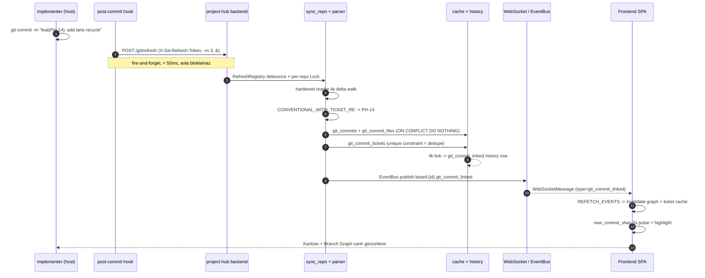

# project-hub Entegrasyonları — Görünürlük ve Kalite

> **Bir cümlede:** project-hub'ın Git, SonarQube ve canlı frontend entegrasyonları, çok-agentlı bir geliştirme akışını insan için *görünür*, *denetlenebilir* ve *kalite-ölçülebilir* kılar — backend hiçbir zaman repo'ya yazmadan, scanner çalıştırmadan, hata durumunda bloklamadan.

Bu doküman, [project-hub mimarisi](02-projecthub-mimari.md) üzerine kurulan üç dış-dünya entegrasyonunu anlatır: kodun *ne zaman/nasıl* değiştiğini gösteren **Git katmanı**, agent-üretimi kodun *teknik borcunu* ölçülebilir kılan **SonarQube katmanı** ve bütün bunları insanın gözlemleyip yönettiği **frontend kontrol yüzeyi**. Ortak tema basittir: agentic development'ı bir kara kutu olmaktan çıkarıp, her adımı kanıta dayanan bir cam kutuya dönüştürmek. Bu hedeflerin nasıl somutlaştığı [hedefler derinlemesine](06-hedefler-derinlemesine.md) dokümanında ayrıca işlenir.

---

## 1. Tasarım felsefesi: read-only, never-500, cache-first

> **Özet:** İki entegrasyon da aynı üç ilkeyle yazıldı — backend repo'ya yazmaz, scanner çalıştırmaz, hata fırlatmaz; hatada boş/degrade sonuç döner ki agentic pipeline asla bloklanmasın.

Hem Git hem SonarQube entegrasyonu, project-hub'ın "kanıt katmanı" rolünü oynar. Çok-agentlı akışın üç kanıt ekseni şöyle ayrışır:

| Eksen | Kaynak | Cevapladığı soru |
|---|---|---|
| **Neden** (WHY) | ticket (project-hub) | Bu değişiklik niye yapıldı? |
| **Ne zaman / nasıl** (WHEN/HOW) | git commit + branch graph | Hangi commit, hangi branch, kim, ne zaman? |
| **Ne** (WHAT) | codewiki | Sistem şu an ne yapıyor? |

Bu üçgenin ([WHY/WHAT/WHEN üçgeni](05-entegrasyon-mimari.md)) Git ayağı, salt-okunur ve savunma-derinlikli bir mimariyle gerçeklenir. Üç ilke tüm path'lerde geçerlidir:

1. **Read-only** — Backend hiçbir zaman write-side git çağrısı yapmaz; commit, branch, merge işlemlerini yalnızca Implementer/Coordinator host tarafında yürütür. Entegrasyon yalnızca okur ve cache'ler.
2. **Never-500** — Force-push, kayıp repo, bozuk JSON, erişilemeyen SonarQube gibi durumlarda istisna fırlatılmaz; boş veya degrade sonuç döner. Pipeline bir entegrasyon arızası yüzünden hiç durmaz.
3. **Cache-first** — Sorgu zamanında git subprocess çalıştırılmaz; sorgular önceden senkronize edilmiş veritabanı cache'i üzerinden koşar.

---

## 2. Git entegrasyonu

> **Özet:** Tek bir hardened reader'dan geçen salt-okunur git I/O, conventional commit'leri otomatik ticket'a bağlar; sync + webhook çift-gözlemcisi unique constraint ile dedupe edilir.

### 2.1 Hardened read-only reader

Tüm git I/O tek bir savunma-derinlikli okuyucudan (`backend/app/git/reader.py`) geçer. Güvenlik katmanları üst üste binmiştir:

- **Path allowlist** — `_validate_under_root`, `realpath` ile yolu çözer; `repos_root` (`/repos`) altında değilse `RepoPathOutsideAllowlist` fırlatır. Symlink ile dışarı kaçma denemesi burada yakalanır.
- **Env hardening** — Her çağrıda `GIT_CONFIG_NOSYSTEM=1`, `GIT_CONFIG_GLOBAL=/dev/null`, izole bir `HOME` (`tempfile.mkdtemp(prefix="git-noconfig-")`) ve `GIT_TERMINAL_PROMPT=0` set edilir. Host'un git config'i hiçbir biçimde devreye girmez.
- **Per-call `-c` flag'ları** (`_SAFE_CONFIG_FLAGS`) — `core.fsmonitor=false`, `core.pager=cat`, `protocol.file.allow=never`. Bunlar `repo.git._persistent_git_options`'a atanır ve **her** git subprocess'ine enjekte edilir. `diff.external` saldırı yüzeyi `--no-ext-diff` ile kapatılır (boş string set etmek `git`'i `""` exec etmeye zorladığından kasıtlı kullanılmaz).
- **Async + cap** — `aopen_repo`, `awalk_commits`, `acommit_files`, `adiff_text`, `arange_diff` wrapper'ları `asyncio.to_thread` ile event loop'u bloklamaz. Diff payload'ları `git_diff_max_bytes` (default 1 MiB) ile cap'lenir ve UTF-8 boundary'de `_utf8_safe_trim` ile güvenli kesilir.

### 2.2 Commit ↔ ticket linkage — conventional commit parse

`parser.py` üç regex tutar:

```
TICKET_KEY_RE              = \b([A-Z]{2,5}-\d+)\b
CONVENTIONAL_COMMIT_RE     # feat|fix|refactor|test|docs|chore|perf|ci|build|revert + (scope)? + !?
CONVENTIONAL_WITH_TICKET_RE  # feat(PH-14): ...  → scope'tan ticket'ı yakalar
```

`expected_branch_name(key, title)` canonical branch ismini üretir: `<key-lower>-<slug>` (50 karakterde kesilir). Bir Implementer `feat(PH-14): describe change` formatında commit attığında, ticket key'i otomatik olarak `PH-14`'e bağlanır — bu, [MCP disiplini](02-projecthub-mimari.md) §2.3'teki conventional commit zorunluluğunun görünür enforcement'ıdır.

### 2.3 Sync servisi — cache doldurucu

`sync_repo(session, board, repo)` ana entry-point'tir. Akış şöyledir:

1. Repository row'u çöz, hardened reader ile aç.
2. `git_branches` upsert et (kaybolanları sil).
3. `last_synced_sha`'dan delta walk yap. Force-push'ta tam backfill'e düşer (`git_backfill_limit` default 2000).
4. Her yeni commit için `git_commits` + `git_commit_files` yaz (`INSERT ON CONFLICT DO NOTHING` — idempotent).
5. Her ticket key için `git_commit_tickets` yaz (unique constraint = dedupe gate).
6. İlk link'te `git_commit_linked` history row'u + EventBus publish.

Tüm yol write-side git çağırmaz; force-push / missing repo / git error içeride yutulur, `SyncResult` her zaman exception'sız döner.

### 2.4 Çift gözlemci dedupe

Webhook ve sync aynı commit'i farklı zamanlarda gözlemleyebilir. `_linkage.py` içindeki `ensure_commit_ticket_link`, `git_commit_tickets(commit_id, ticket_id)` unique constraint'ini ortak dedupe gate olarak kullanır — hangi gözlemci önce görürse history'i o yazar, ikincisi no-op olur. Webhook ilk gözlemci olduğunda minimal bir stub commit yaratır (`parents=[]`, dosyasız); sonraki sync `enrich_commit_row` ile authoritative kolonları (`_ENRICHABLE_COLUMNS`) doldurur. Stub'ın "0 file row" taşıması, "sync henüz koşmadı" sinyalidir.

### 2.5 Webhook — GitHub push / PR / delete

`webhook.py`, HMAC-SHA256 imza doğrulaması yapar (`verify_github_signature`). Davranışlar:

| Event | History |
|---|---|
| Push (conventional) | `git_commit_linked` |
| Push (non-conventional) | `git_commit_invalid_format` (örnek format mesajı: `feat(PH-14): describe change`) |
| PR açma/güncelleme | `git_pr_linked` / `git_pr_updated` |
| PR merge | `git_pr_merged` (+ ticket `in_review/in_test/done` dışındaysa uyarı history'si) |
| PR close | `git_pr_closed` |

Merge + delete'te `branch_name` temizlenir.

### 2.6 Post-commit hook refresh ve debounce

Cache'in tazeliğini bir host post-commit hook'u tetikler. `refresh.py` içindeki `RefreshRegistry` in-process bir singleton'dır; per-repo `asyncio.Lock` + monotonic debounce (`should_coalesce`) tutar. `POST /git/refresh` (anlık) ve `git_poll_cron` (periyodik catch-up, `git_poll_interval_seconds`) aynı registry'i paylaşır, böylece bir repo asla eşzamanlı sync'lenmez.

Host hook'u fire-and-forget tasarlanmıştır — commit latency'sini hiç artırmaz:

```bash
curl -fsS -m 3 -X POST \
  -H 'X-Git-Refresh-Token: <secret>' \
  http://localhost:8000/git/refresh &   # arka-plan subshell
# || true ile commit asla bloklanmaz; hook latency < 50ms
```

Secret, 48-hex (`secrets.token_hex(24)`) olarak üretilir, `board.roles["refresh_secret"]`'te saklanır; `install-git-hook.sh` idempotent'tir. Worktree'ler `git rev-parse --git-common-dir` ile paylaşılan hook setini bulur.

### 2.7 Multi-repo / per-board destek

Bir board 0..N repo barındırabilir; tam biri `is_primary`'dir (`repositories.py`):

- İlk eklenen otomatik primary olur; primary silinirse en eski (`created_at ASC`) terfi eder.
- `resolve_repository(selector)`: `None` → primary (`RepoNotConfigured` 409); aksi halde UUID veya slug match (`NotFound` 404).
- `set_primary`, demote → flush → promote sırasıyla `uq_repository_one_primary` partial index'ini ihlal etmeden çalışır.

**HOST ↔ container path** ayrımı kritiktir (`repo_paths.py`). `Board.repos_path` HOST yolunu tutar (örn. `/Users/huseyinkanat/Documents/kims`); `to_container_path`, `HOST_HOME` prefix'ini `repos_root` (`/repos`) ile değiştirir → `/repos/Documents/kims`. `..`, absolute olmayan veya HOST_HOME dışı yollar `RepoPathError` verir.

**Auto-detect** (`git_detect.py`) board'un container path'inden tarama başlatır, ama **allowlist root mount root'ta (`/repos`) sabit kalır** — iki kök, tek allowlist; güvenlik gardı zayıflamaz. Root'un kendisi bir repo olabilir ve aynı anda bağımsız nested repo'lar barındırabilir (örn. bir GameX → GameXCore / SDK / Demo, her biri kendi `.git`'i ile). True submodule'lar (`.gitmodules`, configparser ile) ve vendored dizinler (`node_modules` / `Pods` / `build` / `.gradle` …) prune edilir. Sınırlar: derinlik ≤ 2, max 100 sonuç, 5.0s wall-clock bütçesi; her hata skip edilir → 200 / boş liste, asla 500.

---

## 3. Branch graph: cache-only sorgular + lane algoritması

> **Özet:** Commit DAG'ı, git subprocess'i hiç çağırmadan cache üzerinden çizilir; topological order, lane recycling ve backend-authoritative `merged_into_default` flag'i ile merge edilmemiş branch'ler görsel olarak ayırt edilir.

### 3.1 Backend — git subprocess YOK, sadece cache

`git_queries.py` içindeki `graph_payload`, DAG payload'ını tamamen cache'ten üretir. Kritik düzeltmeler şunlardır:

- **Topological order** (PH-266) — `_topological_order`, Kahn topo-sort ile child-before-parent sıralar. Default head, birincil sıralama anahtarıdır (`(sha == default_head, committed_at, sha)`) ve her zaman `commits[0]`'dır. Eski `committed_at DESC` sıralaması, timestamp ters döndüğünde merge edilmiş bir tip'i sahte bir "open ring" gibi gösteriyordu.
- **`merged_into_default` flag** (PH-268) — `_bounded_ancestors`, default head'in FULL cache üzerinden parent-edge ile erişilebilir set'ini hesaplar; her commit'in `merged_into_default` alanı bu set üyeliğiyle set edilir. Flag, filtrelenmemiş default head'ten hesaplanır (filtrelenmiş bir main bile bir commit'in merge'liğini doğru tanımlar).
- **Dürüst reachability** (PH-269 / PH-270) — `branch_filter` artık gerçeği söyler: `_reachable_from_heads` / `_bounded_ancestors` ile `commits[]` gerçekten branch head'lerinden erişilebilir set'e daraltılır. `commits_payload`, reachable set'i SQL'e `sha IN (...)` olarak iter; overflow → boş sayfa (sessiz unfiltered fallback yok).
- **ahead/behind** — `_compute_ahead_behind`, BFS set-farkı; overflow'da `(None, None)`, default branch her zaman `(0, 0)`.

`ticket_commits_payload` ve `ticket_branches_payload`, bir ticket'ın TÜM repo'lardaki commit'lerini (join `git_commit_tickets` by `ticket_id` UUID) ve branch'lerini (join by `ticket.key` string) toplar — iki ayrı join key kasıtlıdır.

### 3.2 Frontend lane algoritması

`branchGraphLayout.ts`, saf ve deterministik bir iki-pass O(N+E) lane atama algoritmasıdır (xyflow kaldırılmış, SVG gutter kullanılır). `LANE_W=16px`, `ROW_H=44px`; lane renkleri `var(--lane-*)` ile theme-aware'dir.

- **Pass 1** — branch head'lerinden seed; default → lane 0.
- **Pass 2** — newest-first walk; first-parent lane'i miras alınır, merge parent yeni lane claim eder.

Bu görsel kontrolün sağladıkları (her biri MEMORY.md ve ticket geçmişiyle kanıtlı):

| İyileştirme | Ticket | Etki |
|---|---|---|
| Lane recycling (slot rejoin/terminate'te free; sadece root değil) | PH-265 | maxLane 66 → 4 düşüş ("BranchGraph lane leak") |
| Ghost lane önleme (window dışı non-default head seed edilmez) | PH-267 | sahte boş lane'ler kaybolur |
| Contiguous spans (idle gap'ler asla köprülenmez) | PH-190 | eski global-run bug'ı kapanır |
| Per-branch renk (`branchColor` hash, span tip sha'sından) | PH-198 | aynı lane'i paylaşan ayrı branch'ler ayrı renk |

`computeLanePaths`, PH-268 flag'ini consume eder: flag varsa backend reachability'sine güvenir (`mergedTips`), yoksa legacy lane-0 parent inference'a düşer. Merge eden bir branch kapalı bir fork → merge loop alır; merge **etmeyen** bir branch (`OpenTip`) hollow bir open-ring cap'i alır — "bu branch henüz merge edilmedi" affordance'ı tek bakışta okunur. Bu, [Coordinator audit](04-jarwis-ruleset.md)'inin "unutulmuş branch" maddesini görsel olarak kanıtlar.

---

<a id="sonarqube"></a>
## 4. SonarQube entegrasyonu

> **Özet:** Backend yalnızca bir *planner*'dır — scanner'ı kendi çalıştıramaz; "Scan now" sadece bir job enqueue eder, gerçek işi host watcher daemon yapar, sonuç anlık ingest + WS event ile panele düşer.

### 4.1 Poller + metrics

`sonarqube.py` (2036 satır) içindeki `fetch_board_metrics` iki API çağrısı yapar:

```
GET /api/qualitygates/project_status     # quality gate
GET /api/measures/component              # MEASURE_KEYS
  └─ bugs, vulnerabilities, code_smells, coverage,
     duplicated_lines_density, ncloc
```

Auth modeli SonarQube Community build için taşınabilirdir: kullanıcı token'ı HTTP Basic'te **username olarak, boş password ile** gönderilir. Timeout 10s. SonarQube down / 401 / bozuk JSON / hiç taranmamış proje → `None` (warning log, asla propagate). `SonarSnapshot`, `sonarqube_metrics` tablosuna `(board_id, repo_id)` başına upsert-latest yazar (PH-246 — multi-repo board'da her repo bir row). Başarıda `sonarqube_synced` event'i `board:{id}` Redis kanalına publish edilir → frontend canlı güncellenir.

### 4.2 Project key türetme

| Fonksiyon | Mantık |
|---|---|
| `resolve_project_key` | önce `board.sonarqube_project_key` kolonu, sonra `SONARQUBE_PROJECT_KEY_MAP` JSON |
| `derive_default_project_key` | PH → literal `project-hub` (scanner'ın `sonar-project.properties`'i ile must-match invariant); non-PH → path basename; fallback `board.key.lower()` |
| `derive_repo_project_key` | explicit override → primary inherit board key → sibling `<base>-<slug>` |

### 4.3 "Scan now" semantiği + host watcher daemon

**Kritik kısıt:** Backend bir container içindedir ve `docker compose run` *yapamaz* → scanner'ı kendisi başlatamaz. Bu yüzden `request_board_scan` / `request_repo_scan` ucuz, non-blocking, never-500 bir **planner**'dır — yalnızca `SonarScanJob(state=queued)` enqueue eder. `scan_status` enum'u dürüsttür:

```
queued | running | unsupported | needs_dotnet_setup | disabled | unconfigured | error
```

Dil tespiti (`detect_board_language`): Unity layout → `csharp`, `Gradle.kts` → `kotlin`, ext tally (bounded 4000 dosya). CE-desteklenen diller: kotlin/java/python/js/ts/go/php/ruby. C#, host .NET pipeline gerektirir (`SONAR_DOTNET_ENABLED` gate → dürüstçe `needs_dotnet_setup` döner, sessiz başarısızlık değil).

Gerçek işi host watcher (`scripts/sonar-scan-watcher.sh`) yapar:

```
"Scan now" → POST .../sonarqube/scan → SonarScanJob(queued)
watcher    → GET  /api/scans/pending          (long-poll, SONAR_WATCH_INTERVAL=10s)
           → POST /api/scans/{id}/claim        (queued→running, FOR UPDATE lock, TOCTOU guard)
           → bash sonar-scan-board.sh KEY      (scanner container)
           → POST /api/scans/{id}/complete     (running→done/failed)
backend    → done-success: IMMEDIATE poll_repo ingest + sonarqube_synced WS event
```

Watcher koşmuyorsa job'lar dürüstçe `queued` kalır — asla sahte `done` görünmez. Job lifecycle'ı çatışmadan korur: `claim_scan_job`, `SELECT FOR UPDATE` ile iki watcher'ın aynı job'ı claim'lemesini engeller (`ScanJobConflict` → 409). `complete_scan_job`, success'te `job.repo_id`'nin spesifik metric'ini poll eder; 300s'lik bir poll cron, async-indexing race'i için backstop'tur.

### 4.4 Dürüst health status + auth-gated görünürlük

`build_setup_status` (PH-235) dürüst bir discriminator döner:

```
disabled | unconfigured | no_analysis | ok | unreachable
```

Eski kod, metric yokluğunu sahte bir "unreachable" gibi gösteriyordu. Artık `has_analysis = metric is not None` ayrı bir bilgidir; `reachable=False` SADECE gerçekten başarısız bir live sync'te set edilir. `sync_board_now` / `sync_repo_now` re-poll yapar (re-scan değil). Tüm setup/sync/status/scan path'leri **secret-free**'dir: token ve compose-internal `sonarqube_url` asla payload'da veya log'da görünmez; dashboard linki olarak browser-reachable `sonarqube_scan_url` (örn. `localhost:9000/dashboard?id=<key>`) kullanılır.

### 4.5 Frontend dashboard

`SonarDashboard.tsx` saf presentational ve prop-driven'dır (`{health, boardKey, projectKey}`). BoardDetail'in "Quality" sekmesinde yer alır; `["board", boardKey]` query'si + `sonarqube_synced` WS invalidation'ı ile scan tamamlanınca grid ve count'lar otomatik tazelenir. Quality-gate hero kartı + 6-metrik kart grid'i sunar (bugs / vulns / smells tıklanabilir → `SonarIssueDrawer`). Null health, dürüst bir empty-state gösterir: "linked, no analysis yet · run a scan" — asla boş veya sahte all-zero grid.

---

## 5. Frontend kontrol yüzeyi

> **Özet:** Frontend kod üretmez, *görünürlük* üretir — board-başına bir WebSocket stream, canlı LiveStatus, NotificationBell, görsel WorkflowEditor ve PermissionMatrix ile insan, agentic akışı gözlemler ve yönetir.

Frontend, bir React 18 + Vite + TanStack Query + Zustand SPA'sıdır ve mimari olarak **kod yazmaz**. Tüm yazılım üretimi MCP üzerinden sub-agent'lar tarafından yapılır; SPA, insanın (özellikle `admin` / `pm`) bu akışı gözlemleyip yönettiği kontrol yüzeyidir.

Routing doğrudan iş alanlarını yansıtır (`App.tsx`):

| Route | Sayfa |
|---|---|
| `/` | BoardsPage (board listesi) |
| `boards/:boardKey` | BoardDetailPage (Kanban + Branch Graph + Quality) |
| `boards/:boardKey/settings` | BoardSettingsPage (workflow / permission / repo / sonar) |
| `boards/:boardKey/tickets/:ticketKey` | TicketDetailPage |
| `/login` | LoginPage |

`Layout` dışındaki tüm route'lar `<RequireAuth>` ile sarılıdır; token yoksa `/login`'e `Navigate` + `state={{ from: location }}` yapılır. Yetki, görülen yüzeyi belirler: `useBoardRole(boardKey)`, `me.memberships` içinden ilgili board rolünü çeker; `BoardSettings` bundan `isWorkflowEditor = role === "admin" || role === "pm"` türetir. Non-admin kullanıcılar workflow editörü, permission matrix ve repo yönetimini read-only banner ile görür (örn. "Read-only — admin or pm role required to edit workflows.").

### 5.1 Canlı görünürlük — WebSocket event stream

`useWebSocket` (`hooks/useWebSocket.ts`), board başına bir WS bağlantısı açar: `/ws/boards/${boardId}?token=...`. Production-grade dayanıklılık detayları somuttur:

- **Ping/pong + latency tier** — `pingInterval` default 30000ms; `latencyStatus()` saf fonksiyonu latency'yi `excellent` (<100ms) / `good` (<500ms) / `poor`'a haritalar. `ConnectionQuality` state'i excellent/good/poor/disconnected taşır.
- **Reconnect** — exponential backoff `baseReconnectDelay = 2000 * 1.5^attempt` + `secureRandomInt(1000)` jitter (Math.random YOK), 30s cap, `maxReconnectAttempts=10`. `event.code === 1006` özel olarak auth sorunu diye loglanır.
- **Mesaj tipleri** — normal `WebSocketMessage` (event_id, type, board_id, ticket_key, actor_id, payload, occurred_at); yapısal `ErrorMessage` (`retry_allowed=false` ise reconnect dondurulur); `system_degradation` (retry_count > 3 ise reconnect attempt'leri yapay olarak +2 artırılır).

`BoardDetailPage` bu stream'i canlı Kanban'a çevirir. `REFETCH_EVENTS` set'i 14 event tipi içerir:

```
created, deleted, state_changed, assigned, claimed, released,
field_changed, phase_updated, agent_phase_updated, comment_added,
git_commit_linked, git_pr_linked, git_pr_merged
```

Cache güncellemeleri saf, module-scope transform'larla yapılır (`appendTicketToCache`, `removeTicketFromCache`, `replaceTicketInCache`, `upsertLiveTicket` …) — SonarQube'un S2004 (nested-function-depth) kuralını geçmek için hoist edilmişlerdir. Değişen ticket 3 saniye `highlightedTicketId` ile vurgulanır.

Özel event yolları:
- `git_synced` → `isBoardGitQuery` predicate'i ile tüm repo'ların graph/status query'lerini invalidate eder ve `new_commit_shas` 3s pulse'lar.
- `sonarqube_synced` → board.health + `isSonarIssuesQuery` cache'lerini invalidate eder ve **early-return** yapar (boş `ticket_key` ile `api.getTicket('')` çağrısını önlemek için — PH-196).

### 5.2 LiveStatus, NotificationBell

`LiveStatus.tsx`, saf prop-driven bir StatusPill'dir: `live` (success, pulse), `connecting` (warning, pulse), `off` (danger, static). Erişilebilirlik için `<output aria-live="polite" aria-label="Connection status: …">` kullanır. Bu pill, agent'ların gerçekten canlı çalıştığını ve heartbeat akışının sağlıklı olduğunu insana anlık gösterir.

`TicketDetailPage` ikinci bir WS bağlantısı açar ve `applyLiveTicketUpdate` ile ticket/history/commits/comments cache'lerini canlı tazeler; her event'te `window.dispatchEvent(new CustomEvent("notification:new"))` fırlatır. `NotificationBell.tsx` iki kanaldan beslenir: `refetchInterval: 5_000` polling **ve** `notification:new` custom event invalidation. `iconFor()`, event_type'a göre semantik ikon seçer (`state_changed` → Activity, `comment_added` → MessageSquare, `git_pr_merged` → GitMerge), bilinmeyen tipte mesaj keyword'üne (`/merged|→\s*main/i`) düşer. Okunmamış sayaç 9+ ile cap'lenir.

### 5.3 Görsel teknik-derinlik — Markdown + Mermaid render

Agent'ların ürettiği teknik içerik insana okunabilir hale getirilir. `TicketDetail`, ticket tipine göre alan setini belirler (`TYPE_FIELDS`): `feature`/`task` için `acceptance_criteria`, `technical_depth` (**required** — `in_progress → in_review` için zorunlu, bkz. [state machine ve field gate'ler](02-projecthub-mimari.md#state-machine-ve-field-gateler)), `impact_analysis`, `test_plan`; `bug` için ek olarak `steps_to_reproduce` / `expected_behavior` / `actual_behavior`.

`MarkdownRenderer.tsx`, `react-markdown` + `remark-gfm` kullanır; tüm element bileşenleri module-scope'ta tanımlıdır (S6478 stable identity). Kritik nokta: `MdCode`, `language-mermaid` kod bloğunu yakalar ve `<MermaidBlock key={code} />` olarak render eder (kaynak değişince remount).

`MermaidBlock.tsx`, LLM'lerin ürettiği diyagramları çizmenin tüm canlı zorluklarını çözer:

- **Tema entegrasyonu** — `buildThemeVariables(theme)`, Cyan-on-Black CSS token'larını (`--accent`, `--bg-raised` …) okuyup mermaid `themeVariables`'a çevirir; hedef temayı deterministik okumak için kısa süreliğine `.light` class'ını zorlayıp geri alır (senkron `getComputedStyle`, flash yok).
- **Defansif preprocessing** — `isEmptyMermaid` (boş / `%%`-only girdi Mermaid 10'da "Cannot read properties of null" crash'i verir → placeholder), `autoQuoteParticipantLabels` (`<>():,` içeren label'ları quote'lar), `normalizeBrTags` (`<br/>` → `<br>`).
- **StrictMode güvenliği** — her effect invocation'ında `createRenderId` ile taze id üretir (çift mount'ta querySelector race'ini önler).

Hata/placeholder durumlarında insan-okur mesajlar gösterir (örn. "Architect bu bloğu henüz doldurmadı.").

### 5.4 Yönetim — WorkflowEditor + PermissionMatrix

`WorkflowEditor.tsx`, state machine'i `@xyflow/react` (ReactFlow) ile görsel olarak düzenlemeyi sağlar. State'ler özel `WorkflowStateNode` (initial/terminal rozet, drag-to-connect Handle'lar), transition'lar `WorkflowTransitionEdge` (bezier path + `field_gates.required_fields` varsa Lock ikonlu "req: …" label). Drag-to-connect **anında persist** eder (`addTransitionMutation` → optimistic edge + onError rollback). Delete tuşu veya panel `deleteTransitionMutation` çağırır. `handleSave`, node pozisyon/metadata'sını VE transition'ları birlikte yollar (PH-103: state rename'de edge source/target ref'lerinin atomik güncellenmesi için). `readOnly` modunda handle pointer-events ve delete key kapatılır.

`PermissionMatrix.tsx`, `transitions × roles` checkbox grid'idir (gerçek `<table>` + `<th scope>` + erişilebilir checkbox'lar). Toggle mantığı, state machine güvenlik modelini doğrudan yansıtır: boş `allowed_roles` = **wildcard (Any role)**; bir cell tıklanınca wildcard satır `[role]`'e daraltılır, son rol çıkınca tekrar `[]` (wildcard) olur. Bu, "workflow transition permission gap" notuyla aynı semantiktir. Orphan roller (transition'da geçen ama board'da tanımlı olmayan) gri-disabled + "(orphan)" tooltip ile gösterilir.

`WorkflowStateList.tsx`, `@dnd-kit` ile sürükle-bırak sıralama + state silme sunar; silme guard'ları insan-okur'dur: `tickets_exist` ("önce ticket'ları taşıyın") ve `last_state` ("en az bir state bulunmalıdır"). `BoardSettings`, bu üçlüyü (StateList + WorkflowEditor + PermissionMatrix) Workflow sekmesinde toplar; ayrıca Members, Repository ve SonarQube sekmeleri sunar.

### 5.5 Kimlik bir trust boundary'dir

`stores/auth.ts`, token'ı `localStorage` (`projecthub.token`) ile senkron tutan bir Zustand store'dur. Trust boundary tek bir saf predikatta yaşar: `identityGuard.ts → shouldClearCacheOnIdentityChange(prev, next) = prev !== next`. Bu, `setToken` ve `logout`'un ikisinde de `queryClient.clear()` çağrılmadan önce kontrol edilir — gerçek kimlik değişiminde tüm önceki-kimlik cache'i (me, board role, repos, sonar, tickets) düşürülür (PH-232: "no prior-identity bytes leak"), ama aynı token'ın no-op re-set'inde clear edilmez (refetch loop / flicker önlenir). `useMe` query key'i `["me", token]` token-scoped'tur.

---

## 6. Uçtan uca akış: commit → WS → frontend

> **Özet:** Bir conventional commit, hook/webhook ile parse edilir, ticket history'sine yazılır ve WebSocket üzerinden saniyeler içinde frontend Kanban/graph/notification'a düşer.

Aşağıdaki sequence, tüm entegrasyonun tek bir hikayede nasıl birleştiğini gösterir:



Aynı boru hattı, non-conventional bir commit geldiğinde `git_commit_invalid_format` history'si üretir ve frontend NotificationBell bunu insana bildirir — ticket disiplini görünür biçimde enforce edilir.

---

## 7. Sentez: görünür ve kontrol edilebilir agentic development

> **Özet:** Üç entegrasyon birlikte, agent-üretimi her değişikliği ticket'a bağlar, görsel olarak doğrular ve kalite borcunu ölçer — kara kutu, cam kutuya dönüşür.

Bu entegrasyonların ortak teması, agentic development'ı insan için görünür ve kontrol edilebilir kılmaktır:

1. **Read-only, never-500, cache-first** — Backend repo'ya yazmaz, scanner çalıştırmaz; tüm git I/O tek hardened reader'dan geçer, hatalar boş/degrade sonuca düşer. Pipeline bir entegrasyon arızasından asla bloklanmaz.
2. **Conventional commit = otomatik audit trail** — `feat(PH-XX):` formatı commit'i ticket'a bağlar; sync + webhook çift-gözlemci unique constraint ile dedupe edilir; format ihlalleri otomatik uyarılır.
3. **Branch graph görsel doğruluğu** — Topological order, lane recycling, ghost-lane önleme ve backend-authoritative `merged_into_default` flag'i ile merge edilmemiş branch'lerin sahte/gerçek ayrımı open-ring affordance'ıyla netleşir.
4. **Multi-repo per-board, güvenlik gardı zayıflamadan** — Board başına N repo + primary; scan START board path'i, ama allowlist mount root'ta sabit; submodule/vendored prune + bounded walk ile bağımsız nested repo'lar güvenle keşfedilir.
5. **"Scan now" = enqueue, watcher = execute** — Container backend scanner başlatamaz; host watcher daemon (claim → scan → complete, FOR UPDATE TOCTOU guard) gerçek işi yapar; done'da anlık ingest + WS event, cron backstop. Watcher yoksa job dürüstçe `queued` kalır.
6. **Dürüst durum + secret-free görünürlük** — SonarQube status `no_analysis` / `unreachable` ayrımı sahte alarm üretmez; token ve compose-internal URL asla sızmaz; sadece browser-reachable dashboard linki gösterilir.

Frontend katmanı bu kanıtları insan-okur bir kontrol yüzeyinde toplar: canlı WebSocket Kanban, LiveStatus heartbeat, Markdown+Mermaid teknik-derinlik render'ı, görsel WorkflowEditor ve PermissionMatrix. Bu mekanizmaların [4 hedefe](06-hedefler-derinlemesine.md) (uzun-süreli hafıza, insan kontrolü, anlaşılabilirlik, technical depth) nasıl bağlandığı ilgili dokümanda detaylandırılır.

---

## İlgili dokümanlar

- [00 — Genel bakış ve okuma sırası](00-index.md)
- [01 — Vizyon ve amaç](01-vizyon-amac.md)
- [02 — project-hub mimarisi (stack, veri modeli, MCP, state machine, field gate, permission)](02-projecthub-mimari.md)
- [04 — Jarwis ruleset (Coordinator single-driver, roller, flow, contract)](04-jarwis-ruleset.md)
- [05 — Entegrasyon mimarisi (Jarwis ↔ project-hub ↔ repo, WHY/WHAT/WHEN üçgeni, codewiki)](05-entegrasyon-mimari.md)
- [06 — Hedefler derinlemesine (görünürlük, kontrol, anlaşılabilirlik, technical depth)](06-hedefler-derinlemesine.md)
- [07 — Optimizasyon yolculuğu (benchmark-driven iter 0→9)](07-optimizasyon-yolculugu.md)
- [08 — Sunum iskeleti](08-sunum-iskeleti.md)
