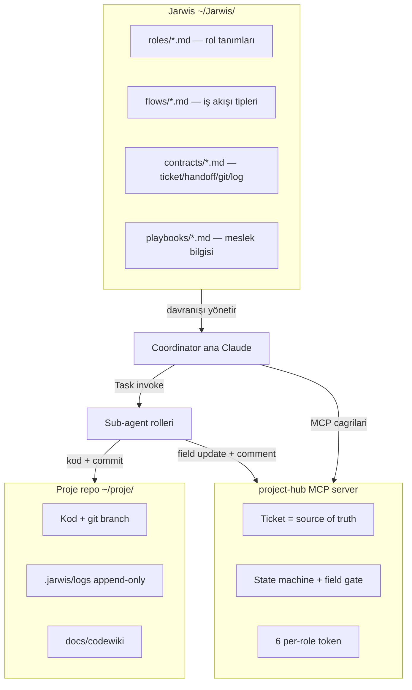
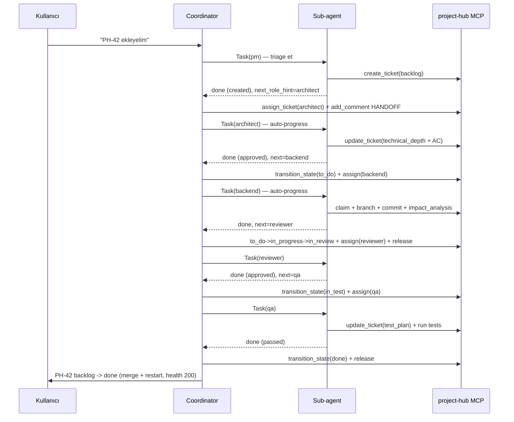
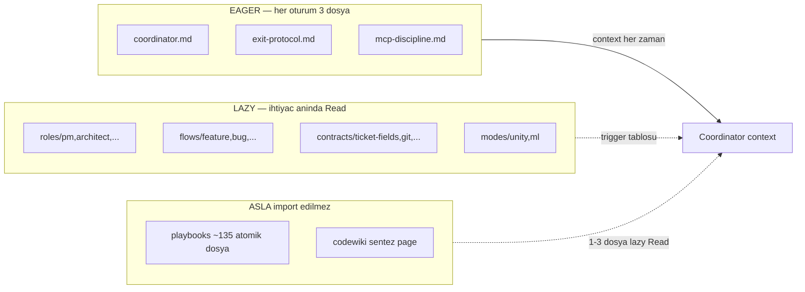

# Jarwis Ruleset — Orkestrasyon ve Davranış Kuralları

> **Bir cümlede:** Jarwis, çok-agentlı bir yazılım geliştirme akışını yöneten, hiç kod içermeyen canonical markdown kural setidir; tüm state machine karmaşıklığını tek bir sürücüde (Coordinator) toplar, sub-agent'ları "simple" tutar ve token ekonomisini birinci sınıf bir tasarım hedefi olarak ele alır.

Bu doküman, Jarwis'in çekirdek mimarisini tanıtır: üç katman modeli, single-driver Coordinator mimarisi, roller ve onların çıkış kontratları, flow tipleri, contract'lar, mode overlay'leri ve playbook bilgi tabanı. Birincil okuyucu, bu sistemi ilk kez gören teknik bir izleyicidir; akış problem → çözüm → mekanizma → kanıt sırasını izler.

---

## 1. Jarwis nedir + üç katmanlı model

> **Özet:** Jarwis bir framework değil; LLM agent'larının davranışını şekillendiren, eager/lazy import edilen bir markdown talimat katmanıdır — ve üç ayrı repo'yu (kural / state / kod) tek bir disiplinli akışta koordine eder.

Jarwis'in tanımı birebir nettir: *"Hiç kod içermez; sadece markdown."* (`~/Jarwis/CLAUDE.md`). Yani Jarwis bir kütüphane veya çalıştırılabilir motor değil — agent davranışını tanımlayan, ihtiyaca göre context'e yüklenen markdown talimat dosyalarının canonical bütünüdür. Karmaşıklık koddan değil, **kuralların tutarlılığından ve uygulanma disiplininden** doğar.

Sistem üç katmanı koordine eder:

1. **Jarwis (`~/Jarwis/`)** — rol/iş akışı tanımları, yani kuralların kendisi. Bu katman platform-bağımsızdır.
2. **project-hub (`~/Documents/project-hub/`)** — ticket/state/branch için **state-of-truth** (MCP server). FastAPI 0.110+ + SQLAlchemy 2 + Alembic + PostgreSQL 16 + Redis 7 stack'i üzerinde çalışır. Detaylar için bkz. [project-hub mimari](02-projecthub-mimari.md).
3. **Proje repo'su (`~/<proje>/`)** — gerçek kod + `.jarwis/logs/<id>/<role>.md` per-task incremental history.

Codewiki dokümantasyonunda bu üçlü ilişki "triangle" olarak adlandırılır: **ticket history (WHY) ↔ codewiki (WHAT) ↔ git (WHEN/HOW)**. Bu üçgenin ayrıntılı işleyişi [entegrasyon mimarisi](05-entegrasyon-mimari.md) dokümanında ele alınır.



Bir proje tek komutla bağlanır: `~/Jarwis/scripts/jarwis-init.sh <project-path> <board-key> [board-name]`. Bu idempotent script 9 adım yürütür: `localhost:8000/health` kontrolü, `~/.jarwis/tokens.json`'da yoksa 6 token mint (`create_jarwis_actors --rotate --json`), board açma, 6 `jarwis-<role>` actor'unu board membership olarak ekleme, `.mcp.json`'a 6 per-role MCP entry yazma (chmod 600), `.claude/agents/` altına 6 sub-agent definition kopyalama, `.gitignore` güncelleme, `docs/codewiki/` scaffold. Multi-project kullanımda aynı 6 actor tüm projelere hizmet eder; projeye özel olan yalnızca **board membership**'tir.

---

## 2. Tasarım ilkeleri (6 madde)

> **Özet:** Altı ilke, sistemin tüm davranışını türeten anayasal kuralları oluşturur — özünde "tek arayüz, tek doğru kaynak, izole agent'lar, silinmeyen hafıza".

| # | İlke | Anlamı |
|---|---|---|
| 1 | **Tek arayüz: Coordinator** | Kullanıcı sadece Coordinator ile konuşur; diğer roller asla doğrudan kullanıcıya yazmaz. |
| 2 | **Ticket = tek source of truth** | Agent'lar arası veri direkt geçmez — ticket alanları + yorumları üzerinden devredilir. Coordinator sadece "kim sıradaki" kararını verir. |
| 3 | **Sub-agent izolasyonu** | Her rol kendi temiz context'inde çalışır (`.claude/agents/*.md`), kendi tool whitelist'i ve sistem promptu vardır. |
| 4 | **Append-only log** | Her rol `.jarwis/logs/<ticket-id>/<role>.md` içine timestamp'li bölüm ekler; hiçbir geçmiş silinmez. |
| 5 | **Sıralı işleyiş** | Coordinator aynı anda yalnızca bir ticket'ı pipeline'da tutar. |
| 6 | **State-of-truth = project-hub** | Lokal kayıt yok; her transition/yorum/branch MCP üzerinden gerçekleşir. |

Bu ilkeler soyut değildir — her biri somut bir mekanizmaya dökülmüştür. Örneğin ilke 2 (ticket = source of truth), pratikte `[HANDOFF X→Y]` comment formatı olarak hayata geçer (bkz. §6); ilke 3 (izolasyon), per-role MCP token whitelist'i olarak fiziksel hale gelir (bkz. §4).

---

<a id="single-driver-mimari"></a>
## 3. v2 Single-driver mimari — NEDEN

> **Özet:** Tüm state geçişlerini sub-agent'lardan alıp tek bir sürücüde toplayan radikal bir karar — sebep teknik: permission gate, missing tool ve invalid_transition hatalarını N×M noktadan 1 noktaya indirger.

Jarwis'in çekirdek mimari kararı birebir şudur: *"Coordinator hem orchestrator HEM transition driver'ıdır. Sub-agent state'e DOKUNMAZ; sadece işini yapar (kod, rapor, field update, comment) ve `done|blocked|rejected` raporu döner."* Coordinator, sub-agent turn'ünü kapatmadan ÖNCE state transition + assign + release işlemlerini yapar.

**NEDEN — en kritik gerekçe (birebir):** *"sub-agent başına permission gate, missing tool, invalid_transition hataları tekil noktada toplanır. Sub-agent simple kalır."* exit-protocol bunu HARD ENFORCEMENT olarak tekrarlar: *"sub-agent state transition denemesi sırasında missing tool whitelist, permission denied, invalid_transition gate'lerine takılıyordu. Tek-driver mimarisi (Coordinator) ile bu kalıcı kapanır."*

Bunun pratik etkisi şudur: 6 rol × M farklı hata tipi yerine, sistem **1 nokta × M hata tipi** problemini çözer. Tüm hata-yakalama mantığı (invalid_transition recovery, field gate doldurma, actor UUID çözümü) Coordinator'da tek yerde yaşar; sub-agent'lar bu karmaşıklıktan tamamen habersizdir.

### Yetki ve enforcement modeli

Coordinator'a PM-eşdeğer yetki verilmiştir — PM token `state.transition:*` permission taşır; pratikte PM MCP server'ı ana Claude'a doğrudan açıktır. project-hub tarafındaki [permission modeli](02-projecthub-mimari.md#permission-grammar) bu yetkiyi tanımlar.

Enforcement davranışla değil, **fiziksel olarak tool whitelist'le** sağlanır:

> Sub-agent `.md` dosyalarında `transition_state` / `assign_ticket` / `release_ticket` tool'ları whitelist'inde **olmamalı** — kaza çağrıyı fiziksel olarak engeller.

Yani kural ihlali "yasak" değil, "yapamaz" düzeyindedir. Bir sub-agent yanlışlıkla `transition_state` çağırmak istese bile, tool onun context'inde mevcut değildir.

### İş bölümü

| Aktör | Yapar | Yapmaz |
|---|---|---|
| **Sub-agent** | İş (kod/rapor/plan), field update (technical_depth, impact_analysis, test_plan), claim/branch/heartbeat, `[HANDOFF X→Y]` comment, yapılandırılmış `done:` raporu | `transition_state`, `assign_ticket`, `release_ticket` |
| **Coordinator** | Routing, sub-agent invoke, **state transition + assignee atama + release_ticket**, audit, kullanıcı özeti | Kod yazmaz, kendi field update yapmaz |

---

<a id="roller"></a>
## 4. Roller — sorumluluk, state etkisi, çıkış kontratı

> **Özet:** Altı rol, ortak bir anayasal kurala (state-blind çalış) tabi; her biri yalnızca kendi domain işini yapar ve yapılandırılmış bir rapor döner — Coordinator bu rapordan state geçişini türetir.

Tüm roller her rol .md'sinin başında ⛔ banner ile tekrarlanan anayasal kurala tabidir: **"State transition Coordinator'un işi — bu rolde state'e dokunma."**

| Rol | Tek-satır sorumluluk | Sub-agent'in YAPTIĞI MCP çağrıları | State etkisi | decision değerleri |
|---|---|---|---|---|
| **PM** | Ham isteği ticket evrenine çevirir; triage + create + epic decompose + reject | `query_tickets`, `get_ticket_slice`, `create_ticket`, `update_ticket(labels)`, `add_comment` | Yok — ticket `backlog`'ta açılır, kalır | `created \| rejected \| epic-decomposed` |
| **Architect** | Teknik fizibilite + şekil; `technical_depth` + mermaid + genişletilmiş AC | `get_ticket`, `update_ticket(technical_depth, AC, description)`, `add_comment` (claim/heartbeat YOK) | Yok (Coordinator approve'da `to_do`'ya geçirir) | `approved \| arch_rejected` |
| **Backend** | Server-side implement; "12-step çekirdek" | `claim_ticket`, `create_branch_for_ticket`, `update_agent_phase` (heartbeat ≤2dk), `update_ticket(impact_analysis, technical_depth)`, `add_comment` | `in_progress` (claim) → done sonrası Coordinator `in_review`'a alır | `done \| blocked` |
| **Frontend** | Client-side (UI/UX); backend ile **aynı 12-step**, fark: scope + tool whitelist + tarayıcı verify zorunlu | Backend ile aynı | Backend ile aynı | `done \| blocked` |
| **Reviewer** | Kod + döküman + ticket alan tutarlılığı denetimi; tek başına approve/reject otoritesi | `get_ticket`, `update_ticket(technical_depth=validated)`, `add_comment` (claim/heartbeat YOK, kod DÜZELTMEZ) | Yok (Coordinator approve'da `in_test`, reject'te `in_progress`) | `approved \| rejected (needs_revision)` |
| **QA** | İki mod: Mod A bug-reproduce (failing test commit), Mod B verify (AC + regression) | Mod A: `claim_ticket` + `create_branch_for_ticket` + failing test commit + `update_agent_phase` + `update_ticket(test_plan)`; Mod B: test koş + `update_ticket(test_plan)` (claim YOK — read-only) | Mod A: `in_progress`; Mod B pass → Coordinator `done` | `passed \| failed \| bug-reproduced \| cannot-reproduce` |

**Çıkışta YAPMAZ (tüm roller):** `transition_state`, `assign_ticket`, `release_ticket`. Reviewer ek olarak kod dosyalarını düzeltmez; QA prod kodu (`src/`, `app/`) değiştirmez, yalnızca `tests/` + `.jarwis/logs/` altına yazar.

### Sub-agent return kontratı

Her rol Coordinator'ın parse ettiği yapılandırılmış bir rapor döner:

```
done: <kısa sonuç 1-2 satır>
  - decision: approved | rejected | passed | failed | blocked | bug-reproduced
  - next_role_hint: architect | backend | frontend | reviewer | qa | pm
  - artifacts: <branch / commit range / test sonuç / finding count>
  - permission_issues: []   # ZORUNLU; boş ise [], doluysa escalation
```

`permission_issues` alanı zorunludur. Doluysa Coordinator transition'ı UYGULAMAZ — kullanıcıya escalate eder (bkz. §5.3).

### İki katmanlı izolasyon

Sub-agent izolasyonu iki katmanda gerçekleşir:

**(a) Sistem promptu izolasyonu.** Her rol `<proje>/.claude/agents/<role>.md` ile kendi temiz context'inde çalışır. Örnek `pm.md` frontmatter gerçek alanlar içerir: `name: pm`, `model: claude-opus-4-8`, ve yalnızca PM'in araçlarını listeleyen `tools:` satırı.

**(b) MCP token whitelist izolasyonu.** Her rol **yalnızca kendi prefix'li** (`mcp__project-hub-<role>__*`) MCP server'ına bağlanır; başka rolün MCP'sine erişim yoktur. Identity smoke testi her oturum başında çalışır: her rol ilk MCP çağrısında actor'ünün `jarwis-<role>` olduğunu doğrular, değilse `permission_issues: ["identity_mismatch"]` döner.

---

<a id="transition-map"></a>
## 5. Coordinator transition map ve mandatory davranışlar

> **Özet:** Coordinator'ın işi deterministiktir — sub-agent'ın `decision` değeri, hangi transition + assign + release zincirinin çalışacağını birebir belirler.

### 5.1 Tam transition map

Aşağıdaki tablo, sub-agent return'üne göre Coordinator'ın yaptığı çağrıların tamamıdır. Workflow path: `backlog → to_do → in_progress → in_review → in_test → done` (detay: [state machine](02-projecthub-mimari.md#state-machine-ve-field-gateler)).

| Sub-agent return | Coordinator çağrıları |
|---|---|
| `pm done` (created) | `assign_ticket(architect)` + `add_comment` — **state backlog'ta kalır** |
| `pm rejected` | `update_ticket(labels+=rejected)` + `add_comment(→user)` |
| `architect approved` | `transition_state(to_do)` + `assign_ticket(implementer)` + `add_comment` |
| `architect arch_rejected` | `update_ticket(labels+=arch_rejected)` + `assign_ticket(pm)` + `add_comment` — state backlog'ta kalır |
| `implementer done` | (gerekirse `to_do→in_progress` ara adım) + `transition_state(in_review)` + `assign_ticket(reviewer)` + `release_ticket` + `add_comment` |
| `implementer blocked` | `assign_ticket(pm)` + `release_ticket` + `add_comment([BLOCKED])` — state in_progress'te kalır |
| `reviewer approved` | `transition_state(in_test)` + `assign_ticket(qa)` + `add_comment` |
| `reviewer rejected` | `transition_state(in_progress)` + `update_ticket(labels+=needs_revision)` + `assign_ticket(implementer)` + `add_comment` |
| `qa passed` | `transition_state(done)` + `release_ticket` + `add_comment` + **post-done deploy** |
| `qa failed` | `transition_state(in_progress)` + `update_ticket(labels+=qa_failed)` + `assign_ticket(implementer)` + `release_ticket` + `add_comment` |
| `qa bug-reproduced` | `transition_state(in_progress)` + `assign_ticket(implementer)` + `release_ticket` + `add_comment` |



### 5.2 Kritik gotcha — 2-step transition zorunlu

`to_do → in_review` direkt geçiş yoktur; önce `in_progress` ara state'i zorunludur. Birebir not: *"PH-148 canlı test 2-step gerekliliğini doğruladı."* Coordinator önce `get_state` ile mevcut durumu kontrol eder, gerekirse ara state'i atar:

```
state = get_state(id)
if state == "to_do":
    transition_state(id, "in_progress")   # ara state — workflow gate
transition_state(id, "in_review")          # asıl hedef
```

### 5.3 8 mandatory Coordinator davranışı

1. **Per-prompt audit (adım 0):** her promptta `query_tickets(state in [in_progress, in_review, in_test])` ile stale claim (>5dk heartbeat yok), `state=done + claimed_by≠null` (release eksik = Coordinator bug), unutulmuş branch (last commit >30dk) tara.
2. **Her sub-agent dönüşünde transition:** `done|blocked|rejected` döndüğünde HEMEN `transition_state` + `assign_ticket` + `release_ticket`.
3. **Fail/blocked'ı da Coordinator handle eder:** reviewer reject, qa fail, implementer blocked için de state geçişi olur.
4. **Assignee tek otoritesi Coordinator:** PM→Architect→Implementer→Reviewer→QA→done rotasyonu Coordinator'da yaşar.
5. **Post-done deployment:** QA pass sonrası `git merge --no-ff` + branch sil + worktree cleanup + docker restart.
6. **Permission/escalation:** sub-agent return'de `permission_issues` doluysa transition YAPMAZ, kullanıcıya raporlar; ancak `release_ticket`'i yine yapar (stale claim önler) + `[ESCALATION]` comment ekler. Gerekçe: *"Sub-agent permission issue'yu sessizce yutarsa: state hareket etmez... ticket 'in_progress'ta unutuldu' duruma düşer."*
7. **Chain continuity (auto-progress, SIRALI) ⚡:** `decision ∈ {done, approved, passed, created, bug-reproduced}` ve `permission_issues == []` ise sıradaki rolü **otomatik** invoke eder, "devam edeyim mi?" diye SORMAZ. **⛔ PARALEL YASAK** — *"Aynı anda birden fazla sub-agent Task çağrısı YOK... Bir tur içinde tek bir aktif sub-agent."* Sıralama: önce hotfix/bug, sonra epic topo-sort (child id ascending).
8. **Kullanıcı özeti:** her turun sonunda `"PH-XX <old_state> → <new_state> (<role>, <decision>)"`.

### 5.4 Anti-recursion ve hallucination guard

Coordinator sub-agent return aldığında transition'ı **kendin** yapar — **yeni `Task()` AÇMAZ**. Üç yasak pattern nettir:

1. **Recursive sub-agent ile transition** — sub-agent yine permission_issues döner, hiçbir şey çözülmez.
2. **Ham curl/raw HTTP** — *"JSON-RPC `id` field'ını unutursan 202 dönüp boşa gider."*
3. **Doğrulamadan "yaptım" demek** — her transition `get_state` ile doğrulanır.

Self-verify için **her zaman `get_state`** (~200 char) kullanılır, `get_ticket` (full payload, ~6K bytes) değil. Bench iter-2→iter-3 ölçümünde bu fark self-verify maliyetini ~30x azalttı. Bu token disiplinin tam analizi [optimizasyon yolculuğu](07-optimizasyon-yolculugu.md) dokümanındadır.

---

## 6. Flow tipleri — aynı rol havuzu, farklı giriş ve sıra

> **Özet:** Beş flow tipi aynı rol havuzunu kullanır ama farklı giriş noktası, sıra ve kalite gate'leriyle ayrışır — severity-bazlı kısayol yoktur; kritik bug bile QA-first akar.

| Flow | Tetikleyici | Rol sırası / ayırt edici özellik |
|---|---|---|
| **Feature** | "X özelliği ekleyelim", yeni yetenek/epic | PM → Architect → Implementer → Reviewer → QA. `backlog → in_progress` geçişini **Implementer (claim)** tetikler. |
| **Bug** | "Şu bozuk", "X hata veriyor", regression | **QA-FIRST**: PM → **QA (Mod A reproduce)** → Dev → Reviewer → QA (Mod B verify). `backlog → in_progress` geçişini **QA** failing test commit'i sırasında tetikler. Dev failing test'i DEĞİŞTİRMEZ, aynı branch'i kullanır. QA fail'de Reviewer ATLANIR. |
| **Hotfix** | Prod down + dakikalar önemli + çözüm net (üçü birden) | **POST-HOC PM/Architect**: Dev ticket'ı kendi açar+claim+branch → fix+minimal test → Reviewer (sadece critical) → QA (smoke only) → done → SONRA PM (retroactive description) + Architect (post-hoc tech_depth). "Şüphe varsa hotfix değil, bug flow." |
| **Refactor** | "Şu modülü temizleyelim", discovered debt promote | Architect-ağırlıklı: PM → Architect (cost/benefit + before/after mermaid) → Dev (davranış değişmez, **test silme YASAK**) → Reviewer (scope creep kontrolü) → QA (**sadece regression**). AC behavior-preserving. |
| **Experiment** (ML mode) | "Yeni model deneyelim", "baseline kur" | PM → Architect (deney tasarımı + baseline + seed/config) → stage roller topo-sort → ml_analyst kararı: **promote \| iterate \| reject**. QA seed ile rerun edip metriği doğrular. |

Feature ve experiment flow'ları **alternatif giriş noktaları** destekler: kullanıcı "PH-42 açtım, hallet" derse Coordinator state + dolu field'lara bakıp doğru rolden başlar (örn. AC dolu + tech_depth yok → Architect'ten başla, PM'i atla).

Severity-bazlı kısayol yoktur — kritik bug bile QA-first akar; gerçek aciliyet hotfix flow'una gider. Bu, kalite gate'lerinin **hard ve atlanamaz** olmasının bilinçli sonucudur.

---

## 7. Contract'lar — ticket-fields, handoff, logging, git

> **Özet:** Dört contract, agent'lar arası veri devrini deterministik kılar — eksik alan pipeline'ı durdurur, sabit-formatlı handoff comment'i "kim sıradaki"yi çözer, append-only log kurumsal hafıza tutar.

### 7.1 ticket-fields — alan-güdümlü state machine

Temel ilke: *"Bir alan eksikse Coordinator pipeline'ı ileri itmez."* Kritik field gate noktaları:

- `acceptance_criteria` — PM taslak → Architect genişletir; **backlog→in_progress öncesi** dolu olmalı. Format: `- [ ] GIVEN <durum> WHEN <aksiyon> THEN <beklenen>` — test edilebilir olmalı; belirsiz AC = Architect reject sebebi.
- `technical_depth` — üç elden geçer: Architect (plan) → Implementer (keşfedilen borç) → Reviewer (doğrula); **in_review öncesi** zorunlu. Format: Approach / Files touched / Risks / Out of scope / Discovered debt.
- `impact_analysis` — Implementer doldurur, in_review öncesi. Format: Affected flows / Migration-backward compat / Rollback plan.
- `test_plan` — QA doldurur, **in_test'e girdiğinde**. Format: Test cases (TC-01 + path) / Regression scope / Result.

**Label sözlüğü** (sub-state mekanizması, ayrı state değil): `draft`, `rejected`, `arch_rejected`, `needs_revision`, `qa_failed`, `hotfix`. [Field gate detayı](02-projecthub-mimari.md#state-machine-ve-field-gateler) project-hub mimarisinde tanımlıdır.

### 7.2 handoff — `[HANDOFF X→Y]` tek veri devir kanalı

Handoff "üç şeyi birlikte yapar": `transition_state` + `assign_ticket` + `add_comment`. v2 mimaride bu üçünü Coordinator yürütür. 9 sabit-formatlı handoff başlığı vardır:

- `[HANDOFF pm→architect]` — Triage / Scope summary / Open questions
- `[HANDOFF architect→<role>]` — Decision: approved / Branch suggestion / Critical risks
- `[HANDOFF architect→pm]` — arch_rejected / Reason / Suggested action
- `[HANDOFF <role>→reviewer]` — Branch / Commits (count + sha range) / Discovered debt
- `[HANDOFF reviewer→<role>]` — needs_revision + Findings (bulgu + file:line)
- `[HANDOFF reviewer→qa]` — approved / Tech depth: validated
- `[HANDOFF qa→<role>]` — qa_failed + Failures (TC-XX expected/got)
- `[HANDOFF qa→done]` — Tests pass/total / Regression: clean
- Bug özel `[HANDOFF qa→<role>]` reproduce — Failing test path::name / Branch / Expected / Actual

Her başlık `Log: .jarwis/logs/<id>/<role>.md` referansıyla biter. Coordinator yeni promptta `query_history` ile son yorumu çeker, başlıktaki `X→Y` etiketinden sıradaki rolü deterministik parse eder.

### 7.3 logging — append-only kurumsal hafıza

`<proje>/.jarwis/logs/<ticket-id>/<role>.md` yapısı; dosya = frontmatter (`ticket`, `role`, `created`, `last_run`) + timestamp'li bölümler. 5 katı kural: yeni dosya `mkdir -p` + frontmatter; append + `last_run` güncelle; **asla silme/üzerine yazma yok** (yanlış varsa "correction:" bölümüyle düzelt); bölüm 8 satırı geçmesin; atıflar inline (commit sha, file path:line). Beklenen boyut 5-10 KB/ticket. Log `.gitignore`'a eklenmez — proje history'sinin parçası. Coordinator token tasarrufu için sadece frontmatter + son 1-2 bölüm okur.

### 7.4 git — branch / worktree / merge disiplini

Kritik kurallar (pilot acılarından doğmuş):

- **Branch zorunluluğu**: format `<ticket_key_lowercase>-<slugified-title>` (örn. `ph-42-add-search`); sadece Implementer `create_branch_for_ticket(id)` ile açar; `main`'e direkt commit yasak. Commit format: `<type>(<TICKET_KEY>): <desc>`; `--no-verify`/`--amend`/`--force` yasak.
- **Branch rename ZORUNLU (§3a)**: Claude Code default `claude/<random-slug>` açar; ilk üç komut `git status` → `create_branch_for_ticket` → `git branch -m <canonical>`. Merge `--no-ff` ile (fast-forward ticket ismini yutar).
- **Worktree disiplini (§3)**: sub-agent worktree'de **main HEAD'i baz alır**; uncommitted main değişiklikleri görünmez → Coordinator sub-agent çağırmadan önce setup commit'lerini atmalı.
- **Per-role token isolation (§7)**: 6 jarwis-* actor, tek `~/.jarwis/tokens.json` (chmod 600), `.mcp.json`'da 6 ayrı server entry — *"disiplin değil, hard isolation"*. Sebep: pilotte tüm sub-agent'lar Admin token kullandı, audit trail bozuldu. Detay: [git entegrasyonu](03-projecthub-entegrasyonlar.md).

---

## 8. Mode'lar ve playbook bilgi tabanı

> **Özet:** Mode bir proje-stack overlay'idir (shared 4 rol değişmez, sadece implementer seti değişir); playbook ise ~135 atomik meslek-bilgisi dosyasıdır ki bilinçli olarak hiç eager import edilmez — token ekonomisinin kalbi budur.

### 8.1 Mode'lar — persona overlay

Mode = *"hangi implementer rollerin aktif olacağını seçen project-stack persona"*. **Shared roller (PM/Architect/Reviewer/QA) tüm mode'larda aynıdır**; sadece implementer seti değişir.

| Mode | Implementer rolleri | Actor sayısı |
|---|---|---|
| `web` (default) | backend_dev, frontend_dev | 6 |
| `unity` | unity_dev, unity_scene_manager, unity_platform | 7 + unityMCP |
| `android` | android_dev | — |
| `ios` | ios_dev | — |
| `ml` | data_engineer, data_labeler, ml_engineer, ml_analyst | 8 |

Mode seçimi `jarwis-init.sh <path> <board> --mode unity` ile yapılır; sadece o mode'un `.mcp.json` entry'leri + `.claude/agents/` tanımları kopyalanır. Overlay mantığı shared rolleri mode'a özgü alanlarla genişletir:

- **unity**: Architect `technical_depth`'e perf bütçesi (target FPS, draw call, GC alloc/frame), render path (Built-in/URP/HDRP), platform matrix ekler; QA → EditMode/PlayMode test.
- **ml**: çıktı servis değil **artifact** (işlenmiş veri/model/eval raporu). Architect overlay önceliği: **VERİ KONTRATI (en kritik)** → deney tasarımı → model ADR → eval protokolü → reproducibility (seed/config). QA model kalitesini **metrik regresyon gate** ile denetler (baseline altına düşerse fail). Post-done: `docker compose restart` UYGULANMAZ; stage'i küçük örnekle rerun + artifact conformance doğrulanır.

### 8.2 Playbook — trigger-based meslek bilgisi

Playbook = SOLID / NFR / test teknikleri / code smell / security pattern gibi **meslek bilgisi**. Felsefe token ekonomisinin kalbidir:

> **"CLAUDE.md'ye import edilmez. Tek bir context yüklemesi olarak gelmez."** Sub-agent ticket'a bakar, rol .md'sindeki **trigger tablosundan** SADECE ihtiyacı olan atomik dosyayı `Read`'ler.

Disk doğrulaması: toplam **~135 atomik .md** dosyası (her biri 30-80 satır, tek konsept, max 2 derinlik). Örnekler: Backend SOLID ihlali görürse `playbooks/shared/solid/srp.md`; Architect SQL/NoSQL kararı için `playbooks/architect/tradeoffs/sql-vs-nosql.md`. Her dosya sabit format: **Apply when / Smell / Fix / Sınır (YAGNI'ye düşme) / İlişkili** — *"akademik tanım değil; karar tetikleyici checklist"*.

**Token tasarrufu mekaniği**: 135 dosyanın hiçbiri prompt'a önden yüklenmez; bir ticket için tipik olarak 1-3 atomik dosya (~100-240 satır) okunur. Monolitik yüklemeye göre context'in büyük kısmı boşta kalır.

---

<a id="eager-vs-lazy-import"></a>
## 9. Eager import vs lazy lookup — token stratejisi

> **Özet:** Sadece 3 dosya her oturumda yüklenir; geri kalan her şey (rol detayları, flow'lar, playbook'lar, codewiki page'leri) ihtiyaç anında `Read` ile çekilir — bu seçicilik, ölçülmüş token tasarrufunun temelidir.

**Eager import (sadece 3 dosya):** `@roles/coordinator.md`, `@contracts/exit-protocol.md`, `@contracts/mcp-discipline.md`. Gerekçe birebir: *"Coordinator'un çekirdek davranışı + transition map + tool disiplini her promptta gerekli."*

**Lazy lookup (14 dosya, `Read` ile çekilir):** Trigger tablolarıyla yönetilir — 6 ana rol .md'si + 4 ML-mode rolü, 4 flow, contract'lar, mode overlay'ler. Sub-agent zaten `.claude/agents/<role>.md` sistem promptunu yüklü alır; canonical role .md'leri sadece detay sorgu/playbook lookup/kural verify ihtiyacında okunur. `playbooks/` (SOLID, NFR, test teknikleri) **hiç import edilmez**.



Bu stratejinin ölçülmüş etkileri: `get_state` (~200B) vs `get_ticket` (~6KB) ayrımı self-verify'da ~30x tasarruf; `get_ticket_slice` vs `get_ticket` sub-agent okumasında ~5x. Codewiki bu stratejinin uzantısıdır — maliyet kontrolü **frequency'den değil seçicilikten** gelir; sadece sık plan yapılan hot subsystem'ler `.codemap`'e konur. Tüm benchmark-driven optimizasyon yolculuğu (iter 0→9) için bkz. [optimizasyon yolculuğu](07-optimizasyon-yolculugu.md).

---

## 10. Whitepaper için anahtar mesajlar

1. **Single-driver, single point of failure-handling.** Tüm state machine karmaşıklığı tek noktada (Coordinator) toplanır; N rol × M hata tipi yerine 1 nokta × M hata tipi'ne indirgenir. Sub-agent'lar simple kalır.
2. **Enforcement davranışla değil, tool whitelist'le sağlanır.** Sub-agent .md'lerinde transition tool'ları fiziksel olarak yoktur — kural ihlali "yasak" değil, "yapamaz" düzeyindedir.
3. **Hallucination guard üç katmanlı.** `get_state` doğrulaması, raw curl yasağı (202 sessiz başarısızlık), recursive Task() yasağı. Doğrulanmadan rapor verilmez.
4. **Token ekonomisi birinci sınıf vatandaş.** 3 eager + 14 lazy bölünmesi, `get_state`/`get_ticket` ayrımı, 135 atomik playbook'un disk'te bekletilmesi — hepsi ölçülmüş.
5. **Otonom ama sıralı.** Chain continuity ile akış done'a kadar yürür, ama PARALEL YASAK — aynı anda tek aktif sub-agent.
6. **Canlı testle kanıtlanmış kurallar.** 2-step transition (PH-148), JSON-RPC id gotcha, escalation "in_progress'ta unutuldu" senaryosu — gerçek başarısızlıklardan türetilmiş düzeltmeler.

---

## İlgili dokümanlar

- [00 — Genel bakış ve okuma sırası](00-index.md)
- [01 — Vizyon ve amaç](01-vizyon-amac.md)
- [02 — project-hub mimari (state machine, field gate, permission)](02-projecthub-mimari.md)
- [03 — project-hub entegrasyonları (git, SonarQube, frontend)](03-projecthub-entegrasyonlar.md)
- [05 — Entegrasyon mimarisi (Jarwis↔project-hub↔repo, WHY/WHAT/WHEN üçgeni, codewiki)](05-entegrasyon-mimari.md)
- [06 — Hedefler derinlemesine](06-hedefler-derinlemesine.md)
- [07 — Optimizasyon yolculuğu (benchmark-driven)](07-optimizasyon-yolculugu.md)
- [08 — Sunum iskeleti](08-sunum-iskeleti.md)
