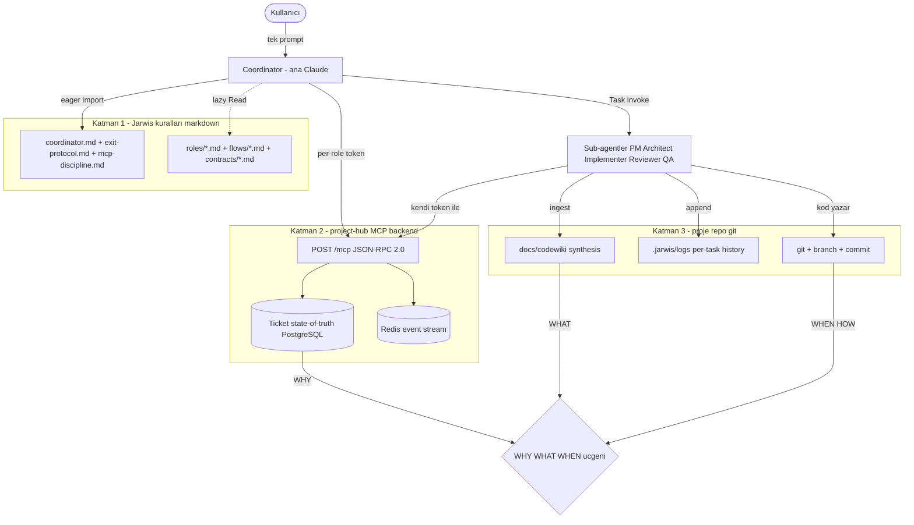
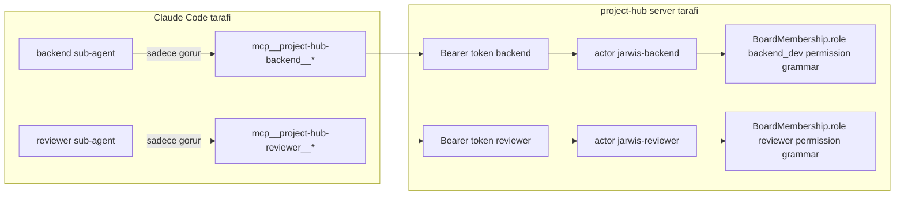
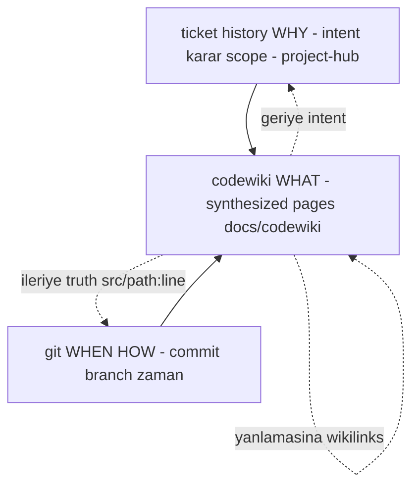
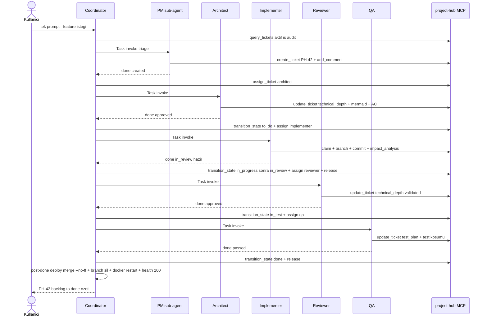

# Entegrasyon Mimarisi — Üç Katman Nasıl Birleşir

> **Bir cümlede:** Jarwis (markdown kural seti), project-hub (PostgreSQL-destekli ticket/state MCP backend) ve proje repo'su (gerçek kod + git + codewiki), per-role token izolasyonu ve ticket lifecycle "kontrat yüzeyi" üzerinden tek bir kontrollü agentic pipeline'a kilitlenir — ve bu pipeline tek bir komutla (`jarwis-init.sh`) ayağa kalkar.

Bu doküman, sistemin üç ayrı katmanının nasıl *tek bir bütüne* dönüştüğünü anlatır. Önceki dokümanlar katmanları tek tek tanıttı: [vizyon ve neden iki repo](01-vizyon-amac.md), [project-hub'ın iç mimarisi](02-projecthub-mimari.md), [project-hub entegrasyonları](03-projecthub-entegrasyonlar.md), [Jarwis ruleset](04-jarwis-ruleset.md). Burada soru farklı: **bu parçalar birbirine fiziksel olarak nereden ve nasıl bağlanır?** Yanıt dört mekanizmada saklı — token/actor modeli, ticket kontrat yüzeyi, WHY/WHAT/WHEN üçgeni, ve `jarwis-init.sh` provisioning'i.

---

## 1. Üç katmanın anatomisi

> **Özet:** Kurallar (Jarwis), state-of-truth (project-hub) ve kod (repo) ayrı yaşar; Coordinator bu üçünü tek noktadan dokur.

Problem şu: çok-agentlı bir geliştirme akışında "kurallar nerede yazılı", "işin gerçek durumu nerede tutuluyor" ve "kod nerede" sorularının yanıtları aynı yerde olursa sistem kırılgan ve denetlenemez hâle gelir. Jarwis bu üç sorumluluğu kasıtlı olarak üç ayrı dizine böler:

| Katman | Konum | Sorumluluk | İçerir |
|---|---|---|---|
| **Jarwis** | `~/Jarwis/` | Rol/iş akışı kuralları — *davranış katmanı* | Yalnız markdown; hiç kod yok |
| **project-hub** | `~/Documents/project-hub/` | Ticket/state/branch **state-of-truth** | FastAPI 0.110+ + SQLAlchemy 2 + PostgreSQL 16 + Redis 7, MCP server `localhost:8000` |
| **Proje repo'su** | `~/<proje>/` | Gerçek kod + per-task history | Kod + `.jarwis/logs/<id>/<role>.md` + `docs/codewiki/` |

Bağlantı dokusu Coordinator'da (ana Claude) yaşar. Coordinator hiç kod yazmaz; rolü routing ve state machine sürmektir. Akış şöyle örgülenir:



Dikkat edilmesi gereken iki ince nokta:

1. **Coordinator yalnız 3 dosyayı eager yükler** (`coordinator.md`, `exit-protocol.md`, `mcp-discipline.md`); geri kalan 14 rol/flow/contract dosyasını ihtiyaç anında `Read`'ler. Bu token ekonomisi tasarımın birinci sınıf vatandaşıdır.
2. **Sub-agent'lar MCP'ye doğrudan bağlanır** — ama Coordinator'ın token'ıyla değil, *kendi* per-role token'larıyla. State-of-truth'a yazma yetkisi rol başına ayrışır. Detay için bkz. [project-hub mimarisi — state machine](02-projecthub-mimari.md#state-machine-ve-field-gateler).

---

## 2. Per-role token / actor modeli — izolasyon + audit trail

> **Özet:** 6 ayrı bearer token, tek `/mcp` endpoint'inde 6 farklı `jarwis-<role>` actor'a resolve olur — her ticket transition'ı gerçek rolün kimliğiyle imzalanır.

Sistemin denetlenebilirliği tek bir tasarım kararına dayanır: **her rol kendi MCP server entry'si + kendi token'ı.** `~/Documents/project-hub/.mcp.json` altı `project-hub-*` HTTP server entry içerir — hepsi *aynı* URL'ye (`http://localhost:8000/mcp`) gider ama her biri *farklı* bearer token taşır:

| Server entry | Token (kısaltılmış) | Resolve olduğu actor |
|---|---|---|
| `project-hub-pm` | `26977b2f…` | `jarwis-pm` |
| `project-hub-architect` | `d6a9f91c…` | `jarwis-architect` |
| `project-hub-reviewer` | `7946bd32…` | `jarwis-reviewer` |
| `project-hub-qa` | `c173183e…` | `jarwis-qa` |
| `project-hub-backend` | `1c7f53fb…` | `jarwis-backend` |
| `project-hub-frontend` | `cf088190…` | `jarwis-frontend` |

Token, backend tarafında bcrypt (default 12 round) ile hash'lenip saklanır — plaintext DB'de tutulmaz. Doğrulama `bcrypt.checkpw` ile yapılır. Her MCP endpoint'i `Depends(current_actor)` ile korunur ve `Authorization: Bearer <token>` zorunludur. Sonuç **iki katmanlı izolasyon**:



- **(a) Claude Code tarafı:** her sub-agent'ın `.claude/agents/<role>.md` frontmatter'ındaki `tools:` whitelist'i yalnız kendi rolünün MCP namespace'ini (`mcp__project-hub-<role>__*`) görür. Yani `backend` sub-agent reviewer tool'larını *çağıramaz bile*.
- **(b) Server tarafı:** token → actor → `BoardMembership.role` → permission grammar. Yetki, davranışla değil rolün üyelik kaydıyla belirlenir.

Bunun denetim (audit) sonucu çok güçlüdür: bir sub-agent ne tool çağırırsa çağırsın, ticket history'de **kendi rolünün identity'si** görünür. Coordinator'ın yazdığı `[HANDOFF X→Y]` yorumları ve sub-agent'ların alan güncellemeleri, gerçek actor kimliğiyle imzalanır. Permission grammar'ın matris detayı için bkz. [project-hub mimarisi — permission](02-projecthub-mimari.md#permission-grammar).

### 2.1 Coordinator'ın özel yetkisi

Coordinator'a PM-eşdeğer yetki verilmiştir: PM token `state.transition:*` permission'ı taşır ve pratikte PM MCP server'ı ana Claude'a doğrudan açıktır. Bu kasıtlıdır — **state machine'i yalnız Coordinator sürer.** Kritik enforcement: hiçbir sub-agent whitelist'inde `transition_state`, `assign_ticket` veya `release_ticket` *yoktur*. Kural ihlali "yasak" değil, "yapamaz" düzeyindedir. Single-driver mimarisinin neden'i için bkz. [Jarwis ruleset — Coordinator single-driver](04-jarwis-ruleset.md#single-driver-mimari).

---

## 3. Ticket lifecycle = agent'lar arası KONTRAT YÜZEYİ

> **Özet:** Agent'lar veriyi birbirine doğrudan geçmez; her devir ticket alanları + `[HANDOFF]` yorumları üzerinden, project-hub'da kalıcı kayıt olarak gerçekleşir.

Jarwis'in ikinci temel ilkesi şudur: **ticket = tek source of truth.** İki sub-agent asla doğrudan mesajlaşmaz; Architect'in ürettiği `technical_depth`, Implementer'ın yazdığı `impact_analysis`, QA'nın doldurduğu `test_plan` hep ticket alanlarına yazılır. Bir sonraki rol bu alanları okuyarak işe başlar. Coordinator yalnızca "kim sıradaki" kararını verir.

Bu, ticket'ı agent'lar arasındaki **kontrat yüzeyine** dönüştürür. Devir (handoff) iki kanaldan akar:

1. **Yapılandırılmış alanlar** — `technical_depth`, `acceptance_criteria`, `impact_analysis`, `test_plan`, `steps_to_reproduce`, `expected_behavior`, `actual_behavior`. Bu alanlar field-gate'lerle korunur: örneğin `in_test → done` geçişi `test_plan` dolu olmadan reddedilir.
2. **`[HANDOFF X→Y]` yorumları** — Coordinator her devirde insan-okunur bir özet bırakır: "`[HANDOFF architect→backend] approved`". Bir sonraki rol önce son `[HANDOFF]` yorumunu okur.

Yapılandırılmış field güncellemeleri minimal-response ile çok ucuzdur. `update_ticket` varsayılan olarak `{ok, id, state, updated_fields}` döner (full payload ~6KB değil); ayrıca okuma tarafında `get_ticket_slice(include=[...])` ile rol-spesifik minimum alan seti çekilir (full `get_ticket`'tan 5-10x küçük). Coordinator kendi self-verify'ını `get_state` (~200 char) ile yapar. Bu projeksiyon araçları çok-agentlı akışta doğrudan token/latency tasarrufu sağlar — detay [project-hub mimarisi](02-projecthub-mimari.md#token-budget-projection)nde.

Kontrat yüzeyinin somut akışı — `claim → branch → field update → handoff comment`:

```
# Implementer (backend sub-agent), kendi token'iyla:
claim_ticket(PH-42)                          -> work-in-progress sinyali (lock)
create_branch_for_ticket(PH-42)              -> "ph-42-add-export-endpoint"
update_agent_phase(PH-42, "coding", "...")   -> heartbeat (>=2 dk'da bir)
update_ticket(PH-42, impact_analysis="...")  -> kontrat alani
add_comment(PH-42, "[HANDOFF backend->reviewer] 5 commits, export endpoint eklendi")

# Coordinator (PM token), sub-agent doner donmez:
transition_state(PH-42, "in_review")
assign_ticket(PH-42, <jarwis-reviewer UUID>)
release_ticket(PH-42)
```

Burada görünen ayrımı tekrar vurgulamak gerekir: sub-agent `claim`, `branch`, `field`, `comment` çağırır; **state machine'e (transition/assign/release) dokunmaz** — onu Coordinator yapar. Tam transition map ve workflow path için bkz. [Jarwis ruleset — transition map](04-jarwis-ruleset.md#transition-map).

---

<a id="why-what-when-ucgeni-ve-codewiki"></a>
## 4. WHY/WHAT/WHEN üçgeni — dağınık hafızanın tek dokuda birleşmesi

> **Özet:** Kurumsal hafıza üç farklı sistemde dağılır; codewiki bu üçünü `[PH-XX]` + `src/path:line` + `[[wikilink]]` ile çift yönlü izlenebilir tek synthesis layer'da örer.

Bir geliştirme sistemi üç ayrı soruya yanıt tutmak zorundadır: **neden** yapıldı, **ne** yapıldı, **ne zaman/nasıl** yapıldı. Jarwis'te bunlar üç farklı katmanda yaşar ve `docs/codewiki/` bunları bir üçgende birleştirir:



| Köşe | Sistem | Tutar |
|---|---|---|
| **WHY** | ticket history (project-hub) | Intent, karar, scope — *niçin bu iş yapıldı* |
| **WHAT** | codewiki `docs/codewiki/*.md` | Davranış sentezi — *sistem şu an ne yapıyor* |
| **WHEN/HOW** | git | Commit/branch — *ne zaman, nasıl değişti* |

Codewiki raw source'un *kopyası değil, sentezidir* — fikir kaynağı açıkça LLM Wiki pattern'i ("Vannevar Bush's 1945 Memex realized with LLMs handling the cross-referencing maintenance burden"). İnsanların yapmaktan vazgeçtiği cross-referencing bakım yükünü sub-agent'lar normal ticket flow'unun parçası olarak üstlenir. Her page YAML frontmatter (`type`, `files`, `last_touched_ticket`) + standart bölümler (`## Current behavior`, `## Design decisions (recent)`, `## Related`) taşır; her design decision ve gotcha bir `[PH-XX]` referansı içerir (MANDATORY).

<a id="codewiki-sync-gate"></a>
### 4.1 Sync gate — tasarrufun garantörü

Codewiki'nin amacı: planning'de Architect raw source yerine sentez page okusun → büyük token tasarrufu. Ama bu tasarruf ancak page'ler **güncel** kalırsa gerçektir. Bu yüzden codewiki **iki kademeli** çalışır:

| Kademe | Ne | Enforcement |
|---|---|---|
| **Gated (mapped)** | `.codemap`'in bir page'e map'lediği source dosyası değişti | Reviewer **HARD needs_revision gate** — page de aynı diff'te olmalı |
| **Optional** | QA gotcha taraması, `/codewiki lint`, `/codewiki bootstrap` | User-triggered; auto-lint/auto-bootstrap YOK |

Reviewer sync gate'i `git diff <main>...HEAD --name-only` alır; değişen bir source `.codemap` glob'una uyuyorsa target page de diff'te olmalı — yoksa **needs_revision** (severity matematiğinden bağımsız, tek başına yeterli). Implementer kodu ve wiki'yi *aynı commit'te* tutmak zorundadır.

**Maliyet seçicilikten gelir, frequency'den değil.** Canlı kanıt: project-hub `.codemap`'i 28 mapping satırı içerir ama yalnız 3 page'e map'ler — `components/git-integration.md`, `components/frontend.md`, `components/sonarqube.md`. ~40 dosyalı `backend.md` *kasten* map dışıdır; böylece her backend dokunuşu gate'e takılmaz, ingest maliyeti küçük load-bearing hot set'le sınırlı kalır. `boş .codemap = sync lint disabled` (bootstrap default).

Üçgenin long-term memory katkısı ölçülebilir: append-only `log.md` 17 günde (2026-05-26 → 2026-06-11) **98 entry** (96 ingest, 3 lint, 3 bootstrap) ve **105 distinct PH-XXX ticket ref** içerir. Her satır parse edilebilir (`## [YYYY-MM-DD] <op> | <title> | [KEY]`) ve bir ticket'a geri izlenir. Bir agent oturumlar arası context kaybetse de page "Current behavior" sentezi kalıcıdır. Codewiki'nin tam mekaniği [hedefler — long-term memory](06-hedefler-derinlemesine.md#long-term-memory)de derinlemesine işlenir.

---

## 5. `jarwis-init.sh` — tek komutta bağlama (9 adım, idempotent)

> **Özet:** Tek komut, yeni bir repo'yu PostgreSQL-destekli ticket backend'ine 6+ izole agent kimliğiyle bağlar; bitişte `claude` başlatması yeterli.

Üç katmanı el ile bağlamak (token mint, board create, membership, `.mcp.json`, agent definition, codewiki scaffold) hatalı ve tekrarlanamaz olurdu. `jarwis-init.sh` bunu `set -euo pipefail` ile 9 idempotent adıma indirir:

İmza: `jarwis-init.sh <project-path> <board-key> [board-name] [--mode web|unity|mobile|android|ios|ml]` (mode default `web`).

| # | Adım | Ne yapar | Idempotency |
|---|---|---|---|
| 1 | Preflight + reachable | `require_cmd curl/jq/python3/docker`; `curl --max-time 3 -sf localhost:8000/health` | salt kontrol |
| 2 | Token mint | `~/.jarwis/tokens.json` yoksa `create_jarwis_actors --rotate --json`; varsa eksik rolleri **top-up** (rotate yok) | varsa top-up |
| 3 | Board create | `create_board --key <KEY>` | varsa no-op |
| 4 | Actor membership | `create_jarwis_actors --board <KEY> --mode <MODE>` | re-add no-op |
| 5 | CLAUDE.md | template'ten substitution; **`ACTOR_IDS_BLOCK` Postgres'ten gerçek UUID çeker** | varsa dokunulmaz |
| 6 | `.mcp.json` | her rol → `project-hub-<suffix>` HTTP entry + token, `chmod 600` | **her zaman overwrite** |
| 7 | Sub-agent kopyala | mode-relevant `.claude/agents/<role>.md` | overwrite |
| 8 | settings.json + .gitignore | pre-approved tool patterns; `.mcp.json`/`.env`/worktrees ignore | settings varsa dokunulmaz, gitignore `grep -qxF \|\| echo` |
| 9 | codewiki scaffold | `docs/codewiki/{components,concepts,api,decisions}` + template'ler — **boş kalır** | varsa dokunulmaz |

Birkaç kritik nokta:

- **Adım 5'teki UUID çözümü** spekülatif değil, gerçek bir patolojiden türemiştir: "FN-2 patolojisi: agent 'reviewer-actor-id' string'i gönderdi → not_found". Bu yüzden CLAUDE.md'ye gerçek actor UUID'leri `psql … SELECT id FROM actors WHERE display_name='jarwis-<suffix>'` ile gömülür. Çözülemezse `(UNRESOLVED — run create_jarwis_actors --rotate)` yazılır.
- **`.mcp.json` bilinçli olarak her zaman overwrite** — generated config olduğu için token refresh'i garanti eder. Diğer her şeyde "varsa dokunma" politikası geçerlidir.
- **`jarwis-bootstrap.sh`** path-only wrapper'dır: board-key'i basename'den türetir (uppercase, max 8 char), `jarwis-init.sh`'i delege eder, sonra `psql` ile "N jarwis-* actor enrolled" smoke doğrulaması yapar.

### 5.1 Multi-project ve idempotency

Aynı 6 `jarwis-*` actor **tüm projeleri sunar**; izolasyon yalnız **board membership** ile sağlanır. `~/.jarwis/tokens.json` tek global dosyadır — `PH`, `MA`, `SHOP` aynı token'ları paylaşır, herkes kendi board'unda ticket açar. Bu yüzden token mint sadece ilk kez (`--rotate`) yapılır; sonraki projelerde yalnız board create + membership eklenir. Trade-off kayıtlıdır: token compromise tüm projeleri etkiler, rotation tek seferde hepsine uygulanır.

"Varsa dokunma" politikasının bir yan etkisi vardır: init, eski projelerde ruleset güncellemelerini kaçırabilir (doctrine drift). `jarwis-codewiki-sync.sh` tam bu boşluğu kapatır — `SCHEMA.md` + `page-template.md` doctrine'ini ve mode-relevant agent `.md`'lerini ~/Jarwis'ten overwrite eder, ama proje-özel içeriği (`.codemap`, `index.md`, `log.md`, pages, CLAUDE.md, `.mcp.json`) korur.

Tek komutun sonunda repo'da hazır olanlar: 6 izole MCP kimlik, mode-relevant sub-agent definition'ları, pre-approved tool patterns (`git`/`docker`/`pytest`/`ruff`/`mypy` allow + `rm -rf /`/`git push --force` deny), board + membership, gerçek UUID'leri gömülü CLAUDE.md, codewiki scaffold. `cd … && claude --model opus --dangerously-skip-permissions` ile Coordinator + 6 sub-agent otomatik yüklenir; identity smoke (`jarwis-<role>` eşleşmesi) sonrası uçtan uca pipeline hazır.

---

## 6. Uçtan uca akış — tek prompt'tan done'a

> **Özet:** Tek bir kullanıcı promptu, Coordinator'ın single-driver state machine'i üzerinden PM→Architect→Implementer→Reviewer→QA→done zincirini otonom ama sıralı yürütür ve post-done deploy ile kapanır.

Üç katmanın birleşmesi en net şu akışta görünür. Kullanıcı tek bir prompt verir ("şu özelliği ekle"); Coordinator zinciri sonuna kadar — kullanıcıya "devam edeyim mi?" diye sormadan — yürütür. Tek kısıt: **PARALEL YASAK**, aynı anda tek aktif sub-agent.



Akışın taşıyıcı kuralları:

- **Chain continuity (auto-progress):** `decision ∈ {done, approved, passed, created, bug-reproduced}` ve `permission_issues == []` ise Coordinator sıradaki rolü otomatik invoke eder.
- **Zincir kırılır** eğer: blocked/rejected/arch_rejected/failed/cannot-reproduce dönerse, `permission_issues` doluysa, ya da kullanıcı "dur" derse.
- **2-step transition gotcha:** `to_do → in_review` direkt geçiş yoktur; önce `in_progress` ara state'i zorunludur (PH-148 canlı test ile doğrulandı). Coordinator `get_state` ile kontrol edip gerekirse ara state'i atar.
- **Field-gate recovery:** `in_test → done` geçişi `test_plan` boşsa reddedilir; bu yüzden QA önce test_plan'i doldurur, Coordinator sonra geçişi yapar. Domain hataları MCP `isError` zarfında `allowed`/`missing_fields`/`from_state` gibi yapılandırılmış alanlarla döner ki Coordinator programatik recovery yapabilsin.
- **Post-done deploy:** QA pass sonrası Coordinator local-first merge (`git merge --no-ff`) + `git branch -d` (safe) + worktree cleanup + docker restart (backend değiştiyse; migration varsa `alembic upgrade head` önce) + health check (`curl -fs localhost:8000/health → 200`). Merge conflict → `git merge --abort` + `transition_state(in_progress)` + `[DEPLOY-FAILED]` comment.

Bu akış, dört hedefin ([hedefler — derinlemesine](06-hedefler-derinlemesine.md)) entegrasyon katmanındaki somut tezahürüdür: long-term memory (ticket + codewiki + log), kontrol (Coordinator single-driver + permission grammar), anlaşılabilirlik (handoff yorumları + audit trail), technical depth (field-gate + Reviewer sync gate).

---

## 7. Neden bu mimari ikna edici — problem → çözüm özeti

> **Özet:** Her tasarım kararı somut bir başarısızlıktan türemiştir; sistem spekülatif değil, ölçülmüş ve canlı-test edilmiştir.

| Problem | Çözüm | Kanıt |
|---|---|---|
| Sub-agent transition denerken permission/tool/gate hatalarına takılıyordu | Single-driver: state machine yalnız Coordinator'da | Sub-agent whitelist'inde transition tool *yok* |
| Agent "reviewer-actor-id" string'i gönderip not_found alıyordu | CLAUDE.md'ye gerçek UUID'ler psql ile gömülü | FN-2 patolojisi → adım 5 |
| Hangi rol ne yaptı belirsizdi | Per-role token → ticket history'de gerçek identity | 6 ayrı bearer token, tek endpoint |
| Planning'de raw source okumak token yakıyordu | Codewiki sentez page + selective `.codemap` | 28 mapping → 3 page; ~40-dosyalı backend.md map dışı |
| Sentez page'ler eskiyordu | Reviewer HARD sync gate (kod + wiki aynı commit) | severity'den bağımsız needs_revision |
| Self-verify `get_ticket` (~6KB) pahalıydı | `get_state` (~200 char) ile self-verify | bench iter-2→iter-3, ~30x tasarruf |

Sonuç: üç bağımsız katman — kurallar, state-of-truth, kod — token izolasyonu, ticket kontrat yüzeyi ve WHY/WHAT/WHEN üçgeniyle tek bir denetlenebilir, otonom-ama-sıralı agentic pipeline'a kilitlenir. Ve tüm bu kurulum tek bir komutla, idempotent biçimde tekrarlanabilir.

---

## İlgili dokümanlar

- [00 — Genel bakış ve okuma sırası](00-index.md)
- [01 — Vizyon, problem, tez](01-vizyon-amac.md)
- [02 — project-hub mimarisi (stack, veri modeli, state machine, permission)](02-projecthub-mimari.md)
- [03 — project-hub entegrasyonları (Git, SonarQube, frontend kontrol yüzeyi)](03-projecthub-entegrasyonlar.md)
- [04 — Jarwis ruleset (3 katman, Coordinator single-driver, roller, flow)](04-jarwis-ruleset.md)
- [06 — Hedefler derinlemesine (long-term memory, kontrol, anlaşılabilirlik, technical depth)](06-hedefler-derinlemesine.md)
- [07 — Optimizasyon yolculuğu (benchmark-driven, iter 0→9)](07-optimizasyon-yolculugu.md)
- [08 — Sunum iskeleti](08-sunum-iskeleti.md)
