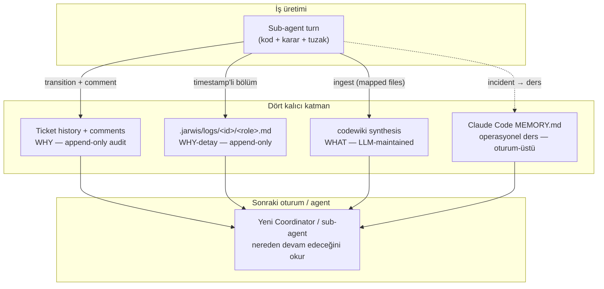
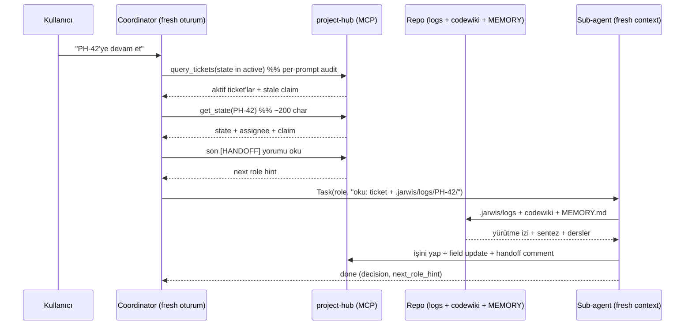
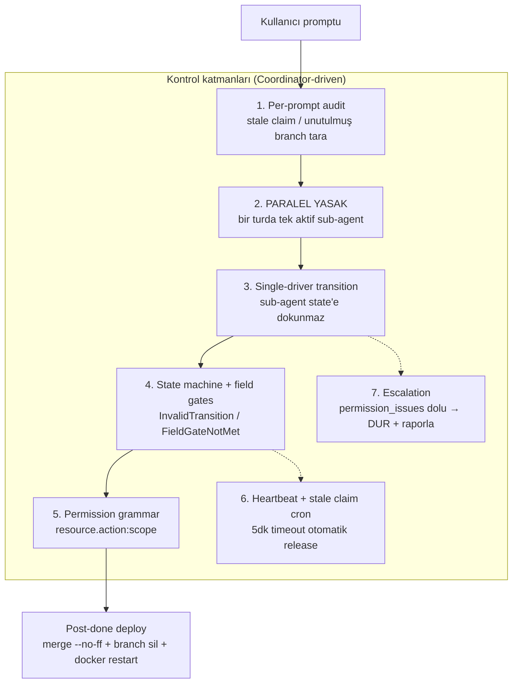
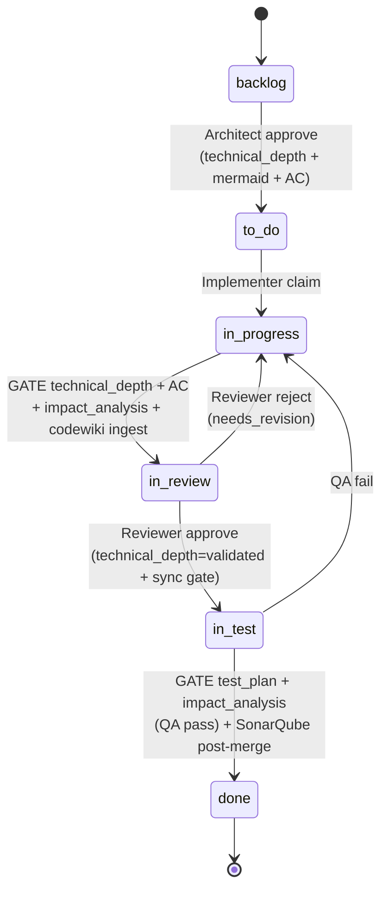

# Hedefler Derinlemesine — Hafıza, Kontrol, Anlaşılabilirlik, Teknik Derinlik

> **Bir cümlede:** Kullanıcının dört üst-hedefi — kalıcı hafıza, kolay context-switch, agentic geliştirme kontrolü ve teknik derinlik yönetimi — soyut istekler değil; project-hub'ın veri modeline, Jarwis'in single-driver Coordinator mimarisine ve codewiki synthesis katmanına gömülü somut mekanizmalarla karşılanır.

Bu doküman, önceki bölümlerde anlatılan mimariyi ([project-hub](02-projecthub-mimari.md), [entegrasyonlar](03-projecthub-entegrasyonlar.md), [Jarwis ruleset](04-jarwis-ruleset.md), [entegrasyon mimarisi](05-entegrasyon-mimari.md)) bir adım öteye taşır: **"Bu sistem neyi başarmaya çalışıyor ve hangi mekanizma bunu garanti ediyor?"** sorusunu yanıtlar. Dört üst-hedefin her birine bir bölüm ayrılmıştır; her bölüm problem → çözüm → mekanizma → kanıt akışını izler.

Üç katmanlı çatıyı hatırlayalım (detay: [Jarwis ruleset §3 katman modeli](04-jarwis-ruleset.md)):

1. **Jarwis (`~/Jarwis/`)** — rol/iş akışı tanımları; *"Hiç kod içermez; sadece markdown."*
2. **project-hub (`~/Documents/project-hub/`)** — ticket/state/branch **state-of-truth**, MCP server (FastAPI + SQLAlchemy 2 + PostgreSQL 16 + Redis 7).
3. **Proje repo'su** — gerçek kod + `.jarwis/logs/<id>/<role>.md` per-task history.

Bu katmanlar üzerinde iki temel ilke tüm hedeflerin altyapısını kurar: **"Ticket = tek source of truth"** (agent'lar arası veri direkt geçmez, ticket alanları + yorumları üzerinden devredilir) ve **"State-of-truth = project-hub; lokal kayıt yok."**

---

<a id="long-term-memory"></a>
## 1. Long-term Memory — Dört Katmanlı, Append-Only Kurumsal Hafıza

> **Özet:** Sistem hiçbir şeyi unutmaz çünkü dört bağımsız hafıza katmanı (ticket history, append-only loglar, codewiki sentezi, Claude Code memory) her biri farklı zaman ölçeğinde ve farklı soru tipinde kalıcı kayıt tutar — ve hiçbiri silinmez.

### Problem

Çok-agentlı bir geliştirme akışında her oturum kendi context penceresinde başlar ve biter. LLM'in çalışma belleği uçucudur: bir sub-agent görevini tamamlayıp döndüğünde, yaptığı işin *gerekçesi*, *kararları* ve *tuzakları* context penceresiyle birlikte kaybolur. "Bu kararı neden almıştık?", "Bu dosyaya en son kim, hangi ticket için dokundu?", "Bu subsystem'de hangi gotcha vardı?" sorularının yanıtı, kalıcı bir hafıza katmanı olmadan her seferinde sıfırdan keşfedilmek zorunda kalır.

### Çözüm — Dört bağımsız katman, dört farklı soru

project-hub + Jarwis, hafızayı tek bir yere yığmak yerine **dört katmana** böler. Her katman farklı bir soru tipine, farklı bir granülariteye ve farklı bir kalıcılık ufkuna hizmet eder:

| Katman | Neyi hatırlar | Soru tipi | Nerede | Süre / kalıcılık |
|---|---|---|---|---|
| **Ticket history + comments** | Intent, karar, scope, state geçişleri, `[HANDOFF X→Y]` devirleri | **WHY** (niyet) | project-hub DB (`TicketHistory`, `Comment`) | Kalıcı, audit'li, actor-attributed; satır asla silinmez/güncellenmez |
| **`.jarwis/logs/<id>/<role>.md`** | Her rolün kendi turunda ne yaptığı, incremental adımlar, outcome satırı | **WHY-detay** (yürütme izi) | Proje repo'su, git'e commit'lenir | Append-only; `done` olunca silinmez, git history'ye girer (~5-10 KB/ticket) |
| **Codewiki (`docs/codewiki/`)** | Subsystem'in mevcut davranışı + design decisions sentezi | **WHAT** (mevcut hâl) | Proje repo'su, `docs/codewiki/*.md` | LLM-maintained; "Current behavior=şimdi / Design decisions=tarih" disiplini |
| **Claude Code memory (`MEMORY.md`)** | Oturum-üstü dersler, runbook'lar, çözülmüş tuzaklar, actor UUID tabloları | **Operasyonel ders** | `~/.claude/.../memory/` | Oturumlar arası kalıcı; "point-in-time observation" |

Bu dört katman, codewiki dokümantasyonunda adı geçen **üçgeni** (ticket history WHY ↔ codewiki WHAT ↔ git WHEN/HOW) Claude Code memory ile dördüncü bir eksene tamamlar: oturum-üstü operasyonel hafıza.

### Mekanizma 1 — Ticket history: append-only audit (WHY)

project-hub'ın `TicketHistory` tablosu **append-only**'dur — özellikle `TimestampMixin` taşımaz (sadece immutable bir `created_at`). Her servis mutasyonu bir history satırı üretir (detay: [project-hub veri modeli](02-projecthub-mimari.md#veri-modeli)):

```
create_ticket        → "created"
update_ticket        → "field_changed"   (field başına ayrı satır)
assign_ticket        → "assigned" / "unassigned"
transition_ticket    → "state_changed"
claim_ticket         → "claimed"
release_ticket       → "released"
update_agent_phase   → "phase_updated"
```

Satırlar asla silinmez veya güncellenmez. Bunun üstünde, agent'lar arası devir `[HANDOFF X→Y] <kısa rapor>` formatlı yorumlarla kayda geçer. `query_history(id)` bu tam izi geri okur. Sonuç: bir ticket'ın *neden* o state'te olduğu, *kim* tarafından *ne zaman* taşındığı her zaman geri-izlenebilir.

### Mekanizma 2 — `.jarwis/logs/`: append-only yürütme izi

Jarwis ilke #4: *"Append-only log. Her rol `.jarwis/logs/<ticket-id>/<role>.md` içine timestamp'li bölüm ekler; hiçbir geçmiş silinmez."* Log disiplini sıkıdır:

- *"Asla silme/üzerine yazma yok."*
- *"Bir bölüm 8 satırı geçmesin; uzun bilgi ticket alanlarına gider."*
- **Outcome satırı zorunlu** — örn. `commits abc123..def456 on branch feature/PH-42`.
- Frontmatter `ticket/role/created/last_run` taşır; ticket `done` olunca dosya **silinmez**, git history'sine girer.

Ticket history "ne karar verildi"yi, log ise "o kararın nasıl yürütüldüğü"nü saklar — ikisi tamamlayıcıdır.

### Mekanizma 3 — Codewiki: synthesis layer (WHAT)

Codewiki, raw source'un kopyası değil **sentezidir** (LLM Wiki / Memex deseni: insanların terk ettiği cross-referencing bakım yükünü LLM üstlenir). Her page üç yöne referans taşır: geriye intent'e (`[PH-XX]` ticket key), ileriye truth'a (`src/path:line`), yanlamasına diğer page'lere (`[[wikilinks]]`). Append-only `log.md` parse edilebilir bir kronoloji tutar:

```
## [YYYY-MM-DD] <op> | <title> | [TICKET-KEY]
```

Canlı kanıt: project-hub'ın `log.md`'si **98 entry** (96 ingest, 3 lint, 3 bootstrap), **105 distinct PH-XXX ticket ref**, 2026-05-26 → 2026-06-11 aralığında — yani 17 günde 98 sentez işlemi. Detay: [codewiki üçgeni](05-entegrasyon-mimari.md#why-what-when-ucgeni-ve-codewiki).

### Mekanizma 4 — Claude Code memory: oturum-üstü ders

Bu katmanın somut örnekleri, hafızanın **gerçek operasyonel acıdan** doğduğunu gösterir. 11 memory dosyasının çoğu canlı bir incident'in kalıcı derse dönüşmüş hâlidir:

| Dosya | Tip | İçerik (özet) |
|---|---|---|
| `kims-production-constraint.md` | production constraint | KIM board canlı (restoran); her schema değişikliği `technical_depth`'te "data shape + backfill story" gerektirir; `migrate_sqlite_to_pg.py` 46 test |
| `jarwis-actor-uuids.md` | reference | `assign_ticket` için 9 jarwis-* actor UUID tablosu, DB-verified |
| `workflow-transition-permission-gap.md` | feedback / resolved | PM `state.transition:*` wildcard'ın per-transition `allowed_roles`'u override etmemesi → workaround → RESOLVED |
| `sonar-autoscan-watcher.md` | runbook | launchd watcher, TCC Full Disk Access + PATH gotcha'ları |
| `branchgraph-lane-leak.md` | diagnostic | `assignLanes` lane'i sadece root commit'te free ediyor → `maxLane 66→4` fix |
| `shared-worktree-concurrent-collision.md` | process gotcha | iki Coordinator tek checkout'u paylaşırsa commit orphan kalır (canlı PH-208 vs PH-203/204) |

Bu, whitepaper için güçlü bir mesaj kurar: **agent'lar kendi hatalarından kalıcı olarak öğreniyor**. Bir incident bir kez yaşandığında, çözümü `MEMORY.md`'ye bir "point-in-time observation" olarak yazılır ve sonraki tüm oturumlar onu okur.

### Hafıza akışı



**Kanıt:** Hiçbir katman destructive değildir. Ticket history `TimestampMixin` taşımaz; `.jarwis/logs` "asla silme"; codewiki append-only `log.md`; memory dosyaları "point-in-time observation". Sistem zayıflıklarını da gizlemez — worktree izolasyonu eksikliği, idempotent-olmayan bootstrap ve agent frontmatter cache hem CLAUDE.md hem memory'de açıkça işaretlidir.

---

## 2. Context-Switch Kolaylığı — Yeni Oturum, Sıfır Yeniden-Keşif

> **Özet:** Yeni bir oturum veya yeni bir sub-agent, dört hafıza katmanını belirli bir okuma sırasıyla tarayarak "kaldığı yerden" tam olarak nereden devam edeceğini hiç insan müdahalesi olmadan çıkarır.

### Problem

İnsan ekiplerinde context-switch pahalıdır: bir geliştiriciye devir yaparken "neredeyiz, ne yapıldı, ne kaldı" sözlü/yazılı olarak aktarılır. Agentic bir sistemde her sub-agent **fresh context** ile başlar — geçmiş oturumun çalışma belleğine erişimi yoktur. Eğer "nereden devam edileceği" sağlam bir kayıttan okunamazsa, her devir bir yeniden-keşif maliyeti doğurur ve ticket'lar "in_progress'ta unutuldu" durumuna düşer.

### Çözüm — Belirlenmiş okuma sırası + sub-agent izolasyonu

Jarwis ilke #3: *"Sub-agent izolasyonu. Her rol kendi temiz context'inde çalışır (`.claude/agents/*.md`). Kendi tool whitelist'i, kendi sistem promptu vardır."* Fresh context bir bug değil, bir **tasarım kararıdır** — her rol sadece kendi işine odaklanır, başka rolün gürültüsünü taşımaz. Devir bilgisi context'te değil, **kalıcı kayıtta** durur.

### Mekanizma — "Kaldığı yerden devam" okuma zinciri

Yeni bir oturum/agent şu sırayla nereden devam edeceğini çıkarır:

1. **Per-prompt audit** (Coordinator adım 0): `query_tickets(state in [in_progress, in_review, in_test])` → aktif iş + stale claim tespiti. Detay: [Coordinator single-driver](04-jarwis-ruleset.md#single-driver-mimari).
2. **Son `[HANDOFF X→Y]` yorumu** → sıradaki rolü belirler.
3. **`.jarwis/logs/<id>/`** → Coordinator "frontmatter + son 1-2 bölüm" okur (tamamı değil); sub-agent prompt'una `oku: .jarwis/logs/<id>/` referansı koyar.
4. **codewiki** (Architect read-before-design) + **MEMORY.md** (oturum-üstü kalıcı bilgi).



### Token ekonomisi — devir ucuz olmalı

Context-switch'in *ucuz* olması da bir hedeftir, sadece *mümkün* olması değil. Coordinator self-verify için her zaman `get_state` (~200 char) kullanır; full `get_ticket` (~6 KB) sadece `field_gate` çözümü için. Bench iter-2→iter-3 ölçümünde bu fark self-verify maliyetini **~30x** azalttı. Aynı seçicilik prensibi import katmanında da var: **3 eager** dosya (coordinator + exit-protocol + mcp-discipline) her oturumda yüklenir; **14 lazy** dosya trigger tablosuyla ihtiyaç anında `Read`'lenir. Codewiki bunun uzantısı — planning'de raw source yerine sentez page okunur. Detay: [token stratejisi](04-jarwis-ruleset.md#eager-vs-lazy-import).

**Kanıt:** "kaldığı yerden devam" senaryosu canlı çalışır — Coordinator audit → handoff → log → codewiki → memory zinciri, kullanıcının tek satırlık "PH-42'ye devam et" promptundan tam bağlamı kurar. Sub-agent fresh context'le başlar ama kalıcı kayıttan sıfır yeniden-keşif maliyetiyle besllenir.

---

## 3. Agentic Geliştirme Kontrolü — Single-Driver Coordinator

> **Özet:** Tüm state machine karmaşıklığı (permission gate, invalid_transition, field gate, actor resolution) tek bir noktada — Coordinator'da — toplanır; sub-agent'lar state'e dokunamaz, akış otonom ama kesinlikle sıralı ilerler.

### Problem

Bağımsız çalışan N agent'a state machine'i değiştirme yetkisi verirseniz, hata yüzeyi N rol × M hata tipine patlar. Pratikte yaşanan tam buydu: *"sub-agent state transition denemesi sırasında missing tool whitelist, permission denied, invalid_transition gate'lerine takılıyordu."* Ayrıca paralel agent'lar tek git checkout'unu paylaştığında commit'ler yanlış branch'e düşer (canlı: PH-208 vs PH-203/204 orphan).

### Çözüm — v2 single-driver mimari

Çekirdek karar: *"Coordinator hem orchestrator HEM transition driver'ıdır. Sub-agent state'e DOKUNMAZ; sadece işini yapar (kod, rapor, field update, comment) ve `done|blocked|rejected` raporu döner."* Coordinator, sub-agent turn'ünü kapatmadan ÖNCE `transition_state` + `assign_ticket` + `release_ticket` yapar.

Gerekçe birebir: *"sub-agent başına permission gate, missing tool, invalid_transition hataları tekil noktada toplanır. Sub-agent simple kalır."* Bu, hata yüzeyini **N rol × M hata tipi**'nden **1 nokta × M hata tipi**'ne indirger.

### Mekanizma — Yedi kontrol katmanı



**1. Per-prompt audit.** Her promptta `query_tickets(state in active)` ile stale claim (>5 dk heartbeat yok), `state=done + claimed_by≠null` (release eksik), unutulmuş branch (last commit >30 dk) taranır.

**2. PARALEL YASAK.** *"Aynı anda birden fazla sub-agent Task çağrısı YOK… Bir tur içinde tek bir aktif sub-agent."* Sıralama: önce hotfix/bug, sonra epic topo-sort (child id ascending). Bu, paylaşılan worktree çakışmasını yapısal olarak engeller.

**3. Single-driver + tool whitelist enforcement.** Sub-agent `.md` dosyalarında `transition_state`/`assign_ticket`/`release_ticket` whitelist'te **olmamalı** — kaza çağrı fiziksel olarak imkânsız. Kural ihlali "yasak" değil, "yapamaz" düzeyinde.

**4. State machine + field gates.** 7 state (`backlog → to_do → in_progress → in_review → in_test → done` + `blocked`). Field gate'ler zorunlu (detay: [state machine ve field gate'ler](02-projecthub-mimari.md#state-machine-ve-field-gateler)):

| Geçiş | Zorunlu field | Exempt |
|---|---|---|
| `in_progress → in_review` | `technical_depth`, `acceptance_criteria` | epic |
| `in_review → in_test` | `test_plan` | epic |
| `in_test → done` | `impact_analysis` | epic |

Kritik gotcha: `to_do → in_review` direkt geçiş yok; önce `in_progress` ara state zorunlu (PH-148 canlı testle doğrulandı). Coordinator `get_state` ile kontrol edip gerekirse ara state'i atar.

**5. Permission grammar.** `resource.action:scope`. PM `state.transition:*` wildcard taşır; ama bir transition `allowed_roles` HİÇ taşımıyorsa engine herkesi reddeder → board kilitlenir, `python -m app.cli repair_workflow --board <KEY>` ile onarılır (PH-168). Kritik tasarım kararı: `allowed_roles` içinde `"assignee"` varsa, claim sahibi de assignee sayılır (`ticket.assignee_id == actor.id OR ticket.claimed_by == actor.id`) — bu, otonom agent'ların `assign_ticket` adımını atlamasıyla oluşan permission deadlock'unu kapatır. Detay: [permission grammar](02-projecthub-mimari.md#permission-grammar).

**6. Heartbeat + stale claim cron.** Aktif claim sahibi `update_agent_phase` ile heartbeat atar; 5 dk (`CLAIM_TIMEOUT_SECONDS = 300`) heartbeat yoksa cron claim'i release eder ve history'ye `reason: "stale_claim_timeout"` yazar.

**7. Escalation.** `permission_issues` doluysa (tipler: `tool_missing`, `permission_denied`, `actor_not_found`, `workflow_gate`, `branch_blocked`, `mcp_server_unreachable`) Coordinator transition map UYGULAMAZ ama `release_ticket`'i yine yapar (stale claim önler) + `[ESCALATION]` comment + kullanıcıya raporlar. Gerekçe: *"Sub-agent permission issue'yu sessizce yutarsa state hareket etmez… ticket 'in_progress'ta unutuldu' duruma düşer."*

### Otonom ama deterministik

**Chain continuity (#7):** `decision ∈ {done, approved, passed, created, bug-reproduced}` ve `permission_issues == []` ise Coordinator sıradaki rolü **otomatik** invoke eder, "devam edeyim mi?" diye SORMAZ. Yani tek prompt → akış done'a kadar yürür. Ama bu otonomi PARALEL YASAK ile dengelenir: otonomi (auto-progress) + determinizm (sıralılık).

**Post-done deploy:** QA pass sonrası Coordinator merge (`git merge --no-ff`) + `git branch -d` (safe, sadece merged ise) + worktree cleanup + docker restart (backend değiştiyse; frontend için vite HMR yeterli) + health check (`curl -fs localhost:<port>/health → 200`). project-hub'ın CLAUDE.md'si bunu `scripts/sonar-scan.sh` post-merge hook'u ile override eder. Detay: [exit protocol ve post-done deploy](04-jarwis-ruleset.md#transition-map).

**Kanıt:** Mimari spekülatif değil — 2-step transition zorunluluğu (PH-148), JSON-RPC `id` field gotcha, escalation "in_progress'ta unutuldu" senaryosu, `repair_workflow` board-kilidi (PH-168) gibi gerçek başarısızlıklardan türetilmiş düzeltmeler içerir. Hallucination guard üç katmanlı: "yaptım demek transition yaptın anlamına gelmez" → her transition `get_state` ile doğrulanır, raw curl yasak (202 sessiz başarısızlık riski), recursive `Task()` yasak.

---

## 4. Technical Depth Management — Teknik Borç Kaybolmaz

> **Özet:** Bir ticket, teknik derinliği (`technical_depth`, `impact_analysis`, `test_plan`, AC) dökümante edilmeden field gate'leri geçemez; Reviewer validasyonu, codewiki sync gate ve SonarQube ile bu derinlik akışın yapısal bir koşulu hâline gelir.

### Problem

Klasik geliştirmede teknik kararlar, etki analizleri ve test stratejisi çoğu zaman geliştiricinin kafasında veya geçici bir PR yorumunda kalır — kod merge olduktan sonra buharlaşır. Sonuç: teknik borç görünmez olur, "neden böyle yapmıştık?" sorusunun yanıtı kaybolur, ve aynı tuzaklara tekrar düşülür. Agentic bir sistemde bu risk daha da büyüktür çünkü "kafa"daki bilgi context penceresiyle birlikte gider.

### Çözüm — Derinliği akışın zorunlu koşulu yapmak

Tez şudur: **teknik derinlik dökümante edilmeden ticket ilerleyemez.** Bu, isteğe bağlı bir "iyi pratik" değil, state machine'in kapısına yerleştirilmiş bir gate'tir.

### Mekanizma — Rol bazlı derinlik üretimi + gate'ler



**Architect** `technical_depth` + mermaid + AC yazar (`update_ticket`); scope/feasibility kararı verir. Bu, ticket `to_do`'ya geçmeden önce derinliğin oluştuğu ilk noktadır.

**Implementer** `impact_analysis` + codewiki design-decisions yazar. Codewiki ingest (mapped files için MANDATORY): eşleşen page'in "Design decisions (recent)" altına `- <decision> [<KEY>] — <rationale>` bullet (zorunlu), frontmatter `last_touched_ticket: <KEY>` (zorunlu), ve **kod + wiki aynı commit'te**. `in_progress → in_review` gate'i `technical_depth` ve `acceptance_criteria` doluluğunu zorlar.

**Reviewer** `technical_depth=validated` set eder. Codewiki **sync gate** (hard): `git diff <main>...HEAD --name-only` alır; değişen bir source `.codemap` glob'una uyuyorsa target page de diff'te **olmalı** — değilse **needs_revision** ("tek başına yeterli, severity matematiğinden bağımsız hard gate"). Bu, sentezin stale olmasını yapısal olarak engeller. Detay: [Reviewer sync gate](05-entegrasyon-mimari.md#codewiki-sync-gate).

**QA** `test_plan` doldurur; `in_review → in_test` gate'i bunu zorlar. QA ayrıca codewiki "Known gotchas"'ı regression check'e çevirir. Chicken-and-egg çözümü: QA test_plan'ı in_review'da yazar, sonra Coordinator tek turda gate-pass eder.

**SonarQube** post-merge best-effort (`scripts/sonar-scan.sh`, ALWAYS exits 0): per-board watcher daemon + real token; C# scans gerçek (PH-257); scan-source izolasyonu 3 fix (PH-242/243/244). Detay: [SonarQube entegrasyonu](03-projecthub-entegrasyonlar.md#sonarqube).

### Üç-kademeli geçiş kontrolü

project-hub'da bir transition dört testi sırayla geçmek zorundadır (detay: [project-hub state machine](02-projecthub-mimari.md#state-machine-ve-field-gateler)):

1. Workflow'da edge olarak **mevcut** olmalı → yoksa `InvalidTransition`.
2. Actor `allowed_roles`/claim/admin testini geçmeli → yoksa `PermissionDenied`.
3. `state.transition:to_<state>` permission'ına sahip olmalı.
4. Field gate'leri **sağlanmalı** → yoksa `FieldGateNotMet`.

Yani derinlik field'ları boşsa (4. test) ticket fiziksel olarak ilerleyemez — borç "kaybolamaz" çünkü kapının anahtarıdır.

### Teknik borcun "kaybolmaması" tezi

Field gate'ler, derinliği *üretim anında* zorlar (Architect/Implementer/QA yazmadan geçemez). Codewiki "Current behavior=şimdi / Design decisions=tarih" disiplini, derinliği *zaman içinde* temiz tutar. Reviewer sync gate, sentezin *güncel* kalmasını garanti eder. SonarQube, kod kalitesini *post-merge* ölçer. Dört mekanizma birlikte, teknik borcu görünür ve geri-izlenebilir kılar:

- **Üretim anında:** field gate (`FieldGateNotMet`)
- **Devir anında:** Reviewer `technical_depth=validated` + codewiki sync gate (hard `needs_revision`)
- **Kalıcılık:** `[PH-XX]` ref'leriyle design decisions → her karar intent'e geri-izlenebilir
- **Sürekli ölçüm:** SonarQube post-merge scan

**Kanıt:** project-hub'ın kendi codewiki'si 17 günde 96 ingest + 105 ticket ref ile bu disiplinin canlı çalıştığını gösterir. `kims-production-constraint.md` memory dosyası, derinlik zorunluluğunun gerçek bir kısıttan doğduğunu kanıtlar: KIM board canlı olduğu için her schema değişikliği `technical_depth`'te "data shape impact + backfill story" gerektirir, ve bu kural `migrate_sqlite_to_pg.py`'nin 46 testiyle (39 unit + 7 PG round-trip) desteklenir.

---

## İlgili dokümanlar

- [00 — Genel bakış ve okuma sırası](00-index.md)
- [01 — Vizyon, amaç ve 4 hedef özeti](01-vizyon-amac.md)
- [02 — project-hub mimarisi: state machine, field gate, permission](02-projecthub-mimari.md)
- [03 — project-hub entegrasyonlar: Git, SonarQube, kontrol yüzeyi](03-projecthub-entegrasyonlar.md)
- [04 — Jarwis ruleset: Coordinator single-driver, roller, flow](04-jarwis-ruleset.md)
- [05 — Entegrasyon mimarisi: WHY/WHAT/WHEN üçgeni, codewiki, jarwis-init](05-entegrasyon-mimari.md)
- [07 — Optimizasyon yolculuğu: benchmark-driven iterasyon](07-optimizasyon-yolculugu.md)
- [08 — Sunum iskeleti](08-sunum-iskeleti.md)
