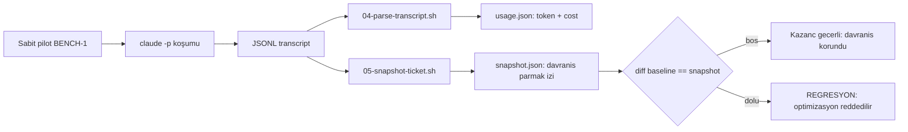
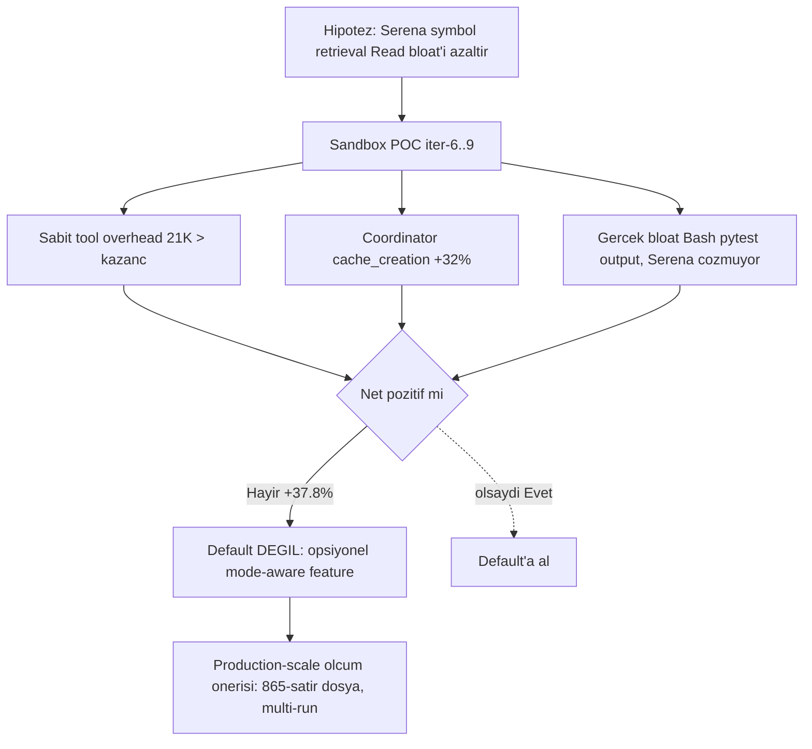

# Optimizasyon Yolculuğu — Ölçülen, Korunan Davranış

> **Bir cümlede:** Jarwis'in token/maliyet optimizasyonu, tek bir sabit pilot prompt üzerinde baseline'dan başlayan ve her adımda davranışı bozmadan ($8.88 → $6.29, 9.44M → 5.70M input token) kazanç biriktiren, "snapshot equivalence" ilkesiyle regresyona karşı korunan bilimsel bir süreçtir.

Bu doküman, Jarwis ruleset'inin nasıl iteratif olarak ucuzlatıldığını anlatır. Ama asıl mesaj sayılarda değil: **kazancın her adımda davranış korunarak elde edilmiş olması.** Bir agentic sistemde token tasarrufu kolay; zor olan, sistemin _aynı sonucu üretmeye devam ettiğini_ kanıtlayarak tasarruf etmek. Jarwis bunu bir mühendislik disiplinine dönüştürdü.

İlk kez bu sistemi gören biri için akış şu: önce **neyi ölçtüğümüzü** (sabit pilot + snapshot equivalence), sonra **adım adım ne kestiğimizi** (iter-0 → iter-9), en sonunda da **bu disiplinin neden önemli olduğunu** göreceğiz.

---

## 1. Metodoloji — sabit pilot + snapshot equivalence

> **Özet:** Optimizasyonu ölçülebilir kılmak için tek bir versiyonlu pilot prompt sabitlendi; kazanç ancak "davranış parmak izi" (snapshot) değişmediğinde geçerli sayıldı.

### 1.1 Sabit pilot: BENCH-1

Optimizasyonun bilimsel olması için bağımsız değişkenlerin sabitlenmesi gerekir. Jarwis bunu **tek, versiyonlu bir pilot prompt** ile yaptı (`scripts/bench/03-pilot-prompt.txt`, ticket adı `BENCH-1`):

> "Backend'e `GET /api/v1/health/version` endpoint'i ekle. Response JSON: `{"version": "0.1.0", "commit": "<git short sha>"}`. pytest ile ... test yaz."

Bu, tüm Jarwis pipeline'ını tetikleyen küçük ama eksiksiz bir feature: PM triage eder, Architect technical_depth + AC yazar, bir implementer (backend) kod + test yazar, Reviewer denetler, QA test eder, Coordinator state'i `done`'a taşır. Yani her rol en az bir kez devreye girer — pipeline'ın token profili gerçekçi şekilde temsil edilir.

### 1.2 Harness — 5 script

Ölçüm tekrarlanabilir olmalı. `scripts/bench/` altında idempotent bir harness kuruldu:

| Script | Görev |
|---|---|
| `01-prepare-sandbox.sh` | Idempotent wipe + recreate: `jarwis-init` + FastAPI scaffold + `.venv` |
| `03-pilot-prompt.txt` | Sabit pilot prompt (BENCH-1) — değişmez bağımsız değişken |
| `04-parse-transcript.sh` | JSONL transcript → `usage.json`; Coordinator vs sub-agent token breakdown |
| `05-snapshot-ticket.sh` | Ticket → `snapshot.json` (davranış parmak izi) |
| `06-summary.sh` | Markdown rapor üretimi |

### 1.3 Headless workaround'lar (iter-0 keşifleri)

Benchmark'ı `claude -p` (headless) ile koşmak üç tuzak ortaya çıkardı — bunlar bizzat birer "davranışı koruma" dersi:

1. **`claude -p` proje-level CLAUDE.md'yi otomatik yüklemiyor.** İlk dört deneme (v1–v4) bu yüzden başarısız oldu: Coordinator Jarwis'i tamamen bypass edip kendi `Bash + Edit + Read` araçlarıyla endpoint'i ekledi — yani ruleset hiç çalışmadı. Çözüm: `--append-system-prompt "$(cat /tmp/jarwis-sysprompt.md)"` (51KB, 1027 satır, ~7–8K token).
2. **`--permission-mode bypassPermissions` zorunlu.** Headless `--mcp-config` modu `settings.json` içindeki `permissions.allow`'u pickup etmiyor.
3. **`--disallowed-tools TodoWrite` CLI flag'i zorunlu.** `settings.json` içindeki `disallowedTools` field'ı bench build'inde uygulanmadı; TodoWrite gürültüsü yalnızca CLI flag ile susturulabildi.

### 1.4 Snapshot equivalence ilkesi

İşte bu yolculuğun kalbi: **Davranış korunmadıkça kazanç sayılmaz.**

`snapshot.json` yalnızca **şekilsel** (structural) alanları yakalar — metni değil. Çünkü LLM'ler stochastic'tir; aynı prompt iki kez çalıştırıldığında üretilen _metin_ farklı olur, ama _davranış_ aynı kalmalıdır. Snapshot şu alanları içerir:

```jsonc
{
  "final_state": "done",                                    // hedef state
  "state_path": ["to_do","in_progress","in_review","in_test","done"],
  "handoff_comments": [ /* [HANDOFF X→Y] zinciri */ ],
  "fields_present": {                                       // 6 boolean
    "description": true, "technical_depth": true,
    "impact_analysis": true, "test_plan": true,
    "acceptance_criteria": true, "branch_name": true
  },
  "labels": [ /* ... */ ],
  "decisions": [ /* approved, passed, ... */ ]
}
```

Eşitlik kriteri: **equivalence = davranış, ≠ metin.** Her iterasyonda baseline snapshot ile yeni snapshot arasında `diff` alınır; sonuç boş olmalıdır (veya en fazla anlamsız bir label içerik varyasyonu). Metin farkı kasıtlı olarak ölçü dışı bırakılır.



> Bu kontrol [project-hub state machine ve field gate](02-projecthub-mimari.md#state-machine-ve-field-gateler) mekanizmasının doğrudan bir izdüşümüdür: `state_path` ve `fields_present`, sistemin state machine sözleşmesini her koşumda tekrar tekrar onaylar.

---

## 2. İterasyon kronolojisi — tek tabloda

> **Özet:** Tek pilot × katmanlı kesinti, kümülatif olarak maliyeti %29 düşürdü; her satırda davranış parmak izi korundu.

| Iter | Versiyon | Optimizasyon | Total input | Cost | Snapshot |
|---|---|---|---|---|---|
| **iter-0** | v5 | Baseline (ölçüt nokta) | 9,442,401 | **$8.88** | — (referans) |
| **iter-1** | v7 | Tool-whitelist-trim (152→49 tool) | 5,711,447 (−39.5%) | $7.64 (−14.0%) | PASS |
| **iter-2** | v8 | MCP minimal response (6 write tool) | (MCP body −57%) | $6.67 (−12.7%) | PASS |
| **iter-3** | v9 | Slice fetcher'lar eklendi (hint yok) | +14.7% (geçici regresyon) | — | PASS |
| **iter-4** | v10 | Sub-agent slice hint'leri | Coordinator −23.2% | — | PASS |
| **iter-5** | v11 | QA mode decision | 5,697,416 (iter-1 parity) | **$6.29 (−17.7% vs iter-1)** | PASS |
| iter-6..9 | — | Serena POC | +17.6% … **+37.8%** | (hepsi negatif) | PASS |

Net sonuç: **baseline $8.88 / 9.44M input → iter-5 $6.29 / 5.70M input.** En büyük tek kazanç tool-whitelist-trim'den (iter-1). Serena (iter-6..9) ölçüldü ve **default'a alınmadı** — neden, §8'de.

---

## 3. iter-0 baseline (v5) — nereden başladık

> **Özet:** İlk ölçüm Coordinator'ın token'ın yarısından fazlasını tükettiğini ve tool gürültüsünün ciddi olduğunu ortaya koydu — optimizasyonun nereye odaklanacağını belirledi.

`bench-baselines/iter-0-baseline-v5/` artifact'ı, ham gerçeği gösterdi:

- **Total input: 9,442,401 token**, total output 44,022, total messages 257.
- **Cost (Opus 4.1 Coordinator, sub-agent'lar Sonnet): $8.88**, duration 916sn (15.3dk).
- **Coordinator tek başına: 98 mesaj, total input 6,032,825 token — grand total'in ~%53'ü.** (cache_creation 308,089, cache_read 5,724,449.)
- Cache hit rate %93+; ilk mesaj cache_creation 41,103.

Tool gürültüsü (optimizasyonun ilk hedefleri):

- **`TodoWrite` × 19** — Jarwis akışında redundant; ticket state machine + `[HANDOFF]` yorumları zaten plan görevi görüyor.
- `Bash` × 48.
- `assign_ticket` × 8 (double-call), `transition_state` × 6 (çift transition).
- 6× `.jarwis/logs` EISDIR hatası.

**Ana bulgu:** "Coordinator token'ın %53'ünü kullanır." Optimizasyon stratejisi bu tek istatistikle yön kazandı — en büyük tasarruf, Coordinator'ın okuduğu/yazdığı veriyi küçültmekten gelecekti.

---

## 4. iter-1 — tool-whitelist-trim: tek seferde −39.5% input

> **Özet:** Her sub-agent'ın araç listesini gerçek kullanıma kırparak 103 tool kaldırıldı; toplam input %39.5 düştü, davranış değişmedi.

Sub-agent'ların `.claude/agents/*.md` frontmatter'ındaki `tools:` listeleri gerçek kullanıma göre kırpıldı (mode-aware: web pilot'unda Unity/UI tool tanımları kaldırıldı). Her tool tanımı, agent'ın system prompt'una eklenen sabit bir token maliyetidir — kullanılmasa bile her turda taşınır.

**152 → 49 tool = −103 tool (%68 azalma).** En büyük kesim QA'da:

| Rol | Önce | Sonra | Kaldırılanlar (örnek) |
|---|---|---|---|
| QA | 58 | 11 | unityMCP 7, Chrome 11, Preview 10, Control_Chrome 8, PDF 7, pdf-viewer 3 |
| pm | 32 | 12 | |
| Architect | 25 | 7 | |
| reviewer | 21 | 7 | |

Kazançlar (v5 → v7):

- **Total input: 9,442,401 → 5,711,447 = −39.5%** (−3.73M token).
- Total messages 257 → 177 (−31.1%); Coordinator messages 98 → 50 (−49.0%).
- Coordinator cache_creation 308,089 → 151,402 (−50.9%); cache_read 5.72M → 3.50M (−38.8%).
- **Cost: $8.88 → $7.64 = −14.0%** (−$1.24); duration 916 → 858sn.
- Tradeoff: ilk mesaj cache_creation 41,103 → 57,948 (+41.0%) — küçük tool seti daha sık cache invalidation tetikledi, ama net büyük kazanç önünde önemsiz.
- **Snapshot equivalence: empty diff** (state_path, fields_present, 5 task_invocation, labels identical).

> **Neden davranışı bozmadı?** Kaldırılan tool'lar zaten kullanılmıyordu (web pilot'unda Unity/Chrome/PDF). Bir tool'u listeden çıkarmak, kullanılmadığı sürece davranışı değiştirmez — sadece system prompt'u küçültür. Bu, "sıfır risk, yüksek getiri" optimizasyonunun ders kitabı örneği.

---

## 5. iter-2 — MCP minimal response: heartbeat'i 6K'dan 814 byte'a indir

> **Özet:** Yüksek frekanslı write tool'ları full ticket döndürüyordu; minimal-default + `verbose:true` opt-in pattern'i 6 tool'da −97.6% sağladı, backward-compat kırmadan.

Sorun şuydu: `backend/app/mcp/server.py` içindeki her write tool'un son satırı `ticket_response(ticket).model_dump(...)` çağırarak **full ticket** render ediyordu. Yani heartbeat amaçlı `update_agent_phase` çağrısı bile per-call ~6,053 char dönüyordu — yüksek frekanslı, düşük-bilgi bir çağrı için tam bir israf.

Çözüm: `_dispatch_tool` içinde 6 write tool **default minimal response** dönecek şekilde değiştirildi; eski full ticket davranışı `verbose:true` parametresiyle korundu (backward-compatible opt-in).

6 write tool ölçümü (iter-1 → iter-2, sum_chars):

| Tool | Çağrı | Önce | Sonra | Δ |
|---|---|---|---|---|
| `transition_state` | ×6 | 33,636 | 781 | −97.7% |
| `update_agent_phase` | ×5 | 30,267 | 814 | −97.3% |
| `update_ticket` | ×4 | 25,852 | 587 | |
| `assign_ticket` | ×4 | 21,384 | 496 | |
| `release_ticket` | ×2 | 13,938 | 177 | −98.7% |
| `claim_ticket` | ×1 | 4,768 | 222 | |
| **6-tool toplamı** | | **129,845** | **3,077** | **−97.6%** |

- **Tüm project-hub MCP responses: 187,129 → 80,525 = −57.0%** (≈−26.6K token).
- **Cost: $7.64 → $6.67 = −12.7%**; Coordinator input −7.2%.
- Tradeoff: toplam input +6.8% — minimal response, bazı yerlerde sub-agent'ın eksik bilgiyi telafi etmek için ekstra `get_ticket` fetch döngüleri açmasına yol açtı. Bu regresyon iter-3+ slice fetcher'larla kapatıldı.
- **Snapshot equivalence: PASS** (yalnızca label varyasyonu: "health-check" ↔ "health"+"version").

> **Ders:** MCP response body **asimetrik bloat**'tır. En çok çağrılan tool'lar (heartbeat) en az bilgiye ihtiyaç duyar ama en pahalı payload'ı döndürüyordu. Optimizasyon, ortalamayı değil, _frekans × payload_ çarpımını hedeflemeli.

---

## 6. iter-3/4 — slice fetcher'lar: doğru ölçek noktasını bul

> **Özet:** Slice tool'ları eklemek tek başına yetmedi (+14.7% regresyon); kullanımlarını sub-agent prompt'larıyla zorlamak gerekti — sonra Coordinator input −23.2% düştü.

### 6.1 iter-3 (v9) — araç var, kullanım yok

İki yeni read tool eklendi:

- **`get_state`** (~200 char, ticket boyutundan bağımsız) — Coordinator self-verify için zorunlu probe.
- **`get_ticket_slice(id, include=[...])`** — caller'ın seçtiği projection ile yalnızca ihtiyaç duyulan alanlar.

Ama bir hata yapıldı: sub-agent `.md` dosyalarına **hint eklenmedi.** Sonuç: `get_ticket_slice` **0 çağrı** aldı; sub-agent'lar eski `get_ticket` deseninde kaldı. Tek-transcript TOTAL input **+14.7% (geçici regresyon)** — yeni tool tanımları maliyet ekledi ama hiç kullanılmadı.

### 6.2 iter-4 (v10) — kullanımı prompt'la zorla

5 sub-agent + pm prompt'una "MCP okuma disiplini" bölümü eklendi; her rol artık minimum slice çağırıyor:

| Rol | include projeksiyonu | Tipik boyut |
|---|---|---|
| Architect | `[description, AC, labels, priority]` | ~600–1K char |
| Backend/Frontend | `[... technical_depth, branch_name]` | ~2–3K char |
| Reviewer | `[... impact_analysis ...]` | ~2K char |
| QA | mod-aware (Mod B'de minimal) | değişken |

Sonuç:

- **Coordinator input: 3,654,983 → 2,807,500 = −23.2%.** `get_state` uplift'i: eski self-verify deseni 5×6K = 30K → yeni 5×320 = 1.6K char.
- **Net MCP body iter-1 → iter-4: 187,129 → 56,232 = −70.0%** (−26K token).
- 18/18 pytest yeşil (6 yeni test).
- **Snapshot equivalence: PASS.**
- Tek bloat: **QA +172.1%** (1,082,112 token) — iter-5'te çözüldü.

> **Caveat (harness bug):** `04-parse-transcript.sh` marker filter bug'ı iter-2/3/4'te birden fazla transcript'i birleştirip yanlış toplam veriyordu. `-newer "$MARKER"` (TZ-agnostic) + `TRANSCRIPT_FILE` env override ile düzeltildi. Yukarıdaki rakamlar düzeltilmiş **tek-transcript** değerleridir. (Ölçüm aracının kendisini de doğrulamak gerekti — meta-ders.)

`get_state` (~200B) ile `get_ticket` (~6KB) ayrımı, [Coordinator single-driver mimarisinin](04-jarwis-ruleset.md#single-driver-mimari) "her transition sonrası get_state ile self-verify" kuralının doğrudan ekonomik gerekçesidir.

---

## 7. iter-5 — QA mode decision: yanlış moda düşmeyi engelle

> **Özet:** QA'nın yanlışlıkla bug-repro moduna girip full ticket payload'a kayması engellendi; QA token'ı −43.1% düştü ve toplam, iter-1 ile parity'ye geldi.

QA bloat'ının kök nedeni davranışsaldı: BENCH feature ticket'ında QA, `claim_ticket` çağırarak yanlışlıkla **Mod A**'ya (bug reproduce) giriyordu. Mod A'da slice field'ları boş geldiği için QA, telafi olarak `get_ticket` full payload'a kayıyordu.

Düzeltme `.claude/agents/qa.md`'ye eklendi:

- **Zorunlu "Mod karar" bölümü** — handoff sinyali + ticket type'a bakarak Mod A (reproduce) vs Mod B (verify) seçimi.
- **`get_ticket` YASAK** — slice yetmiyorsa `include` genişlet, ya da `blocked` dön.
- **Mod B'de "Claim ALMA"** — verify modunda claim gereksiz.

Sonuç:

- **QA: 1,082,112 → 615,644 = −43.1%.**
- GRAND TOTAL: 5,828,949 → 5,697,416 (iter-1 baseline ile **−0.2% parity**).
- **Cost: iter-1 $7.64 → iter-5 $6.29 = −17.7%.**
- project-hub MCP bytes: iter-1'in %29.7'si (**−70.3%**).
- **Snapshot equivalence: zero diff.**

Bu, [QA rolünün Mod A/Mod B ayrımının](04-jarwis-ruleset.md#roller) sadece doğruluk için değil, token ekonomisi için de kritik olduğunu gösterdi.

---

## 8. iter-6..9 — Serena POC: neden default DEĞİL

> **Özet:** Symbol-level retrieval (Serena) küçük sandbox'ta sabit tool-tanım overhead'i yüzünden net negatif çıktı (+37.8%); ölçüm, optimizasyonu reddetme cesaretini de gerektirir.

Serena MCP, tree-sitter + LSP ile symbol-level retrieval sunar (`find_symbol`, `find_referencing_symbols`). Hipotez: sub-agent'ların `Read` bloat'ını ham dosya yerine sembol-düzeyinde getirme ile azaltmak.

4 iterasyonluk sandbox POC sonucu (vs iter-5 grand total):

| Iter | Konfigürasyon | Δ (grand total) |
|---|---|---|
| iter-6 | Serena overlay | +17.6% |
| iter-8 | (optimize) | +10.2% |
| **iter-9** | 3 agent, 15 çağrı / 10,103 byte | **+37.8%** (GRAND TOTAL 7,848,702 — en yüksek) |

**Hepsi negatif.** Nedenleri:

1. **Sabit tool-tanım overhead'i.** Sandbox kodu ~140 satır; Serena tool tanımları per-agent ~7K × 3 agent = **21K sabit overhead.** Küçük kod tabanında bu, kazançtan büyük.
2. **Coordinator cache_creation +%32** — yeni tool seti cache'i bozdu.
3. **Yanlış hedef.** Reviewer'da `Read` 5→2 düştü ama net pozitif değildi; QA'daki gerçek bloat ise Bash pytest output'uydu (22 çağrı, 46K) — Serena bunu hiç çözmüyor.

**Karar:** Serena, opsiyonel **mode-aware feature** olarak konumlandı (`modes/web.md` "Serena overlay"); aktivasyon kriteri: **500+ satır/dosya + 20+ dosya + deep dependency graph.** Jarwis default state'i iter-5 ile **birebir aynıya** geri çekildi. **Snapshot equivalence korundu.**

Production ölçüm önerisi: 865-satırlık gerçek `app/mcp/server.py` üzerinde gerçek bir refactor ticket'ı, multi-run ortalaması ile (single-pilot noisy).



> **Ders:** Doğru test ortamı sonucu belirler. Küçük sandbox (~140 satır) her optimizasyon için geçerli değil — production-scale ölçüm şarttır. Aynı uyarı tüm "pilot single-ticket happy path" rakamları için geçerli: heartbeat −97% veya multi-comment slice gibi kazançların gerçek değeri, **uzun ömürlü ticket'larda exponential** büyür.

---

## 9. Snapshot equivalence — her iter'de PASS

> **Özet:** iter-1'den iter-9'a kadar davranış parmak izi tek bir kez bile kırılmadı — kazançlar regresyonsuz.

Her iterasyon (iter-1..9) için `diff` boş veya yalnızca anlamsız label içerik varyasyonu çıktı. Sabit kalan davranış parmak izi:

| Boyut | Tüm iter'lerde değer |
|---|---|
| `final_state` | `done` |
| `state_path` | 5-state: `to_do → in_progress → in_review → in_test → done` |
| `fields_present` | 6/6 `true` (description, technical_depth, impact_analysis, test_plan, acceptance_criteria, branch_name) |
| `task_invocations` | 5 (PM, Architect, Backend, Reviewer, QA) |

**Davranış hiç kırılmadı.** Maliyet %29 düşerken, sistemin ürettiği sonuç bit düzeyinde değilse de _davranış düzeyinde_ identical kaldı.

---

## 10. Kapanış — mühendislik kültürü olarak optimizasyon

> **Özet:** Bu yolculuk bir maliyet düşürme hikâyesi değil; ölçüm-temelli, regresyon-korumalı bir mühendislik disiplininin kanıtı.

Bu yolculuğun gösterdiği altı ilke, bir sunum kapanışı için doğrudan kullanılabilir:

1. **Snapshot equivalence = optimizasyonun bilimsel temeli.** Şekilsel fingerprint (state_path + fields_present + handoff) sabit tutularak token kazancı "davranış kaybı olmadan" garanti edildi; metin varyansı kasıtlı olarak ölçü dışı bırakıldı.

2. **Tek prompt × katmanlı kesinti = kümülatif sonuç.** Baseline $8.88 / 9.44M → iter-5 $6.29 / 5.70M. En büyük tek kazanç tool-whitelist-trim'den geldi (−103 tool, input −39.5%).

3. **Doğru ölçek noktasını bul.** Coordinator token'ın %53'ünü kullanıyordu; bu yüzden `get_state` self-verify probe'u (200 char, ticket boyutundan bağımsız) Coordinator input'unu tek başına −23.2% düşürdü. Doğru noktayı bulmak, attığın taştan önemli.

4. **MCP response body asimetrik bloat'tır.** Heartbeat gibi yüksek-frekans, düşük-bilgi çağrılar full ticket döndürüyordu (~6K/call). Minimal-default + `verbose:true` opt-in 6 tool'da −97.6% sağladı, backward-compat kırmadan.

5. **Tool eklemek yetmez; kullanımını prompt'la zorla.** iter-3 slice fetcher'ları ekledi ama hint yoktu (+14.7% regresyon); iter-4 disiplin bölümleri eklenince −70% MCP body gerçekleşti.

6. **Optimizasyonu reddetme cesareti.** Serena sandbox'ta net negatif çıkınca (+37.8%) default'a alınmadı, opsiyonel feature'a indirildi. Bir optimizasyonu _ölçüp reddetmek_, körlemesine kabul etmek kadar değerli mühendislik kararıdır.

Tüm bu disiplin, Jarwis'in [dört temel hedefinden](06-hedefler-derinlemesine.md) biri olan "ölçülebilir, anlaşılabilir, sürdürülebilir agentic sistem" vizyonunun somut kanıtıdır: sistem sadece çalışmıyor — _ne kadara çalıştığını biliyoruz ve davranışını bozmadan ucuzlatabiliyoruz._

---

## İlgili dokümanlar

- [00 — Genel bakış ve okuma sırası](00-index.md)
- [01 — Vizyon ve amaç](01-vizyon-amac.md)
- [02 — project-hub mimarisi (state machine, field gate, MCP)](02-projecthub-mimari.md)
- [03 — project-hub entegrasyonları (Git, SonarQube, frontend)](03-projecthub-entegrasyonlar.md)
- [04 — Jarwis ruleset (Coordinator single-driver, roller, flow)](04-jarwis-ruleset.md)
- [05 — Entegrasyon mimarisi (token, ticket lifecycle, codewiki)](05-entegrasyon-mimari.md)
- [06 — Hedefler derinlemesine (4 hedef → mekanizma)](06-hedefler-derinlemesine.md)
- [08 — Sunum iskeleti](08-sunum-iskeleti.md)
